# La longo de lumondo kiel natura etalono

## Prelego en Internacia Somera Universitato, Haarlem, 1954

Pasintjare en Zagrebo mi rakontis, kiel estiĝis la metra sistemo
kaj menciis je la fino de mia prelego, ke oni intencas ŝanĝi la fundamenton
de la sistemo kaj uzi la longon de lumondo kiel neniam
variontan nature donitan kontrolilon, unuvorte kiel *naturan etalonon*.

Nun mi tiun aplikon de optika teorio al grava problemo de internaciismo
pritraktos pli detale.

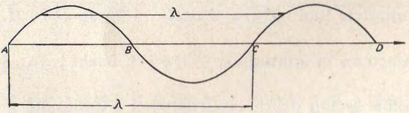
[bildo 1]: bildo 1

Ekde la komenco de la pasinta jarcento la hipotezo ke la lumo
estas ondeca movado en la etero, gajnis terenon kaj sukcesis klarigi
ĉiujn tiam konatajn optikajn fenomenojn. Oni imagis, ke lumradio
konsistas el transversaj ondoj [bildo 1]. Unu tuta ondo, kies longon ni
nomu $\lambda$, konsistas el monto inter $A$ kaj $B$ kaj valo inter $B$ kaj $C$. La
ondado disvastiĝas kun lumrapido laŭ la meza rekto $AD$, la direkto de
la radio. La *frekvenco*, la nombro de la vibradoj en unu sekundo, estas
determinita de la naturo de la lumfonto kaj restas senŝanĝa kiam la
radio pasas de unu medio en alian, ekzemple el aero en vitron, kie ĝia
rapido estas nur proksimume 2/3 de la rapido en la aero. Pro la konstanteco de la frekvenco la ondolongo devas proporcie plietiĝi. Se $n$
estas la indico de refrakto de tiu alia medio, $\lambda$ la ondolongo en aero, la
ondolongo en la alia medio

[formulo 1]: $ \lambda^* = \lambda/n $

Komence de la pasinta jarcento oni sukcesis mezuri $\lambda$, la longon
de la lumondoj, uzante fenomenojn kaŭzitajn de la interago de la lumondoj, de la *interfero*. En [bildo 2] estas desegnitaj du ondoj de la sama
longo, unu streketite kaj la alia punktite. Ili moviĝas en la sama direkto kaj
kuntrafas en bildo $a$ tiel, ke monto koincidas kun monto
kaj valo kun valo, ke ili estas en la *sama fazo*, kiel la fizikistoj diras.
Tiaj ondoj plifortigas sin kaj rezultigas pli fortan ondadon dike desegnitan.
Se kontraŭe la du ondoj kuntrafas tiel, ke monto koincidas
kun valo kaj valo kun monto, ke ili estas en kontraŭa fazo (bildo b),
ili rezultigas la pli malfortan dike desegnitan ondadon. Se la du ondoj
estas egale fortaj, (bildo c), ili sin neniigas reciproke. Tio kondukas al
iom stranga konkludo, ĉar lumo aldonita al lumo rezultigus mallumon
ĉe tia interfero.

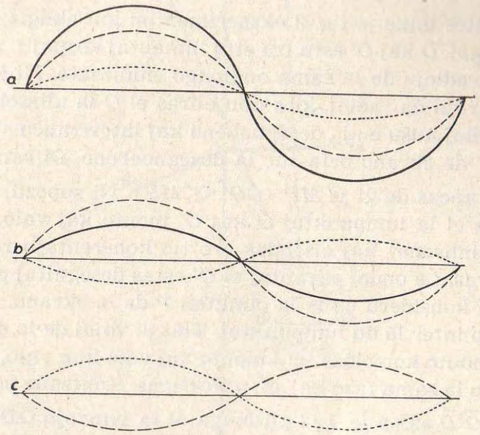
[bildo 2]: bildo 2

Mi pritraktos unue je [bildo 3] eksperimenton kiu ebligis la mezuradon
de la ondlongoj. $O$ kaj $O'$ estu tre etaj lumantaj korpoj t. n. lumpunktoj
elsendantaj radiojn de la sama ondlongo ĉiudirekte. Ni konsideru nun
diversajn parojn da radioj, kies unu eliras el $O$ la alia el $O'$. 
Ĉiuj konsiderataj radioj kuŝu en la desegnebeno kaj intertranĉu sin en la 
punktoj $P D H D'$ de ekrano orta sur la desegnoebeno. Ĝi estas paralela al
$OO'$ kaj distancas de ĝi je $MP (\overline{OO'} << \overline{MP})$. 
Ni supozu, ke ĉiam samtempe eliras el la lumpunktoj $O$ kaj $O'$ monto kaj valo, ke ili oscilas
samtakte (sinĥrone) kaj elsendas pro tio koherentajn radiojn, kiel la
fizikistoj diras. La ondoj elirantaj el $O'$ estas desegnitaj plene, tiuj el $O$
punktite. Ni konsideru unue la punkton $P$ de la ekrano. $P$ situas en la
simetriebeno inter la du lumpunktoj. Tial la vojoj de la du radioj estas
egalaj kaj monto koincidas kun monto kaj valo kun valo, la du ondadoj
en $P$ estas en la sama fazo kaj sin plifortigas. Kontraŭe por la punkto $D$
la lumvojo $\oberline{O'D}$ estas je $\lambda/2$ pli longa ol la
lumvojo $\overline{OD}$. Koincidas do en $D$ ĉiam monto kun valo kaj valo kun
monto; la du ondoj estas en kontraŭa fazo, ili neniigas sin, kaj ni devus observi
en $D$ mallumon. En $H$ la lumvojo de la radio el $O'$ estas je unu tuta ondo pli longa ol tiu
de la radio el $O$; tial la du radioj estas en la sama fazo kaj plifortigas
sin. En $D'$ la lumvojo de la radio el $O'$ estas je $3\lambda/2$ pli longa ol tiu de
la radio el $O$. La du radioj estas en la kontraŭa fazo kaj devus denove
rezultigi mallumon. Tiu ŝanĝiĝo de lumo kaj mallumo ripetiĝus maldekstren kaj ni
imagas facile, ke pro kaŭzoj de simetrio la samo okazos
sur la parto de la ekrano dekstre de $P$. Se tiu ekrano ne estas tro larĝa,
ni vidos sur ĝi laŭ tiu terio paralelajn helajn kaj malhelajn striojn,
*franĝojn*. Hela franĝo estas en la simetriebeno $MP$; la unua dekstre aŭ
maldekstre de ĝi respondas al optika vojdiferenco $1\lambda$, ĝi estas de la
*unua ordo*; la dua respondas al optika vojdiferenco $2\lambda$, ĝi estas de la
*dua ordo*, ktp. La unua malhela franĝo respondas al optika vojdiferenco
$\lambda/2$, la $N$-a al optika vojdiferenco $(2N — 1) \lambda/2$.

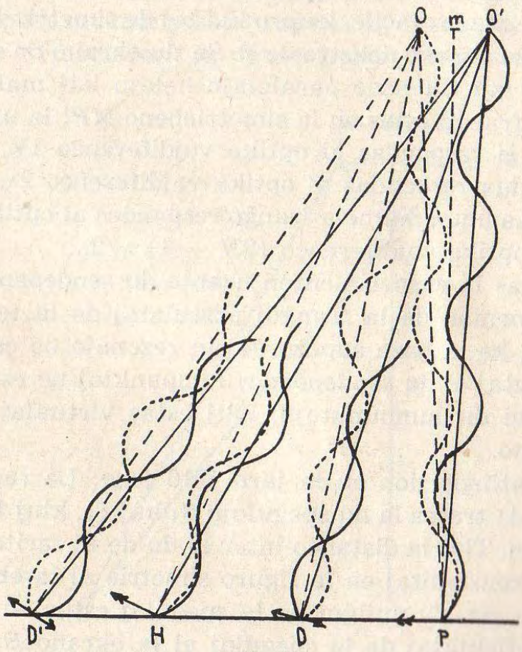
[bildo 3]: bildo 3

Sed se ni faras la eksperimenton uzante du sendependajn lumpunktojn,
ni vidas nenion de la franĝoj postulataj de la teorio. Tio estas
kaŭzata de tio, ke la baza supozo de tiu rezonaĵo ne estas plenumita.
La ondoj elirantaj el du *sendependaj* lumpunktoj ne estas *koherentaj*.
Ni devas do uzi du lumpunktojn, kiuj estas virtualaj bildoj de unu
reala lumpunkto.

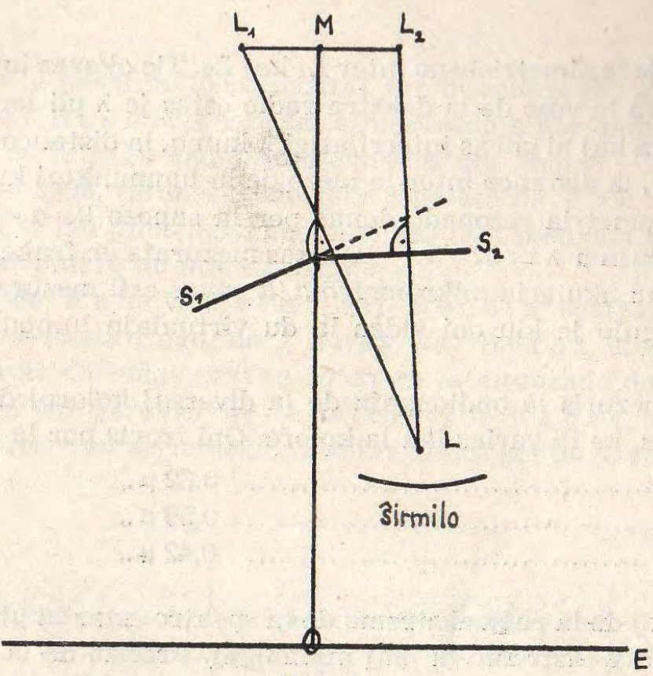
[bildo 4]: bildo 4

_Fresnel_ atingis tion en la jaro 1816 jene: La radioj de la lumpunkto $L$
[bildo 4] trafas la du spegulojn $S_1$ kaj $S_2$, kiuj formas tre malakutan angulon. Tial la distanco inter la du de ili faritaj virtualaj bildoj
$L_1$ kaj $L_2$ konstruitaj en la figuro simetrie al la ebenoj de la speguloj estas tre eta. Ĝi nuliĝus se la speguloj estus en unu ebeno. La
radioj estas reflektataj de la speguloj al la ekrano $E$, kiu estas protektata
per ŝirmilo kontraŭ la rektaj radioj de la reala lumpunkto $L$.
Nun oni vidas sur la ekrano $E$ la helajn kaj malhelajn franĝojn postulitajn
de la teorio kaj havas antaŭ la okuloj pruvon, ke lumo aldonita
al lumo povas doni mallumon, ke la ondeca teorio de la lumo estas
prava. Nun ni povas rezoni pri la lumpunktoj $L_1$ kaj $L_2$ kvazaŭ ili estus
realaj [bildo 5]. Ni konsideru la unuan helan franĝon en la distanco $D$
maldekstre de la simetriebeno inter $L_1$ kaj $L_2$. Tie okazas interfero de la
unua ordo. Do la vojo de la dekstra radio estas je $\lambda$ pli longa ol tiu de
la maldekstra kaj ni povas interrilatigi $\lambda$ kun $a$, la distanco inter La kaj $L_2$ kaj kun $h$, la distanco inter la mezo de la lumpunktoj kaj la ekrano.

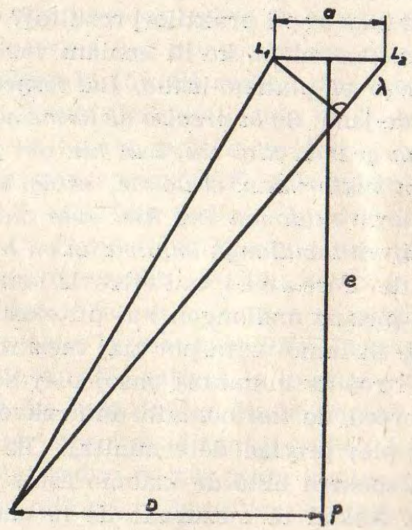
[bildo 5]: bildo 5

Simpla geometria rezonado donas per la supozo ke $a << h$ la proksimuman
rezulton $\lambda = aD/h$; $D$ estas mezurata en frakcioj de metro.
Per lorno kun okularia mikrometro $a/h$ povas esti mezurata en radianoj, kiel angulo je kiu oni vidas la du virtualajn lumpunktojn el la 
punkto $P$.

Tiel oni mezuris la ondlongojn de la diversaj koloroj de la spektro
kaj konstatis, ke ili varias laŭ la koloro. Oni trovis por la koloro

ruĝa: $\pu{0,62 \mu}
flava: $\pu{0,59 \mu}
viola: $\pu{0,42 \mu}

Do la ondoj de la ruĝa ekstremo de la spektro estas la plej longaj kaj
tiuj de la viola ekstremo la plej mallongaj. Precizo de la difino pri la
koloro mankis ĉe _Fresnel_. Pri la ruĝa koloro ekzemple li diris, ke
li uzis ruĝan vitron de antikva preĝejfenestro, kiu tralasis nur malmulte da flava lumo.

Tiu metodo de _Fresnel_ havas hodiaŭ nur historian signifon.
Tamen ni ekkonas el ĝi jenon principe gravan: Aŭ ni povas uzi la longon
de metro por mezuri la distancon $D$ de la franĝoj kaj kalkuli el ĝi
la ondolongon aŭ ni povas inverse uzi la ondlongon por determini la
longon de nia metra prototipo en ondlongoj. Ni devas do scii, kiom da
ondlongoj de difinita koloro ĝi enhavas.

Kiu procedo kondukas al pli praktikaj rezultoj? Pri la ondlongoj de
la lumo ni havas la konvinkon, ke ili neniam varios kompare kun la
longo de metalstango el plateno-iridio. La respondo al la starigita
demando dependas de jeno: *Se la precizo de la mezurado de la ondlongo
estas almenaŭ same granda kiel tiu, kun kiu oni povas reprodukti la
eventuale detruitan materialan etalonon, estas konsilinde preni iun
lumondon kiel naturan etalonon kaj kiel eble plej precize mezuri la
nombron de bone difinita ondlongo enhavatan en la metra prototipo.*

Post la esploroj de _Fresnel_ oni eltrovis iom post iom pli precizajn
metodojn por mezuri ondlongon kaj pli ekzaktajn metodojn por
difini la koloron de la lumo uzita por tiaj mezuroj. Oni rimarkis, ke
la linioj en la spektroj de lumantaj gasoj plej bone respondas al la
postulo de unukoloreco, de tiel nomata unufrekvenceco, kaj trovis la
liniojn, kiuj estas plej precize determinitaj. Ĝis antaŭ nelonge oni
opiniis, ke la ruĝa spektra linio de kadmio estas la plej neta t. e. la
plej unufrekvenca. Ankaŭ la mezurado de la ondlongoj fariĝis post
la unuaj eksperimentoj de _Fresnel_ ĉiam pli ekzakta pro la pliperfektigo
de la mezurmetodoj bazitaj sur interfero kaj en 1893 
_Michelson_ kaj _Benoît_[^1] jam faris mezuradojn por determini, kiom
da lumondoj de la ruĝa kadmilinio enhavas unu metro.

Pli poste, en 1906, tiu mezurado estis ripetata de _Fabry_, _Pérot_
kaj _Benoît_[^2] laŭ plibonigita metodo, kaj tiun metodon publikigitan
en 280-paĝa memuaro mi nun skizos por vi.

[^1] *Travaux et Mémoires du Bureau International des Poids et Mesures* t. XI (1894).

[^2] Samloke t. XV (1913).

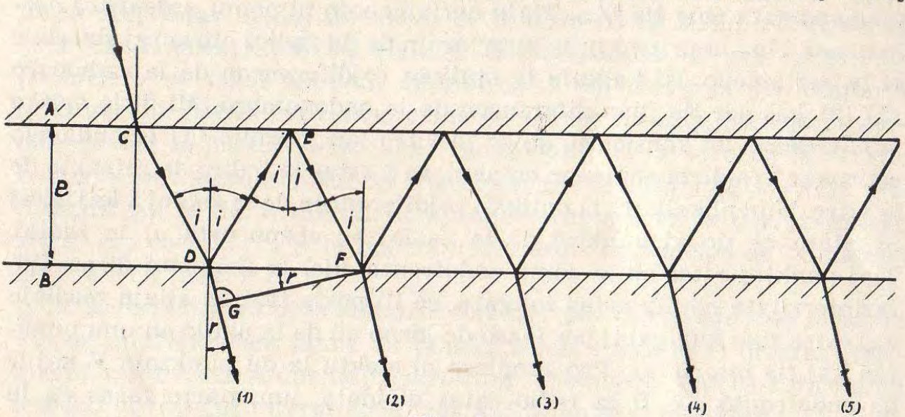
[bildo 6]: bildo 6

La metodo de _Fabry_, _Pérot_ kaj _Benoît_ baziĝas sur interferofenomeno
nomata ringoj de _Fabry_ kaj _Pérot_, kiun mi devas
antaŭe priparoli. Ĝi ludas gravan rolon en la mezurado de longoj per
interfero, en la interferometrio. Ĉe tiaj ringoj de _Fabry_ kaj _Pérot_
temas pri interfero en aerlameno. Ĝi estas limita per du paralelaj vitraj
platoj [bildo 6] $A$, $B$. La vitro estas haĉita en la figuro. La ekstera parto
de la du platoj, ne interesa por nia problemo, mankas en la figuro.
Ni supozu unufrekvencan lumon. Se radio pasas tra la supra plato ĉe
$C$ en la aerlamenon, ĝi estas parte ellasata ĉe $D$ en la suban platon,
parte reflektata. Tiu reflektata radio estas denove parte reflektata ĉe
$E$ de la supra plato kaj eliras poste ĉe $F$ en la suban platon. Tiel eliras
el la aerlamenoj ĉe $D$ kaj $F$ du radioj, (1) kaj (2), kiuj havas optikan
vojdiferencon. Ĉe $F$ ripetiĝas la sama ludo per reflekto en la
aerlamenon kaj estiĝas tria radio (3), kiu havas je la dua la saman
vojdiferencon, kie la dua je la unua, ĉar pro geometriaj kaŭzoj la dua
triangulo estas kongrua kun la triangulo $DEF$. La post la dua triangulo
en la lamenon reflektata radio estigas la kvaran (4) el la aerlameno
elirantan radion k.t.p. La ludo daŭras ĝis la fino de la lameno kun la
sama vojdiferenco inter sinsekve elirantaj radioj. La kunagado de la
tuta garbo da paralelaj radioj ĉe ĝia posta kunigo per optika
instrumento en unu punkton plifortigas la efikon, kiu estus nur malforta ĉe
unu radioparo. Sed la sekvantaj radioj iĝas ĉiam pli malfortaj, ĉar nur
parto de la lumo falanta sur vitran platon estas reflektata, ĉe vitra
surfaco eble nur 1/20. Do eĉ radio post la dua reflekto malfortigita
ĝis 1/400 ne plu estus konsiderinda. Por la sekvantaj eksperimentoj
gravas, ke kiel eble plej granda parto de la radiaĵo alfalanta sur la
vitrajn limojn de la aerlameno estu reflektata, por ke la radioj elirantaj
sinsekve el la aerlameno ne fariĝu tro malfortaj. Tial oni kovras la
facojn de la vitraj platoj limantajn la aerlamenon per tre maldika
tavolo el arĝento, tiel maldika, ke ĝi estas ankoraŭ travidebla. Per
tia arĝenta tavolo la trapasantaj radioj estas ja malfortigataj, sed
la partumo de radioj reflektata de la arĝentitaj vitraj facoj estas
pligrandigata eble ĝis 8/10. Tiajn aerlamenojn ni nomu *arĝentitaj
aerlamenoj*. Nun ni pritraktu la interferojn de du radioj elirantaj sinsekve
el la aerlameno. Ni kalkulu la optikan vojdiferencon de la radioparo
(1) (2) kaj per tio ilian diferencon de la ondonombro. Mi diris *optika
vojdiferenco*. Ni konsideru, ke en la vitro laŭ formulo [formulo 1] la ondlongo
estas nur $\lambda/n$ de la ondlongo en aero, se $n$ estas la indico de refrakto de
la vitro. Nun ni kalkulu la optikan vojdiferencon de la radioj 1 kaj 2 kaj
ni rilatu ĉe tio al punktoj de la radioj en ebeno orta al la radioj.
Tiaj punktoj estas en la sama ondofronto, kiel la fizikistoj diras. Ilia
fazinterrilato ne plu estas ŝanĝata, se ili poste trairas aliajn mediojn
kaj estas fine kunigataj per lenso de lorno aŭ de la okulo en unu punkton
kaj tie interferas. Pro simpleco ni elektu la du punktojn $F$ kaj $G$
de ondofronto. Ĉe $D$ la radio estas dividata, unu parto faras en la
aero la vojon $\overline{DEF}$, la alia en la vitro kun la refrakta indico $n$ la vojon $\overline{DG}$. Ĉar la punktoj $F$ kaj $G$ estas en la sama ondofronto ilia fazdiferenco $\Delta$ determinas la postajn interferojn.

Oni ekkonas el [bildo 6] per la donitaj klarigoj, ke

$$\Delta = \overline{DEF} - n\overline{DG}$$

(ĉar la rapideco de la radio en la aero egalas $n x$ tiun en la vitro).

Enkondukante $i$, la angulon de alfalo de la radio en la aerlameno sur
la suban vitran platon, kaj $r$, ĝian angulon de refrakto en la vitro, kaj
$e$, la dikon de la aerlameno, oni ricevas per facila kalkulo [^3] komprenebla
el la [bildo 6]

[formulo 2]: $$\Delta = 2e cos{i}$$

[^3]: $\overline{DEF} = 2e / \cos i $; 
$n = {\sin i} / {\sin r}$, do $n \sin r = \sin i$;
$\overline{DF} = 2e \tg i = 2e \sin i / \cos i$;
$n \overline{DG} = n \overline{DF} \sin r = \overline{DF} \sin i= 2e \sin^2 i / \cos i$; Do $\Delta = \overline{DEF} - n$. $\overline{DG} = 2e (1 - \sin^2 i) / \cos i = 2e \cos^2 i / \cos i = 2e \cos i$.

Ni supozu nun, ke en tiun aerlamenon enfalas lumo el ĉiuj direktoj
kaj ni observu ĉe la alia flanko la elirantan lumon per lorno ĝustigita
por la senfino, kies akso estu orta al la ebeno de la lameno. Per tiu
lorno paralelaj radioj estas kunigataj en unu punkto de la fokusa
ebeno. Al ĉiu direkto de paralela garbo respondas do unu tia punkto.
Kie $i$ havas valoron tian ke $\Delta = m\lambda$, ni vidas helon; $m$ ĉie en ĉi tiu
traktaĵo signifas entjeron. Pro geometriaj kaŭzoj la radio, kiu faras
en la aerlameno kun ĝia orto[^4] la angulon $i$, faras ankaŭ tiun angulon
kun la akso de la lorno, ĉar la vitraj platoj limantaj la aerlamenon
estas ebenaj kaj paralelaj. Ĉar $e$ ne varias, dependas nur de $i$, ĉu la
punkto en la bildo estas hela. Al egalaj anguloj kun la akso de la
lorno respondas egalaj distancoj el la akso de la lorno. Ni vidos do
aron da samcentraj helaj cirkloj. Ĉiu respondas al unu valoro de
la entjero $m$. Ĝian angulan diametron $\delta$ oni mezuras per okularia
mikrometro. Sekve ĝia duono estas la angulo inter la orto je la aerlameno
kaj la paralelgarbo kiu, transpasonte el la aero en la vitron,
trafas la supran platon sub la angulo de alfalo $i$. Do $\delta/2 = i$ 
(Ĉio pritraktita laŭ la [bildo 6] valoras kompreneble ne nur en la desegnoebeno,
sed en ĉiu ebeno orta je la lameno). Tio estas la principo de la metodo
de _Fabry_ kaj _Pérot_.

[^4]: orto = ortanto = perpendiklo.

Ĉio pritraktita valoras kompreneble nur por la radiaĵo kun la sama
$\lambda$, por unufrekvenca lumo. Ĉe blanka lumo, miksaĵo el diversaj
ondlongoj, oni tute ne vidus la priparolitan fenomenon. Ĉar ĉe sufiĉe dika
lameno la franĝoj interproksimiĝas kaj la koloroj miksiĝas.

_Fabry_, _Pérot_ kaj _Benoît_ uzis nun la cirklajn franĝojn estigitajn
per la lumo de la ruĝa kadmilinio por mezuri, kiom da ondlongoj
aerlameno estas dika, alivorte, kiom da ondlongoj enhavas ĝia orto
inter la arĝentspeguloj. Ni volas nun adepti la [formulon 2] al 
praktikaj celoj per proksimumigo.

Konsiderante, ke $i$ estas eta, kaj uzante la proksimumigajn formulojn

[formulo 3]: $$\cos x = 1 - x^2/2$$ kaj $$1/(1 +- x) = 1 +- x$$

ni ricevas, enkondukante fine $\delta$, la angulan diametron de la ringoj,

$$m\lambda = 2e \cos i = 2e (1 — i^2/2) = 2e - ei^2 = 2e - \delta^2/4$$

Laŭ tiu formulo do ĉe grandaj ringoj la ordo de la interfero estas
malpli granda. Parenteze dirate: Tio estas kontraŭa al tio, kion oni
observas ĉe la jam pli frue ekkonitaj ringoj de _Newton_.

Ni rigardu, kion oni observas en la akso de la lorno, do ĉe $\delta = 0$. Laŭ
la lasta formulo 

$$ 2e = m\lambda ; e=m\lambda/2 $$

Se $e$ egalas precize entjeran nombron da duonondoj, ni vidas helan
punkton en la centro kaj la unua ringo respondas al interferordo
$(m — 1)$. Sed tio estus nur hazardo, ke la diko de la aerlameno estas
entjera multoblo de $\lambda/2$. Ĝenerale ne estas en la centro, ĉe $\delta = 0$, hela
punkto, kaj oni devos mezuri $\delta$, la diametron de la unua ringo. Ĝi donas
la frakcion de ondlongo, je kiu la en $\lambda$ mezurita duobla diko $P$ superas
$N$, la entjeran nombron da ondoj respondantan al tiu ringo. Jen la
esenco de la interferometria metodo de _Fabry_ kaj _Pérot_.

Ni nun kalkulu $P$, la ordon de la interferoj en direkto orta al la aerlameno,
se ĝi ne estas entjero. Memkompreneble $P\lambda = 2e$ kaj tial
$P = 2e/\lambda$. Se ni konas $N$, la ordon de interfero de la unua ringo, ni
scias, ke $N = (2e/\lambda) \cos i$ kaj tial per enkonduko de la kalkulenda $P$ sekvas $N = (2e/\lambda) \cos i = P \cos i$ kaj el tio $P = N/\cos i$. Per apliko de la [formuloj 3] kaj enkondukante $i = \delta/2$, ni ricevas fine 
$P = N +N\delta^2/8$.

La dua termo estas la frakcio de la ondlongo, se $\delta$ rilatas al la unua
ringo.

Por koni $P$ necesas koni la entjeran nombron $N$, la ordon de la unua
ringo. Al ĝi oni aldonas la frakcion, per kiu diferenciĝas la en $\lambda$
mezurita diko de la aerlameno je $N$, la ordo de la unua ringo. Se temas pri
dikoj de kelkaj centimetroj, tiu nombro sumiĝas je kelkaj centmiloj.
La tri fizikistoj ne nombris ĝin pligrandigante la dikon de la lameno de
nul ĝis ĝia definitiva valoro, sed ili uzis metodon ion similan al la
verniero[^5]. Ili uzis samtempe krom la ruĝa kadmilinio ankaŭ aliajn liniojn
kun konata ondlongo, kiuj donas ankaŭ ringojn konforme al sia ondlongo.
Ili estas distingeblaj per sia koloro de la ruĝaj ringoj kaj koincidas
kelkfoje en la bildo prezentita en la lorno kun tiuj. Post difinita
nombro da ringoj, post periodo kalkulebla el la konataj ondlongoj, tiu
koincido ripetiĝas. Tiu periodo estas multe pli longa ol unu ondlongo
de ruĝa kadmilinio kaj respondas jam al longo konstatebla per la
ordinaraj mezurmetodoj.

[^5]: _Verniero_ estas mallonga egalintervala skalo movebla laŭ longa
ankaŭ egalintervala skalo por ebligi ekzaktan legadon de n-onoj de
elementa intervalo de ĉi tiu skalo. La longo de la helpskala intervalo
egalas al (n — 1) n-onoj de la ĉefskala intervalo. (A, F; _Vernier_; G.
_Nonius_).

Oni do determinas $P$, se oni jam scias la entjeran parton de la
nombro de la ondoj kaj poste aldonas la duan termon de la formulo, la
frakcion de ondolongo de la ruĝa kadmilinio.

Tiel la aŭtoroj povis mezuri la dikon de aerlameno kun precizo de
ĉ. 1/10 de ondlongo de la ruĝa kadmilinio, do kun precizo de $\pu{0,06 \mu}$ . Se
oni povus apliki tiun metodon al aerlameno dika unu metron, ni povus
difini la metron kun precizo pli granda ol $10^{-7}$! Tion ili ankaŭ volonte
estus farintaj, sed bedaŭrinde tio ne eblas. Ĉar radioj kun tiom granda
vojdiferenco (2 m) ne plu interferas, parte ĉar eĉ la ruĝa kadmilinio
ne estas sufiĉe unufrekvenca — ĝi ankaŭ havas sian larĝon —, parte ĉar
unu unuopa lumelsenda „vibrado” havas nur treege etan daŭron, al kiu
respondas unuopa ondaro laŭradie malpli longa ol du metrojn.

La aŭtoroj povis mezuri per la priskribita interfermetodo, la ringoj
de _Fabry_ kaj _Pérot_, aerlamenon dikan nur ĉirkaŭ 1/16 de metro
$~ \pu{6,25 cm}$ kaj uzis poste alian interfermetodon, la metodon de la
*supermetitaj franĝoj*, kiujn observis unuafoje _Brewster_ en 1826. Ĝi
ebligas ekzakte mezuri la dikon de duoble pli dika aerlameno, 1/8 m, kaj
poste denove la duoblon de tiu, 1/4 m, k.t.p. ĝis unu metro. Necesas do
kvar tiaj mezuroj.

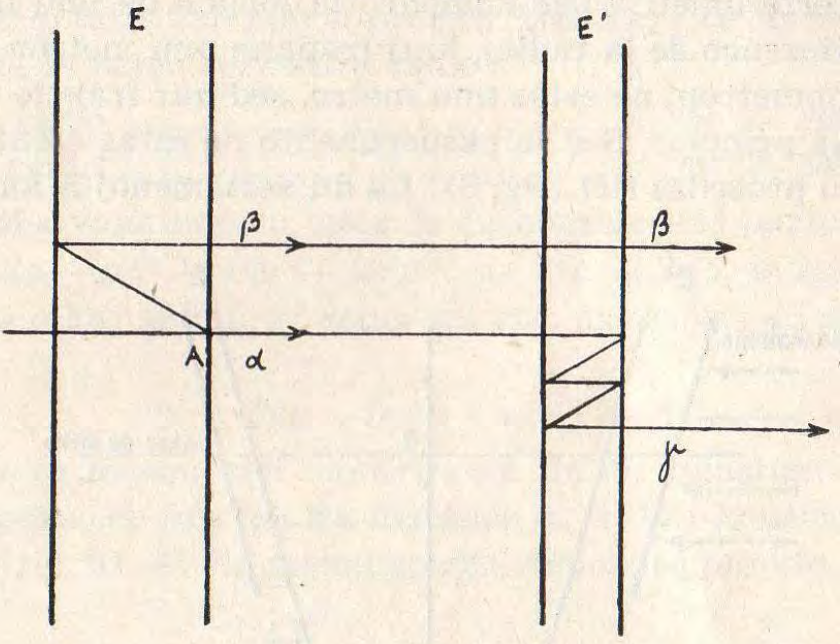
[bildo 7]: bildo 7

La principo de tiu mirinda metodo de la supermetitaj franĝoj estas
jena: Garbo da paralela lumo [bildo 7] falas orte sur arĝentitan aerlamenon
$E$. La vitro de la aerlamenoj en tiu kaj la sekvantaj figuroj ne
estas desegnita, ĉar ĝi ne estas esenca. Nur unu radio de la garbo estas
desegnita. Ĉe $A$ la radio disduiĝas, la parto $\alpha$ eliras el $E$, alia parto
estas dufoje reflektata kaj eniras poste kiel $\beta$ en alian paralelan
arĝentitan aerlamenon $E'$, kiun ĝi parte trapasas. La en $E$ ne reflektita
radio ankaŭ eniras $E'$ kaj estas en ĝi parte kvarfoje reflektata kaj eliras
poste ($\gamma$) en sia unua direkto. Por antaŭokuligi tion mi devis falsigi
la reflektan leĝon. Kompreneble $\beta$ kaj $\gamma$ koincidas kaj interferas,

Ni supozu ke $e'$, la diko de $E'$, estas ekzakte la duono de $e$, la diko de
$E$. Plue ni supozu, ke la alfalanta lumo estas unufrekvenca. Kiom estas
la optika vojdiferenco inter la radioj $\beta$ kaj $\gamma$? $\beta$ dufoje trapasas la
dikon de $E$ kaj $\gamma$ kvarfoje la dikon de $E/2$; la vojdiferenco estas do nul,
eĉ se la diko de tiu aerlameno estas unu metro! $\beta$ kaj $\gamma$ estas en la sama
fazo kaj plifortigas sin. Nun ni imagu, ke enfalas [bildo 7]] alia unufrekvenca radio
de alia ondlongo (koloro)! Validas la samo: plifortigo
de la tralasata lumo. Do ankaŭ la samo validas, se enfalas miksaĵo de
ĉiuj koloroj, blanka lumo. Ni ricevas plifortigon!

Se kontraŭe enfalas en $E$ unufrekvenca lumo de ondlongo $\lambda$ kaj $E'$
estas pli dika aŭ pli maldika je nur $\lambda/8$ ol la ekzakta valoro $e/2$,
$\beta$ kaj $\gamma$ ricevas fazdiferencon da $\lambda/2$ kaj neniigas sin. Se alfalas nun
sur $E$ blanka lumo, ĝi koloriĝas, ĉar mankas en la eliranta garbo la
koloro de $\lambda$ kaj la resto aperas en. komplementa koloro. Vi ekkonas,
kiel solviĝas nun la paradokso, kiun eble kelkaj el vi rimarkis: La lumradioj
kun vojdiferenco de du metroj ja ne plu interferas, sed tamen oni
mezuras interferometrie per komparo la longon de unu metro, ĉar la
optika vojdiferenco de la radioj, kiuj trapasis unu metron, je tiuj, kiuj
trapasis duonmetron, ne estas unu metro, sed nur frakcio de ondlongo.

Tio estis la principo. Sed la eksperimento ne estas efektivigebla tiamaniere.
Oni procedas tiel [bildo 8]: La du aerlamenoj $E$ kaj $E'$ ne estas
ekzakte paralelaj, sed faras inter si tre etan angulon, eble $2''$, (en la
desegno trograndigita), kiun ni nomu $\alpha$. La desegnebeno estas orta al
la aerlamenoj. Ilia simetriebeno tranĉas la desegnon en $OP$. Ĝia orto
estas la akso de lorno. La rilatumo de la dikoj de la du lamenoj ne
estu ekzakte unu je du, sed nur proksimume: $e' ~ e/2$. Ni konsideru
paralelgarbon, kiu faras kun la orto de $E$ angulon $\beta$ kaj kun la orto
de $E'$ angulon $\beta'$. Ni konsideru paralelgarbon, kiu alfalas sur $E$ kaj 
disduiĝas ĉe ĝia flanko $f$. Unu parto estu dufoje reflektata en $E$ kaj
transpasas $E'$ senreflekte, alia transpasas $E$ senreflekte kaj estas kvarfoje
reflektata en $E'$. Ni rezonu pri tiuj du partoj kiel pri du radioj kaj kalkulu
la optikan vojdiferencon inter ili jene: Ni kalkulu unue la vojdiferencon
inter la unua radio kaj radio kiu senreflekte transpasis ambaŭ
lamenojn, poste la vojdiferencon inter la dua radio kaj la en ambaŭ
ne reflektita. La diferenco inter tiuj ambaŭ vojdiferencoj estas la
vojdiferenco inter la du konsiderataj radioj.

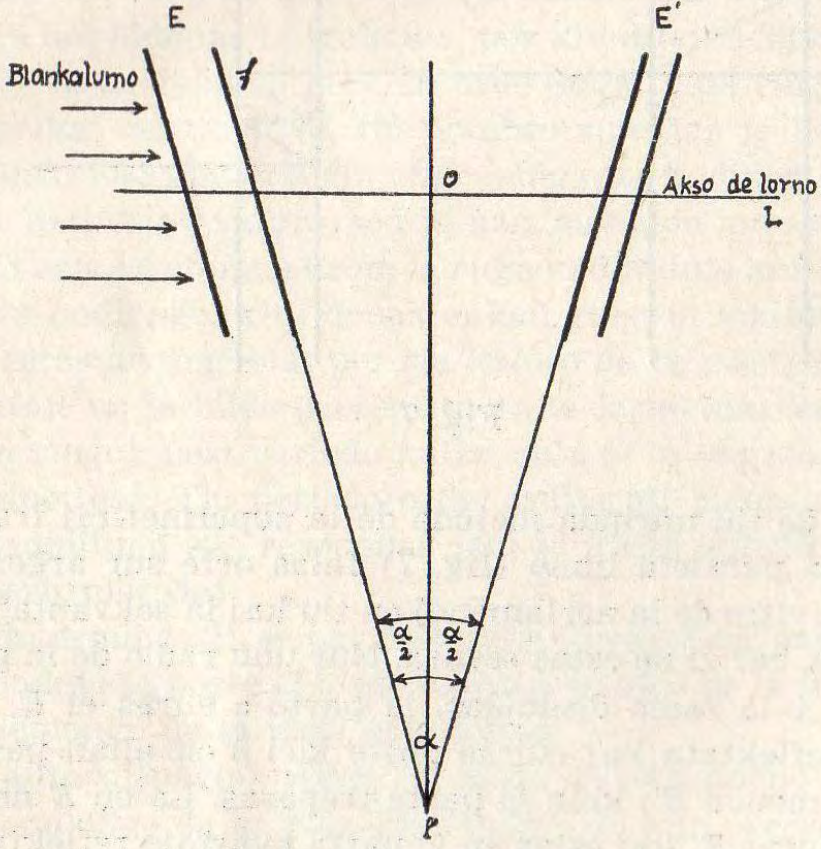
[bildo 8]: bildo 8

Ni uzas [formulo 2](formulon 2) kaj aplikas en ĝi por la kosinusoj de la anguloj
de alfalo $\beta$ kaj $\beta'$, ĉar ili estas etaj, la proksimumigajn formulojn (3)
analoge, kiel ni faris tion jam antaŭe (p. 129) kaj ricevas la optikan vojdiferencon je la nenie reflektita radio

por la unua radio: $2e - e\beta^2$  
por la dua radio: $4e' - 2e'\beta'^2$  

Do la optika vojdiferenco inter la du konsideritaj partoj de la radio
estas $\Delta = 2e - e\beta^2 - (4e' - 2e'\beta'^2) = 2(e - 2e') + 2e'\beta'^2 - e\beta^2$.

Ĉar $2e' ~ e$ kaj ankaŭ $\beta'$ estas tre eta, ni ricevas en sufiĉa proksimumigo 

[formulo 4]: $$\Delta = 2(e-2e') + e(\beta'^2 - \beta^2)$$

Ni nun metu lornon kiel montrite en [fig. 8], alĝustigu ĝin por senfino kaj supozu, ke ĝia fokusa distanco = 1, kaj konsideru, kion oni
vidas en ĝi [fig. 9]. Al ĉiu paralelgarbo respondas punkto en la fokusa
ebeno. La distanco inter du punktoj en la desegno respondas al la angulo
inter la koncernaj direktoj, mezurita en radianoj. Al la studita paralelgarbo respondu la punkto $P$. Al la akso de la lorno respondas la punkto
$O$, al la ortoj je $E$ resp. $E'$ respondas la punktoj $E$ resp. $E'$. Ni enmetu
karteziajn koordinatojn kun origino en $O$ kaj la $X$-akso tra $EE'$. Ni nun
kalkulu $(\beta'^2 - \beta^2)$ de la [formulo 4]. Ĉar $\oberline{EE'}$ estas la angulo $\alpha$ en [fig. 8] kaj $O$ duonigas tiun angulon kaj
$\overline{PE} = \beta, \overline{PE'} = \beta'$ ni ekkonas el
[fig. 9], ke

$$\beta'^2 = y^2 + (x + \alpha/2)^2$$  
$$\beta^2 = y^2 +  (x + \alpha/2)^2$$  

El tio sekvas

$$\beta'^2 - \beta^2 = 2\alpha x$$  

Enmetante tion en [formulo 4] ni ricevas por la optika vojdiferenco

[formulo 5]: $$\Delta = 2(e - 2e') + 2e \alpha x$$

kie $e$ kaj $e'$ estas la dikoj de la lamenoj kaj $x$ la absciso de la koncerna
punkto $P$, determinita per la direkto de la paralelgarbo.

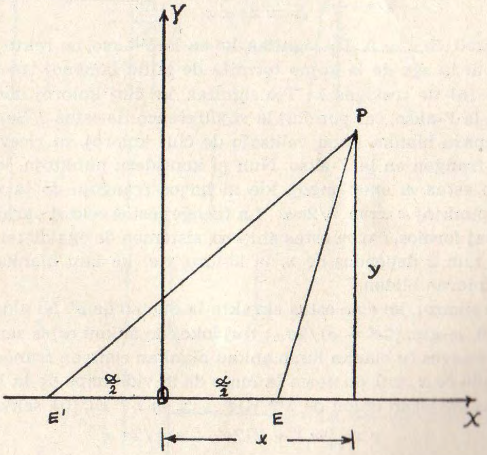
[bildo 9]: bildo 9

Ni vidas el [formulo 5], ke $\Delta$ estas sendependa de $y$. Al egala $x$ respondas
egala vojdiferenco. Radioj kun egala vojdiferenco faras bildon en paralelo al $y$.

Unue ni supozu, ke la rilatumo de la dikoj de la lamenoj estas ekzakte unu je du, ke do $e = 2e'$. Tiam laŭ [formulo 5] fariĝas

[formulo 6]: $$\Delta = ee \alpha x$$

Do $\Delta = 0$,ĉe $x = 0$. Tio signifas, ke en la $Y$-akso, en rekto vertikala
paralela al la eĝo de la kojno formita de la du lamenoj troviĝas hela
strio. En [formulo 6] ne troviĝas $\lambda$. Tio signifas, ke ĉiuj koloroj donas helan
strion en la $Y$-akso, ĉar por ĉiuj la vojdiferenco tie estas 0. Se alfalas al
la lamenparo blanka lumo, miksaĵo de ĉiuj koloroj, ni ricevos ankaŭ
blankan franĝon en la $Y$-akso. Nun ni konsideru punktojn, kie la vojdiferenco estas $m$ ondolongoj, kie ni havos franĝojn de la $m$-a ordo.
Por tiaj punktoj $x = m \lambda/2e \alpha$. La franĝoj estos rektoj paralelaj al la
$Y$-akso kaj formos, ĉar $m$ estas entjero, sistemon de egaldistancaj franĝoj. Sed nun $x$ dependas de $\lambda$, la koloro, tiel ke kun blanka lumo ni
ricevos koloran bildon.

Due ni supozu, ke $e$ ne estas ekzakte la duoblo de $e'$. Ni vidas, ke laŭ
[formulo 5] $\Delta=0$, se $x = (2e' - e)/2e\alpha$; tiuj lokoj do ankaŭ estas sendependaj
de $\lambda$. Ni ricevos ĉe blanka lumo ankaŭ blankan centran franĝon, sed ne
kiel antaŭe ĉe $x = 0$, do ne en la mezo de la vidkampo de la lorno. Kie
ni ricevas entjeran oblon de $\lambda$? Kie $\Delta=m\lambda$? El [formulo 5] sekvas

$$x = {m\lambda + 2(2e'-e)}/2e \alpha$$

Do la distanco inter la franĝoj estas kiel antaŭe $\lambda/2e\alpha$ kaj ni same
ricevas ĉe la flankaj franĝoj koloran bildon. La tuta bildo en la lorno
estas forŝovita laŭ la grando de la diferenco $2e' - e$.

Sed por praktike uzi tiun metodon la dikecoj de la komparendaj
aerlamenoj devus esti tre precize ĝustigataj, por ke estu la diferenco
$(2e' — e)$ tre eta, tiel ke ĉe $m = O$, do ĉe la centra franĝo, $x$ estu tiel
eta, ke ĝi restu ankoraŭ en la tre limigita vidkampo de la lorno. Ĉar
tia ekzakteco de la ĝustigado maleblas, la aŭtoroj uzis jenan artifikon. Ili faris unu lamenon intence pli maldika, tiel ke ili devis ankoraŭ
aldoni trian aerlamenon de variigebla diko por ricevi kompenson
[fig. 10]. Ili uzis kojnforman travideble arĝentitan aerlamenon — en la desegno la angulo de la kojno kaj ĝia diko estas trograndigitaj —, kiun
oni povis ŝovi laŭ la ebeno de unu ĝia edro. Se venas la kompensanta
diko en la lumfaskon, oni vidas la blankan franĝon. Tiu aerlameno havis
skalon sur la arĝenta tavolo, tiel ke al ĉiu streko de la skalo respondis
konata diko. Ĝi estis interferometrie etalonita en unufrekvenca orte
alfalanta lumo. Ni supozu, ke en [fig. 10] la 1/8-metra lameno estas iomete
tro maldika. La radio, kiu post dufoja reflekto trapasas nereflektate
la 1/16-metran lamenon estas poste en la kojnforma lameno parte dufoje reflektata kaj la
mankanta diko de la 1/8-metra lameno estas aldonata per la kompensa kojno. En [fig. 10] la leĝoj de la reflekto denove
devis esti neglektataj por antaŭokuligo. Tiel oni nun konas la dikon de
la 1/8-metra aerlameno kun precizo de dekono de mikrono. Anstataŭigante poste la 1/16-metran lamenon per 1/4-metra oni ricevas ties dikon
per analoga mezurado per la kompensa kojno. Poste oni anstataŭigas la
1/8-metran lamenon per 1/2-metra, kiun fine oni komparas kun la 1-metra
lameno, uzante, kiel antaŭe, la kompensan kojnon. Oni ricevas do
la longon de la 1-metra aerlameno en ondlongoj de la ruĝa kadmilinio,
ĉar tiun oni uzis por mezuri la lamenon 1/16-metran.

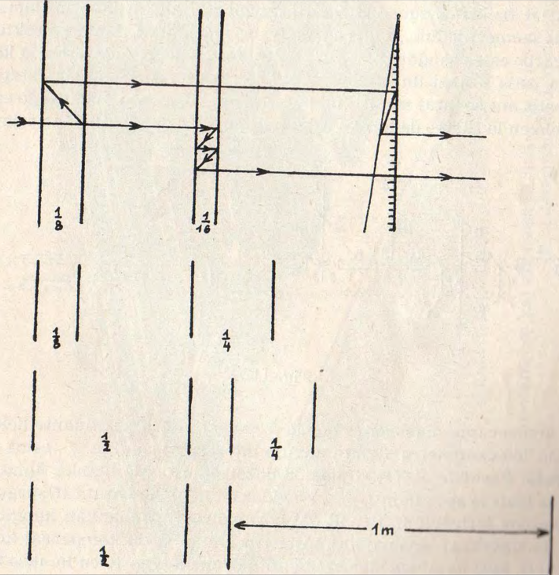
[fig. 10]: fig. 10

Tamen oni ne povas fari en la praktiko tiajn mezurojn en maniero
kiel la [fig. 10] sugestas, nome forigante kaj enigante aerlamenojn en
senmovan lumgarbon. Ĉar pro la grandega precizo de la mezurmetodoj
ĉia translokado de la aerlamenoj jam rimarkeble ŝanĝus ilian longon.
Ĉi tie temas ja pri dekonoj de mikrono!

La tri fizikistoj sukcesis trovi aranĝon, ĉe kiu la kvin aerlamenoj
restas senmovaj, dum la interferometriaj mezuradoj, dum la direkto de
lumgarbo estas ŝanĝata per enmeto kaj forigo de speguloj. Por la kompenso
estis uzataj du etalonitaj kojnoj, kiuj restis sur siaj stativoj
kaj estis nur ŝovataj sur ĝi, kiom postulis la kompenso. La aranĝo estas
videbla en la skemo de [fig. 11]. En unu linio $XY$ estas lokitaj la aerlamenoj
komencante maldekstre per la 6,25-centimetra kaj finante dekstre
per la 100-centimetra. La eta angulo inter la lamenoj, ĉ. 2”, estas neglektata.
Paralele al $XY$ alfalas de dekstre garbo da blanka lumo, kiu
povas trafi la spegulojn 1, 4, 7. Ni vidas en la plano entute 16 spegulojn
laŭbezone forigeblajn. Per ili oni povas direkti la blankan lumgarbon
tra du sinsekvaj lamenoj kaj poste tra unu el la du kompensaj kojnoj
$F$ kaj $G$. kiuj ne situas kiel en nia antaŭa skemo [fig. 10] en la akso de la
lamenoj.

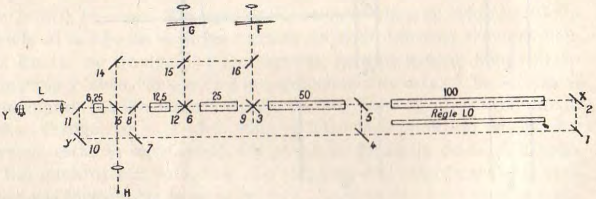
[fig. 11]: fig. 11

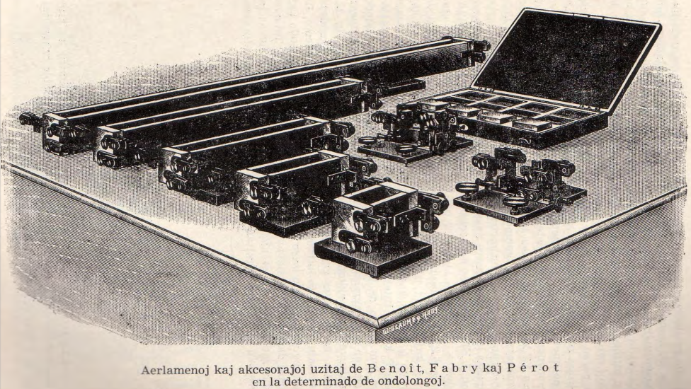
[fig. 12]: Aerlamenoj kaj akcesoraĵoj uzitaj de _Benoît_, _Fabry_ kaj _Pérot_ en la determinado de ondolongoj.

Mi nun priskribos la mezuradon, sed procedos en inversa ordo kiel
antaŭe. Mi komencos per la komparo de la 100-centimetra lameno kun
la 50-centimetra. En la praktiko oni tramezuris en ambaŭ ordoj, oni
ripetis tuj la mezurojn en inversa ordo por tiel ankaŭ kontroli, ĉu ne
pro iu influo kreskanta kun la tempo, ekzemple temperaturŝanĝiĝo, la
rezultoj estis influataj.

La garbo de la blanka lumo falas sur spegulon $1$ kaj estas poste
reflektata per $2$ laŭ la akso de la aerlamenoj. Ĝi trapasas la lamenojn
100-centimetran kaj 50-centimetran kaj estas poste reflektata per $3$ en
la kompensan lamenon $F$. Poste oni direktas la lumon per $4$ kaj $5$ laŭ
la akso $XY$ kaj igas ĝin trapasi la 50-centimetran kaj la 25-centimetran
aerlamenojn kaj per $6$ la kompensan kojnon $G$. Por kompari la
12,5-centimetran kun la 25-centimetra lameno oni uzas $7$ kaj $8$. La garbo
transpasas ilin de maldekstre dekstren kaj atingas per $9$ la kompensan
kojnon $F$. Fine la lameno 6,25-centimetra estas komparata kun la
12,5-centimetra. Uzante $10$, $11$ kaj $12$ oni kompensas per $G$.
Poste oni etalonas la 6,25-centimetran aerlamenon per la metodo de la ringoj de
_Fabry_ kaj _Pérot_ uzante la kadmian lampon $H$, la spegulon $13$ kaj
la lornon $L$. Per la kadmia lampo oni ankaŭ etalonas la kompensajn
kojnojn $F$ kaj $G$. Intertempe oni komparis la 100-centimetran
aerlamenon kun kopio de la metra prototipo per komparilo laŭ metodo
klarigita en mia Zagreba prelego[^6]. Kiel oni faras tion ĉe la aerlameno
100-centimetra, oni ekkonas se oni rigardas la aerlamenojn en [fig. 12].
Oni vidas, ke ili havas grandan longon kaj relative tre malgrandajn
transversajn dimensiojn kaj ne tute konvene estas nomataj lamenoj. Ili
estas stangoj el la alojo *invar* (konsistanta el 100 partoj da nikelo kaj
36 partoj da ŝtalo), kiu havas tre etan koeficienton de dilato. Interne
ili estas malplenaj por ebligi la trapason de la lumo, kaj havas la
transversan profilon desegnitan en [fig. 13], la tiel nomitan U-formon.

[^6]: Sc. R. 7 134/135,

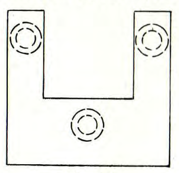
[fig. 13]: fig. 13

Je la finaĵoj elstaras tri butonoj, en la figuro strekumitaj, al kiuj
estas alpremataj per risortoj dikaj vitraj platoj travideble arĝentitaj
sur la faco, kiu estas en kontakto kun la butonoj. Per zorga fajlado
de tiuj butonoj kaj streĉo de la risortoj oni povis reguligi la dikon
kaj paralelecon de la aerlamenoj. La kvin lamenoj estas bilditaj en
[fig. 12]. La plej dika, la 100-centimetra aerlameno devas, post sia
mezurado per lumondoj, esti komparata kun kopio de la metra prototipo
per la komparilo[^6]. Notinde estas, ke oni mezuris interferometrie la
distancon inter la arĝentitaj facoj de la vitraj platoj limantaj la
lamenon. Oni ne povas mezuri la distancon inter la arĝentitaj facoj de la
vitraj platoj per komparilo. Ni imagu, ke tiuj staras kun vertikalaj
arĝentitaj facoj sub ĝiaj du mikroskopoj! Oni ankaŭ ne povas uzi por tiu
celo la eĝojn, kiujn faras la arĝentitaj facoj kun la pli mallarĝaj
horizontalaj facoj de la platoj, kvankam tiaj idealaj netaj eĝoj havus la
distancon de la arĝentitaj facoj. Tial oni faras sur tiuj mallarĝaj
horizontalaj facoj de la vitraj platoj mikroskope observeblajn strekojn
paralelajn al tiuj eĝoj en distanco de ili kiel eble plej eta. Tiu distanco estas
pr. 0,4 mm. La distanco inter tiuj du mikroskopaj strekoj estas sekve pr.
0,8 mm pli granda ol la distanco de la arĝentitaj facoj de la
100-centimetra aerlameno. Oni devis do korekti la per lumondoj mezuritan
distancon de la arĝentitaj vitraj facoj per aldono de tiu longo de pr. 0,8 mm,
kiu devis esti mezurata kun simila precizo kiel la diko de la
100-centimetra aerlameno. La priskribo de tiu detalo bezonas en la citita
memuaro dek paĝojn. Malgraŭ ĉiaj antaŭzorgoj la relativa ekarto de tiu
korekto estas pli ol la duoblo de la relativa ekarto en la interferometria
mezurado de la tuta aerlameno.

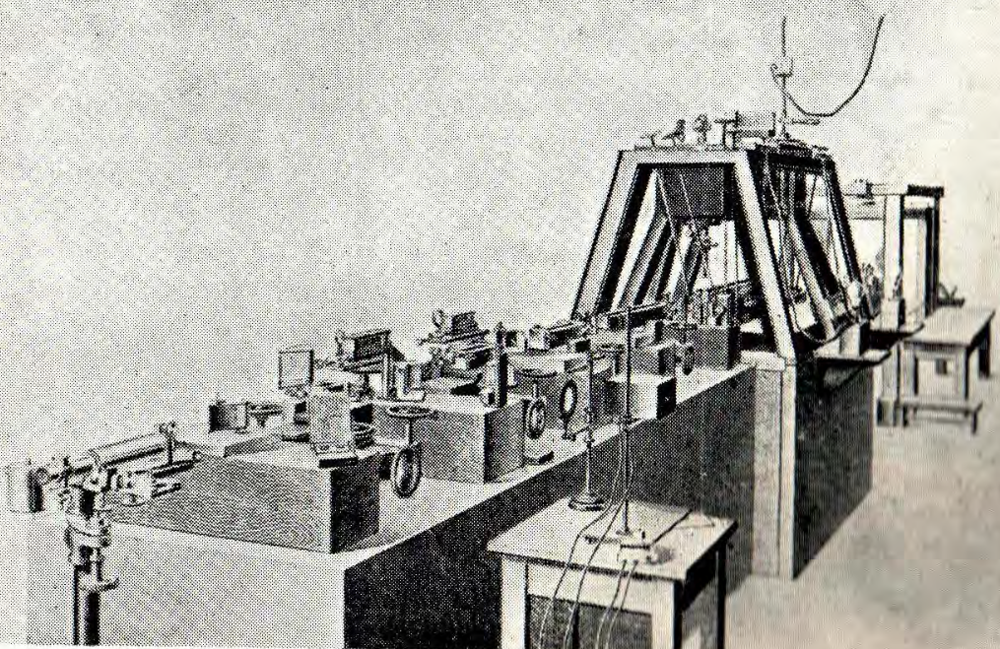
[fig. 14]: fig. 14

[fig. 14] montras perspektivan bildon de la aparato, kies skemon donas
[fig. 11]. Ĉiuj aerlamenoj estas muntitaj. La 100-centimetra estas sub la
komparilo. Je la fino de la akso oni vidas la lornon uzitan por etalonado
de la 6,25-centimetra lameno per la kadmia lampo, kiu staras antaŭ
la stablo sur aparta tableto.

La rezulto de la multjara laboro de la tri fizikistoj estas[^7] ke 1 m =
1 553 163,95 ondolongoj de la ruĝa kadmilinio.

[^7]: La nombro donita en la memuaro devis poste esti malpliigata per
0,18, ĉar oni konstatis post la publikigo ŝanĝon en la uzita kopio de la
metro. Tiu ŝanĝita nombro estas uzata ĉi tie kaj en la sekvanta tabelo.

Tio rilatas al la lumondoj en tiel nomata normala aero, t.e. seka aero
ĉe premo de 760 mm da hidrargo je la temperaturo de 15°C. Tiujn tri
grandojn necesas aldoni, ĉar la indico de refrakto de la aero dependas
de ili kaj la ondlongo dependas de la indico de refrakto laŭ formulo (1).
Tial tiujn tri grandojn oni zorge kontrolis dum la mezuradoj, kaj la
rezultojn reduktis al la normala valoro per konataj formuloj.

La antaŭa mezurado de _Michelson_ kaj _Benoît_ (p. 127) donis
post redukto al normala aero

$$\pu{1m} = 1553164,25 \lambda_R$$

Kun tiu nombro ĝi eniras la tabelon I pri la diversaj samcelaj
esploroj[^8] eke de la jaro 1892 ĝis la plej novaj mezuradoj en 1940. Tiu
periodo do ampleksas preskaŭ 50 jarojn. En la tria kolono estas ankaŭ
donita la mezvaloro de ĉiuj 9 apartaj determinoj de tiu nombro. En la
kvara kolono troviĝas la absoluta valoro de la ekartoj el la mezvaloro.
La mezvaloro de tiuj ekartoj, 0,24 multobligita per la ondlongo de la
kadmia linio, 0,644 $\mu$, donas 0,155 $\mu$, la necertecon de aparta observo.
Ĝi estas inter la limoj de necerteco ĉe la komparo de la metroprototipoj
kun strekoj.

[^8]: *Communications from the National Physical Laboratory* 1946,
p. 168.

Malgraŭ tiu granda precizo de la ĝisnunaj mezuroj la ondlongo de la
ruĝa kadmilinio ne povas esti deklarata kiel estonta lumetalono, ĉar
estas espero, ke oni faros estonte la spektroskopiajn mezurojn ankoraŭ
pli precize. En tiu senco faris lastan aŭtunon internacia komisiono
de plej kompetentaj fakuloj, la „*Commission Consultative pour la
Définition. du Mètre*” (La Konsilanta Komisiono por la Difino de la Metro)
jenajn proponojn: Ĉar la baza longunuo en formo de etalono el
plateno-iridio ne kontentigas modernajn postulojn, oni konsideru novan difinon
de la metro bazendan sur la longon de lumondo, kiu restas senŝanĝa
kaj estas nedetruebla. Estu uzata la ondlongo en la vakuo. Por
konservi kontinuecon oni uzu kiel perilon la valoron de la ondlongo
de la ruĝa kadmia linio kun la valoro fiksita de la Ĝenerala Konferenco
de Pezoj kaj Mezuroj en sia sepa kunveno, sed oni poste akceptu
valoron rilatantan al la vakuo. Tio estas grava por la spektroskopiistoj,
ĉar ili rilatigas siajn valorojn de ondlongoj al tiu de la ruĝa
kadmilinio kaj ne estos ĝenataj per la ŝanĝo de la difino de la metro.

Nun oni ekkonis, ke la ruĝa kadmilinio ne estas, kiel oni antaŭe
pensis, la plej bona, alivorte ĝia unufrekvenceco, kvankam granda,
tamen ne estas la plej granda. Laŭ la modernaj eltrovoj de la kemio
la naturaj elementoj, la elsendantoj de la spektraj linioj, estas miksaĵoj
el diversaj izotopoj. Oni uzos por spektroskopiaj celoj elementon
konsistantan el nur unu izotopo, kiun ni nomu monobara, uzante
neologismon enkondukitan de la eminenta fizikisto _Pérard_[^9] en la francan
lingvon.

[^9]: *Travaux et Mémoires du Bureau International des Polda et
Mesures, Tome XXI*, Paris 1952. *Les récents progrès du sustème métrique*,
p. 9

Amerikaj esploristoj preparis el oro izotopon de hidrargo $\ce{^{198}Hg}$ kaj
vi vidas en [fig. 15], ke la cirklaj franĝoj de la ringoj de _Fabry_ kaj
_Pérot_ por la verda linio de hidrargo estas ĉe la monobara hidrargo
(dekstre) pli netaj ol ĉe la miksaĵo de izotopoj, la natura hidrargo
(maldekstre). La amerikaj fizikistoj nun proponas tiun monobaran
hidrargon por la difino de la metro.

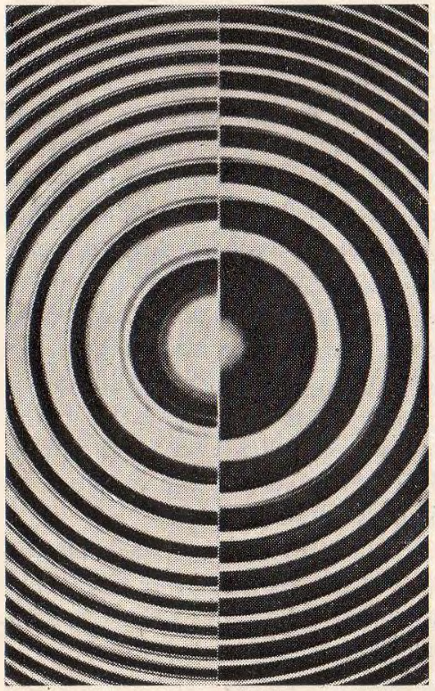
[fig. 15]: fig. 15

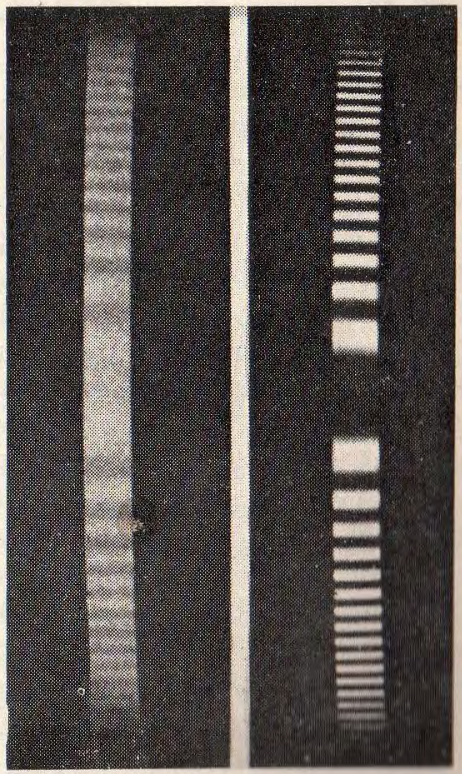
[fig. 16]: fig. 16

[fig. 16] montras al ni komparon de eltranĉaĵoj el la ringoj de _Fabry_
kaj _Pérot_ unuflanke ĉe la verda linio de monobara hidrargo kaj
aliflanke ĉe la ruĝa kadmilinio. Ankaŭ ĉi tie oni konstatas la pli grandan
netecon de la linioj de la monobara hidrargo. Tial la amerikaj fizikistoj
nun proponas ĝin por la difino de la metro.

Aliflanke germanaj fizikistoj disigis la du izotopojn en la natura
kriptono kun la atompezoj 84 kaj 86 kaj rekomendas $\ce{^{84}Kr}$ por
spektroskopiaj celoj.

Simile estas kun la kadmio, kiu konsistas el kvin izotopoj. Rusaj
sciencistoj nun rekomendas la uzon de $\ce{^{144}Cd}$.

La Konstanta Komisiono ankoraŭ ne prijuĝis tiujn proponojn, sed
rekomendas pluajn esplorojn en la ŝtataj laboratorioj kaj en la
Internacia Oficejo por Pezoj kaj Mezuroj.

Ni vidas en la proponoj de la Komisiono la socian saĝon, kiu tiel
ofte bonefikis en la historio de la metra sistemo. Oni estas ŝanĝanta
ĝian fundamenton, sed neniu el la ĉiutagaj aplikoj estas tuŝata. La
granda publiko eĉ ne rimarkos tiun principe gravan ŝanĝon, kiu donos
al la metra sistemo eternan fundamenton. Tiu propono de la
Komisiono estos pritraktata venontan aŭtunon de la Ĝenerala Konferenco.

Permesu kelkajn vortojn pri la historio de la ideo preni lumondon
kiel bazon de la metra sistemo, kiel naturan etalonon.

Kiel unua skribe proklamis tiun ideon la franca fizikisto
_Babinet_[^10] en memuaro publikigita en 1829 pri kradoj, interferaparatoj
inventitaj de _Fraunhofer_ kaj atentigis, ke oni povas kontroli la
longon de la metro per longo de lumondoj kun precizo de unu dumilono.
Karakteriza estas la rimarko, kiun aldonis la redaktoro de la gazeto,
la fama franca fizikisto _Arago_, al tiu memuaro. Li menciis, ke li
jam antaŭ kelka tempo proklamis tiun ideon en sciencista kunveno en
Parizo, sed ke ĝi vekis nenian interesiĝon, kio ne estas bedaŭrinda, ĉar
ĝi havas nenian realan utilon! Do unu el la plej famaj tiamaj fizikistoj
preskaŭ ridindigis antaŭ 125 jaroj la ideon nun efektivigotan!

Dek jarojn poste la germana astronomo _Lamont_ havis la saman
ideon[^11] kaj donis eĉ, por komprenigi ĝin, en provizora kalkulo la
nombron de la lumondoj de la natria D-linio en unu metro.

En la jaro 1864 la franca fizikisto _Fizeau_ evoluigis la metodon
mezuri longojn per lumondoj. Ĝi estas nun konata per la nomo
interferometrio kaj ludas jam gravan rolon en la tekniko. _Fizeau_ ankaŭ
ekkonis, ke oni havas en lumondo „naturan mikrometron”.

[^10]: *Ann. de chimie et de physique* \[2\] 40 (1829) 176.
[^11]: *Jahrbuch der Königlichen Sternwarte bei München für 1839*. p. 188.

## Tabelo I

 

|Jaro  | Observantoj | Nombro de ondlongoj | Ekarto el la mezvaloro |
|---   |---          |---|---|
|1892/3| Michelson kaj Benoît    | 1 553 164,25 |  (+) 0,10   |
|1905/6| Benoît, Fabry kaj Pérot | 1 553 163,95 |  (-) 0,20   |
|1927  | Watanabe                | 1 553 164,46 |  (+) 0,81   |
|1933  | Sears kaj Barell        | 1 553 163,71 |  (-) 0,44   |
|1935  | Sears kaj Barell        | 1 553 163,81 |  (-) 0,34   |
|1933  | Kösters                 | 1 553 164,29 |  (+) 0,14   |
|1935  | Kösters                 | 1 553 164,26 |  (+) O,11   |
|1937  | Kösters                 | 1 553 164,02 |  (-) 0,13   |
|1940  | Romanova                | 1 553 164,58 |  (+) 0,43   |
|---   |---          |---|---|
|      |Mezvaloro                | 1 553 164,15 |  (±) 0,24   |

Mezurado de la metro per ondlongoj de la ruĝa kadmilinio en aero
normala.

## Tabelo II

| Tempo | Persono |
|---    |---      |
|Antaŭ 1829 |_Arago_ atentigas en sciencista kunveno pri la ebleco uzi la longon de lumondo kiel etalonon.|
|1829 | _Babinet_ atentigas en memuaro pri la kradoj de _Fraunhofer_, ke oni povas kontroli la longon de la metro per la longo de lumondoj. |
|1839 | _Lamont_ komprenigas tiun ideon per kalkulado de la nombro de ondlongoj de la natria D-linio en unu metro.|
|1864 |_Fizeau_ evoluigas la interferometrion kaj vidas en la lumondo „naturan mikrometron”.|
|1870 |_Maxwell_ proponas la uzon de linio el la H-spektro kiel naturan etalonon.|
|1874 |_van der Willingen_ diskutas la eksperimentajn eblojn de la metodo, proponas la uzon de mezvaloro el la du natrilinioj kaj pridubas, ĉu la kradmetodo estos la plej bona. |
|1894 |_Michelson_ kaj _Beno^it_ komencas serion da sistemaj esploroj pri la ondlongo de la ruĝa kadmilinio kiel etalono.|

En 1870 la angla fizikisto _Maxwel_[^12] proponis la uzon de linio
de la hidrogena spektro.

Daŭrigante nian historian superrigardon ni venas al fama fizikisto,
kiu vivis kaj laboris ĉi tie en Harlemo, en nia kongresurbo, kiel
Direktoro de la Muzeo _Teyler_, kiu nin gastigas. Temas pri la nederlanda
fizikisto _van der Willingen_. En la Arkivoj de la _Teyler_-muzeo
por 1874 li publikigis per 1870 datitan memuaron[^13] : „*Sur les
mesures naturelles*” (Pri la naturaj mezuroj), en kiu li emfazis la
principon kaj jam tre detale pritraktis la eksperimentajn eblojn uzi la
ondlongon kiel senŝanĝan kontrolilon de la metro. Li konis jam la
duoblecon de la natria D-linio kaj proponas uzi la mezvaloron de la
ondlongoj por la mezuroj. Li rekomendas redukton de la ondlongoj al vakuo
por kio oni observu ĉe la mezuroj la premon, temperaturon kaj
malsekon de la aero, kaj diskutas mezuradojn per difraktaj kradoj de
_Fraunhofer_. Sed li mencias, ke li ne estas konvinkita, ke la
difraktaj kradoj estos la plej taŭgaj por tiu celo. Tiel klare antaŭvidis la
Harlema fizikisto la estontan evoluon kaj la Nederlanda Akademio de
Sciencoj akceptis favoran raporton pri tiu memuaro kaj antaŭdiris, ke
liaj ideoj povos konduki al kontrolo de la senŝanĝeco de la longunuo.

Kion antaŭvidis _v. d. Willingen_ realiĝis post 84 jaroj. Oni
estas nun konvinkita, ke la mezurado per difraktaj kradoj ne estas la
plej preciza, sed la metodo de la ringoj de _Fabry_ kaj _Pérot_,
kombinita kun la metodo de la supermetitaj interferoj eltrovita de
_Brewster_ en 1826 kaj aplikita al la metrologio en la priparolita klasika
laboro de la tri francaj fizikistoj.

Nun la meritoj de _v. d. Willingen_ estas forgesitaj. Nur hazarde
mi trovis liajn esplorojn preparante ĉi tiun prelegon. Oni devas timi, ke
ili restus nekonataj al la mondo, eble pro troa modesto de la
nederlandanoj.

Estas rimarkinde, ke antaŭ 30 jaroj fama finna astronomo, nia
samideano _Väisälä_[^14], kies foreston en nia kongreso ni bedaŭras, uzis
interferometrian metodon por mezuri distancojn ĝis kelkcent metroj
kun precizo de unu milionono. Tio estas grava por la mezurado de la
bazoj en la geodezio. Kiel interese estus, se li dum unu el niaj
sekvontaj kongresoj, eble jam en Bolonjo, prelegus al ni pri siaj laboroj![^15]

Rigardo al la [Tabelo II], kie la historiaj faktoj estas resumitaj,
montras al ni kiel malrapide sciencaj ekkonoj donas praktikan rezulton.
Antaŭ pli ol 125 jaroj aperis ekkono. Ĝia eltrovinto ne opinias ĝin
praktike efektivigebla. Iom post iom la fizikaj praktikaj rimedoj por
ĝia realigado estis evoluigataj, kaj nur nun ĝi estas realiĝanta.

[^12]: Clerk Maxwell, *Scientific Papers*. Vol. II. p. 225.

[^13]: *Archives du Musée Teyler* 3 142.

[^14]: *Zeitschrift für Instrumentenkunde* 47 (1927) p. 398.

[^15]: Ĝis nun (komenco de 1957) tio ne okazis. (Red.)

Aldono post la redakto de la prelego. (Januaro 1955)

Membro de la Konsilanta Komisiono por la Difino de la Metro D-ro
_Stulla-Götz_ afable komunikis al mi, ke la deka
Ĝenerala Konferenco por Pezoj kaj Mezuroj lastan aŭtunon konsideris, ke ankaŭ la
monobara ksenono kun la masnombro 136 elsendas ĉe la
(bol)temperaturo de likva nitrogeno radiaĵon treege unufrekvencan.
Tial la Konferenco decidis rekomendi ankoraŭ pluajn esplorojn por ebligi al la 11-a Konferenco definitivan solvon. — Sirk.
