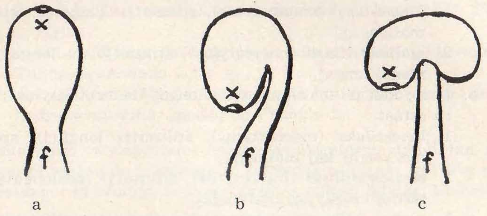
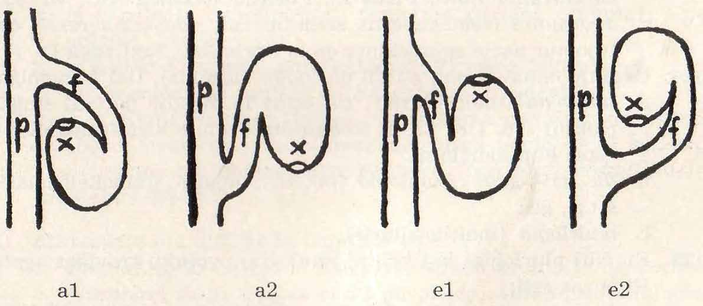

# Terminaro pri la ekstera morfologio de la florhavaj plantoj (Anthophyta)

laŭ
„HANDBOEK DER PLANTBESCHRIJVING”
(lernolibro pri la priskribo de plantoj)

de d-ro J. W. MOLL †.

iama profesoro pri botaniko
ĉe la ŝtata universitato en
Groningen (Nederlando).

Prilaboris esperantlingve

Chr. F. W. Slijper

## Antaŭparolo

Tiu ĉi terminaro tute baziĝas sur la lernolibro de profesoro 
d-ro *J. W. Moll*. Tamen, plurajn aldonojn mi ĉerpis el la terminologia parto de
„*Compendium*” de d-ro *A. A. Pulle*, eksprofesoro ĉe la ŝtata universitato
en *Utrecht* (Nederlando) kaj el „*Leerboek der algemene plantkunde*”
(Lernolibro pri la ĝenerala botaniko) de d-ro *E. Reinders*, profesoro ĉe
la ŝtata agronomia altlernejo en *Wageningen* (Nederlando).

Kiel eble plej multe mi uzis terminojn, troveblajn en „Botanika klasifiko” de d-ro *A. L. Malmanche*, membro de la franca botanika asocio, kaj
en Plena Vortaro. Tamen, ĉar multajn el tiuj terminoj nur laŭ aspekto
oni povas nomi esperantaj, tiajn mi klopodis vere esperantigi. Bedaŭrinde ne ĉiam mi sukcesis.

Post la terminoj troviĝas la scienca traduko; ordinare la latinaj substantivoj estas donitaj en formo singulara, adjektivoj en „vira” formo singulara.

Mi ĝojas, ke ĉiloke mi povas esprimi koran dankon al kelkaj 
amikoj-esperantistoj, kiuj bonvole helpis min en dubaj kazoj, speciale al s-ro
*G. F. Makkink*, biologia doktorando, prezidanto de ANSE, kiu zorge
tralegis la tutan manuskripton.

Plurajn rimarkojn liajn mi profite uzis por pliprecizigi mian laboron.

Plue mi sincere dankas la eldonejon *J. B. Wolters* (*Groningen*, Nederlando), kiu senrezerve permesis al mi uzi la libron de profesoro *Moll*.

Chr. S.

## Enkonduko.

1. La tri ĉefaj partoj, kiuj konsistigas korpon de planto, estas:
    a. *folio* (folium); vidu 4.
    b. *tigo* aŭ *trunko* (caulis); vd. 33.
    c. *radiko* (radix); vd. 45.

2. El *folio* aŭ/kaj *tigo* devenas:
    a. *burĝonoj* (gemma); vd. 50.
    b. *bulboj* kaj *tuberoj* (bulbus kaj tuber); vd. 54.
    c. *ĉiroj* (cirrus); vd. 60.
    d. *dornoj* (spina); vd. 61.
    e. *pokaloj* kaj *ampoletoj*; (ascidium kaj ampulla); vd. 62.
    f. *floroj* (flos); vd. 66 kaj 74.
    g. *fruktoj* (fructus); vd. 129.
    h. *semeroj* aŭ *grajnoj* (semen aŭ granum); vd. 139.

3. Plue estas menciindaj supraĵaj elkreskaĵoj, nome
    *akcesoraĵoj* (organum accessorium); vd. 63.

## Folio (folium).

4. La partoj de folio estas jenaj:
    a. *folia ingo* (vagina); vd. 8.
    b. *petiolo* (petiolus), ordinare cilindroforma. Kelkfoje ĝi estas *sulkita* (canaliculatus); vd. 9.
    c. *limbo* (limbus, lamina), ordinare plata; vd. 10.
    Rim. Pri la *lokiĝo* de la folioj (dispositio foliorum) vd. 32.

5. Rilate al la havo aŭ nehavo de tiuj partoj oni nomas folion:
    a. *kompleta*, se ĝi konsistas el ĉiuj tri partoj; Ranunculus acer L.
    b. *nekompleta*, se unu aŭ du el tiuj partoj mankas; Fago, Gramenacoj, Miozoto, Acacia Willd.

6. Ĉe folio kelkfoje alestas:
    a. *stipoloj* (stipula), du folietoj flanke de la petiolo, insertitaj sur la tigo; Viola tricolor L., Liriodendron Tulipifera L. Kelkfoje du stipoloj estas kunkreskintaj kun la petiolo (stipulae adnatae); Rosa L. Kelkfoje kun la stipoloj de la kontraŭa folio; Humulus Lupulus L.
    b. *tubeto* (ocrea aŭ ochrea), du kunkreskintaj stipoloj kiuj tube ĉirkaŭas la trunketon; Rheum Rhaponticum L., Platanus oeccidentalis L.
    c. *langeto* (ligula), malgranda membrano sur la limo inter folia ingo kaj limbo ĉe la Gramenacoj.

7. Laŭ la nombro de siaj limboj folio estas:
    a. simpla (simplex), se ĝi estas unulimba; vd. 8.
    b. kompozita (compositus), se ĝi estas plurlimba; vd. 28. Tamen, atentu 31a.

## Simpla folio  (folium simplex).

## Folia ingo (vagina).

8. Folia *ingo* estas la plej suba parto de folio, ĉirkaŭanta tute aŭ
parte la tigon. La diversajn formojn oni ne distingas per apartaj
terminoj.

## Petiolo (petiolus).

9. Folio povas esti:
    a. *senpetiola*; tiukaze oni distingas:
        1. *sidanta* (sessilis), en kazo de nura nehavo de petiolo; Myosotis L.
        2. tigoĉirkaŭanta (amplexicaulis), la bazo de la limbo pli-malpli ĉirkaŭas la tigon; Sonchus oleraceus L.
    
    b. *petiola* (petiolatus). En tiu kazo la petiolo estas:
        1. *ordinara*; Quercus Robur L.
        *Rim.* Tia petiolo kelkfoje estas sulkita (canaliculatus).
        2. *ala* (alatus), kun plata elkreskaĵo ambaŭflanke; Citrus aurantium L.
        3. *limbeca*, t.e. iom plata kaj plilarĝiĝinta; la limbo mankas aŭ estas tre malgranda filodio aŭ limbeca petiolo (phyllodium) servas kiel limbo; Acacia auriculaeformis Willd.

## Limbo (limbus, lamina).

10. Pri limbo necesas priparoli:
    a. *ĝeneralan formon* (circumscriptio); vd. 11.
    b. *pinton* (apex); vd. 16.
    e. *bazon* (basis); vd. 17.
    d. *nervojn* (nervus) kaj *vejnojn* (vena); vd. 18.
    e. *intervejnaĵon* (intervenium); vd. 19.
    f. *nervaron* (nervatio, venatio); vd. 20.
    g. *randon* (margo); vd. 21.
    h. *surfacon*; vd. 26.

# Ĝenerala formo de la limbo (circumscriptio).

11. Rilate al priskribo de la ĝenerala formo gravas, kie troviĝas la
plej granda larĝo de la limbo, nome:
    a. je la mezo; vd. 12.
    b. sub la mezo; vd. 13.
    c. super la mezo; vd. 14.
    d. la larĝo ne varias; vd. 15.

12. La plej granda larĝo troviĝas meze; la limbo povas esti:
    a. *cirkla*, *ronda* (orbicularis, rotundus); longo kaj larĝo   estas egalaj; Tropaeolum majus L., Rhus Cotinus L.
    *Rim.* Se la petiolo estas insertita en la mezo de la limbo, oni pomas la folion *ŝildforma* (peltatus, scutatus); Tropaeolum majus L., Hydrocotyle vulgaris L.; vd. ankaŭ 13 b3.
    b. *ovala* aŭ *elipsa* (ovalis, ellipticus), longo 1½- ĝis 2-oble la larĝo; Camellia japonica L.
    c. *oblonga*, longforma (oblongus), longo 2½ - ĝis 3-oble la larĝo; Ficus elastica Roxb.
    d. *lancetforma* (lanceolata), longo 3½- ĝis 5-oble la larĝo; Salix alba L.

13. La plej granda larĝo troviĝas sub la mezo. Tiukaze la limbo povas
esti:
    a. hehavanta lobojn aŭ baskojn ĉe la bazo:
        1. *ovoforma* (ovatus); Syringa vulgaris L.
        2. *triangula* (triangularis), havanta la formon de egalkrura (izocela) triangulo; Atriplex hortensis L.
        3. *deltoforma* (deltoideus), havanta la formon de egallatera triangulo; Populus monilifera Ait.
        4. *romboforma* (rhomboideus); Populus pyramidalis Salisb.
    b. havanta lobojn aŭ baskojn (lacinia) ĉe la entranĉita bazo:
        1. *korforma* (cordatus), pinto akuta, bazaj loboj obtuzaj; Aristolochia Sipho L'Hérit.
        2. *renforma* (reniformis), mallonga kaj larĝa, bazaj loboj obtuzaj; Nuphar luteum Sm.
        3. *sagoforma* (sagittus), pinto kaj bazaj baskoj akutaj; Sagittaria sagittifolia L.
        *Rim.* Ankaŭ inter la sagoformaj folioj troviĝas ŝildformaj; Colocasia Schott.
        4. *lancoforma* (hastatus), kiel sagoforma, sed la bazaj baskoj elstaras horizontale; Rumex Acetosella L.
        5. *orelhava* (auriculatus), similas je sagoforma aŭ lancoforma, sed konsiderindaj entranĉoj bazaj apartigas du iom malgrandajn lobojn aŭ baskojn (orelojn) de la granda kaj larĝa antaŭa limboparto; Solanum Dulcamara L.

14. La plej granda larĝo troviĝas super la mezo. Tiukaze limbo povas
esti:
    a. *invers-ovoforma* (obovatus); Corylus Avellana L.
    b. *spatelforma* (spathulatus), kiel invers-ovoforma, sed la limbo per mallarĝa strio etendiĝas laŭlonge de la petiolo; Bellis perennis L.
    *Rim.* Folio, kies limbo plilongiĝas, kelkfoje eĉ laŭlonge de la tigo, nomiĝas *dekura* (decurrens); Symphytum officinale L.
    c. *kojnoforma* (cuneiformis, cuneatus), t.e. pli-malpli invers-triangula; Ginkgo biloba L.
    d. *invers-korforma* (obcordatus); Oxalis L.

15. La larĝo de la limbo ne varias, estas konstanta. Tiukaze la limbo
povas esti:
    a. *liniforma* (linearis), la transversa tratranĉo estas plata, maldika; Taxus baccata L., pluraj Gramenacoj.
    b. *rubandoforma* (ligulatus), liniforma, sed tre longa; Butomus umbellatus L.
    *Rim.* Se la transversa tratranĉo estas iom dika, plat-elipsa, la folio ofte estas nomata rimenforma; kelkaj Liliacoj, pluraj Orkidacoj.
    c. *glavoforma* (ensiformis), la ĉefa nervo (costa) ege plidikiĝis, do la transversa tratranĉo estas romboforma; Iris Pseudacoris L.
    d. *alenforma* (subulatus), la transversa tratranĉo estas cirkla; la folio estas malmola kaj akutpinta; Juniperus communis L.
    e. *pingloforma* (acerosus, acicularis), la pli-malpli alenformaj folietoj de pingloarboj; Pinus L., Abies Mill.

## Limbopinto (apex).

16. Limbopinto povas esti:
    a. *akuta* (acutus), iom post iom mallarĝiĝanta ĝis pintiĝo; Salix alba L.
    b. *obtuza* (obtusus), la supra duono de la limbo pli-malpli similas duoncirklon; Bellis perennis L., Berberis vulgaris L.
    c. *abrupt-akuta* (acuminatus), kun elstara pinteto; Ulmus campestris L.
    d. *abrupt-obtuza* (hebetatus), la limbo estas iom longforma, sed subite finiĝas per obtuza supro; Rhus Cotinus L.
    e. *detranĉita* (truncatus), la supro ŝajne estas fortranĉita rektlinie; Liriodendron Tulipifera L.
    f. *entranĉita* (emarginatus), kun malprofunda eltranĉaĵo; Oxalis L.
    g. *pikilpinta* (mucronatus), kun klare apartigita, mallonga, cilindroforma pinto; Potamogeton mucronatus Schrad.

## Limbobazo (basis).

17. Limbobazo povas esti:
    a. *nekunkreskinta*:

        1. *akuta* (acutus); Salix alba L., Oxalis L.
        2. *obtuza* (obtusus), se la limbo estas ronda, ovoforma aŭ ovala.
        3. *detranĉita* (truncatus), se la limbo estas aŭ triangula, aŭ deltoforma.
        4. *entranĉita* (emarginatus); Lonicera Caprifolium L.
    b. *kunkreskinta* (connatus), la bazoj de du aŭ tri sidantaj folioj kunkreskis, ĉirkaŭante la tigon; Dipsacus laciniatus L.
    c. *trakreskita* (perfoliatus), la bazaj elstaraĵoj de sidanta folio kunkreskis, ĉirkaŭante la tigon, kiu do ŝajne trakreskas la folion; Bupleurum rotundifolium L.

## Nervoj (nervus).

18. Oni distingas:
    a. *ĉefnervon* aŭ *mezan nervon* (costa); ĝi dividas la limbon en du ĝenerale samgrandajn partojn.
    *Rim.* Se la partoj ne estas samgrandaj, la limbo nomiĝas nesimetria (inaequalis); Ulmus campestris L., begonioj.
    b. *flanknervojn* (nervus lateralis), pli-malpli grandajn nervojn ambaŭflanke de la ĉefnervo.
    c. *vejnojn* (vena), la plej delikatajn nervetojn flanke de la ĉefnervo kaj de la flanknervoj.
    *Rim.* Ofte la vejnoj formas retsimilan figuron; la folio nomiĝas *retvejna* (reticularis).

## Intervejnaĵo (intervenium).

19. *Intervejnaĵo*, la mola, ordinare verda substanco kiu troviĝas inter vejnoj kaj nervoj.

## Nervaro (nervatio, venatio).

20. Laŭ la aranĝo de la nervoj folio nomiĝas:
    a. se la nervoj diverĝas (nervus divergentibus);
        1. *palmnerva* (palminervis); pluraj nervoj diverĝas de el la mezo de la limbobazo.
        2. *plumnerva* (penninervis); ambaŭflanke la ĉefnervo naskas flanknervojn, en diversaj distancoj de la bazo.
        *Rim.* Multaj Laŭracoj kaj kelkaj aliaj plantoj havas nervaron, kiu mezas inter palmnerva kaj plumnerva: je malgranda distanco de la bazo, el la ĉefnervo eliras ambaŭflanke unu aŭ du fortikaj, kurbaj nervoj. Tiuokaze la limbo nomiĝas trinerva (triplinervis) aŭ kvinnerva (quintuplinervis).
    b. se la nervoj kuniĝas ĉe la supro (nervus confluentibus):
        1. *paralelnerva* (rectinervis); ĉiuj nervoj estas rektaj kaj pli-malpli paralelaj.
        2. *kurbnerva* (curvinervis); nur la ĉefnervo estas rekta kaj la flankaj nervoj estas kurbaj. Ili diverĝas de la bazo ĝis la mezo, poste konverĝas ĝis la pinto.

## Limborando (margo).

21. Rando povas esti:
    a. *integra* (integer), sen entranĉoj; vd. 24.
    b. *entranĉita* (divisus), nome:
        1. la entranĉoj estas malgrandaj, ne ŝanĝas la aspekton de la limborando; vd. 22.
        2. la entranĉoj ŝanĝas la aspekton de la limbo, ĉar ili estas iom profundaj ĝis profundaj (folium dissectum). Tiukaze la entranĉoj troviĝas inter du flanknervoj aŭ inter flanknervo kaj ĉefnervo; vd. 23.

22. Se la entranĉoj estas malgrandaj, rando povas esti:
    a. *segildenta* (serratus), entranĉoj (sinus) kaj elstaraĵoj (angulus) akutaj.
    Plue oni uzas la terminojn *segildenteta* kaj *segildentega*.
    b. *duoble segildenta* (biserratus); la randoj de la „segildentoj” refoje estas segildentaj.
    c. *ondlinia*, *serpentuma* (repandus); entranĉoj kaj elstaraĵoj obtuzaj.
    d. *krenela* (crenatus); entranĉoj akutaj, elstaraĵoj obtuzaj.
    e. *denta* (dentatus); entranĉoj obtuzaj, elstaraĵoj akutaj.
    f. *pikildenta* (spinose dentatus); kiel denta, sed ĉiu „dento” finiĝas per pikilo; Ilex Aquifolium L., multaj kardoj.

23. Se la entranĉoj estas iom profundaj (folium dissectum), la folioj
nomiĝas:
    a. *lobaj* (lobatus); la entranĉoj ne atingas ĝis la duono de la flanknervoj: du-, tri-, kvar-, kvinloba (bi-, tri-, quadri-, quinquelobatus) k.t.p.
    b. *fendaj* (fissus); la entranĉoj atingas ĝis la duono de la flanknervoj: du-, tri-, kvar-, kvinfenda (bi-, tri-, quadri-, quinquefissus) k.t.p.
    e. *partaj* (partitus, dividus); entranĉoj atingas ĝis pli ol duono de la flanknervoj: du-, tri-, kvar-, kvinparta (bi-, tri-, quadri-, quinquepartitus) k.t.p.

24. Pri limborando plue estas menciinda:
    a. kelkfoje la rando kaj la apudranda parto de la limbo onde leviĝas kaj malleviĝas. Tia folio nomiĝas *onda* (undulatus).
    b. folia organo, kies randoj havas elstaraĵojn similantajn franĝon nomiĝas *franĝa* (fimbriatus).
    c. folia organo, kies dikiĝintaj randoj havas iom fortikajn, destarajn harojn, nomiĝas *cilia* (ciliatus); vd. 65 Rim. 1.

25. Laŭ nervaro kaj entranĉoj limbo nomiĝas:
    a. *palmloba* (palmatilobus), palmnerva kaj loba.
    b. *palmfenda* (palmatifissus), palmnerva kaj fenda.
    c. *palmparta* (palmatipartitus), palmnerva kaj parta.
    d. *plumloba* (pinnatilobus), plumnerva kaj loba.
    e. *plumfenda* (pinnatifissus), plumnerva kaj fenda.
    f. *plumparta* (pinnatipartitus), plumnerva kaj parta.
    *Rim.* 1. Folioj, kiaj la folioj de Achillea Millefolium L., nomiĝas *duoble plumpartaj* (pinnati-bipartus).
    *Rim.* 2. Parton de folio inter du pli-malpli profundaj entranĉoj oni nomas *basko* (lacinia); Quercus Robur var. laciniata.

## Surfaco.

26. La surfaco de limbo povas esti:
    a. *glata* (laevis), t.e. sen elstaraĵoj, buletoj, sulketoj k.t.p. Glata folio povas esti:
        1. *brileta* (nitidus, nitens).
        2. *malbrila* (opacus).
        3. *prujneska* (prunosus).
    b. *senhara* (glaber).
    c. *malglata*, *raspa* (scaber, asper).
    d. *sulketa* (rugosus).
    d. *buleta* (bullatus).
    Pri haroj kaj aliaj akcesoraĵoj vd. 63.
    Pri koloroj vd. 106.

27. Laŭ ĝia diko oni nomas limbon:
    a. *membraneca* (membranosus), ege maldika.
    b. *skarioza* aŭ *sekmembraneca* (scariosus), ege maldika kaj seka.
    *Rim.* La terminojn sub a kaj b oni uzas fakte nur priskribante kalikon, korolon, brakteon, k.t.p.
    c. *herbeca* (herbaceus), mola kaj maldika.
    d. *papereca* (papyraceus, chartaceus), maldika, tamen iom fortika.
    e. *pergameneca* (pergamentaceus), maldika kaj malmola.
    f. *ledeca* (coriaceus), iom dika kaj malmola.
    g. *karneca* (carnosus), dika kaj sukoriĉa.

## Kompozita folio (folium compositus).

28. La partoj, kiuj povas konsistigi kompozitan folion estas:
    a. *folia ingo* (vagina).
    b. *komuna petiolo* (petiolus communis).
    c. *subpetioloj* (petiolulus), ĉiuj subtenantaj unu *sublimbon*.
    d. *folioloj* (foliolum), la unuopaj sublimboj.
    *Rim.* Se folio estas pluroble kompozita, oni povas paroli pri petioloj kaj folioloj unuarangaj, duarangaj, k.t.p.
    e. *substipoloj* (stipellae), stipoloj ĉe la bazo de la folioloj.

29. Kompozita folio povas esti:
    a. *palmkompozita* (palmatus), tri aŭ pli da folioloj insertitaj sur la supro de komuna petiolo; vd. 30.
    b. *plumkompozita* (pinnatus), folioloj ambaŭflanke de komuna petiolo. Du kontraŭaj folioloj formas *jugon* (jugum); vd. 31.
    c. *palm-plumkompozita* (digitatopinnatus), palmkompozita kun plumkompozitaj folioloj; Mimosa pudica L.
    *Rim.* Folio de Helleborus foetidus L. kaj multaj Aroideae nomiĝas *piedforme kompozita* (pedatipartus).

30. Laŭ la nombro de la folioloj palmkompozita folio nomiĝas:
    a. *trifoliola* (trifoliolatus).
    b. *kvinfoliola* (quinquefoliolatus).
    c. *sepfoliola* (septemfoliolatus).
    d. *naŭfoliola* (novemfoliolatus).
    e. *multfoliola* (multifoliolatus), pli ol 9 folioloj.
    f. *duoble trifoliola* (biternatus); trifoliola folio, kies folioloj denove estas palmkompozitaj, havantaj tri subfolioloj.

31. Plumkompozita folio povas esti:
    a. *unufoliola* (unifoliolatus); nur la supra foliolo disvolviĝis. Tia folio distingiĝas de simpla folio ĉar inter la foliolo kaj la petiolo troviĝas *artiko* (articulatio).
    b. *dufoliola* (bifoliolatus).
    c. *nepare plumkompozita* (imparipinnatus), kun foliolo sur la supro de la petiolo.
    d. *pare plumkompozita* (paripinnatus, abrupte pinnatus), sen foliolo sur la supro de la petiolo.
    e. *interrompite plumkompozita* (interrupte pinnatus); inter du normalaj folioloj ĉiufoje troviĝas multe pli malgranda foliolo.
    f. *duoble plumkompozita* (bipinnatus); plumkompozita folio, kies folioloj denove estas plumkompozitaj.
    g. *malpliiĝe plumkompozita*, la supra parto de la folio estas malpli-oble plumkompozita ol la malsupra parto; pluraj Umbelacoj.

## Lokiĝo de la folioj (dispositio foliorum, phyllotaxis).

32. Sur ĉiu nodo (vd. 33) povas esti lokita(j):
    a. unu folio; tiukaze la lokiĝo estas:
        1. *disa* (alternus, sparsus); la folioj ŝajne estas neregule dislokitaj sur la tigo, sed la lokiĝo estas indikebla jene: 1/3, 2/5, 3/8 k.t.p.
        2. *duvice alterna* (folia disticha); tia lokiĝo estas indikebla per 1/2.
    b. du folioj; ili nomiĝas *kontraŭaj* (folia opposita) kaj la lokiĝon Oni nomas *kruca* (decussata), ĉar du sinsekvaj paroj da folioj ĉiam formas krucon.
    c. pli ol du folioj; tia lokiĝo nomiĝas *verticila*  (verticillatus); Asperula L.

## Tigo, trunko (caulis).

33. *Tigo* estas la portanto de folioj kaj diversaj aliaj organoj. La ofte iom dikiĝinta loko, sur kiu troviĝas unu aŭ pli da folioj nomiĝas *nodo* (nodus).
Parto de tigo inter du nodoj nomiĝas *internodaĵo* (internodium).
La supra angulo, limigita de tigo kaj folio, petiolo aŭ branĉo nomiĝas *akselo* (axilla).
Dika, rekte staranta tigo de arbo nomiĝas *trunko*.

34. Oni distingas:
    a. *sentigajn plantojn* (planta acaulis), ŝajne sentigajn, sed fakte havantajn ege mallongan tigon; tiukaze la folioj nomiĝas *radikaj* folioj (folia radicalia); ili formas *rozeton* (rosula).
    b. *tighavajn plantojn*.
    *Rim.* Veratrum L. kaj Musa L. (la banan„arbo”) nur ŝajne havas tigon aŭ trunkon. Tia *pseŭdotrunko* (truncus spurius) konsistas el fortikaj folio-ingoj, kiuj ĉirkaŭas unu la alian.

35. Subtera tigo nomiĝas:
    a. *tigo-piedo* (caudex), la subtera, mallonga, travintranta parto de la tigo de dujardaŭraj herboj; Valeriana officinalis L.
    b. *rizomo* (rhizoma), iom longa, plej ofte horizontale kreskanta; Acorus Calamus L.
    *Rim.* Burĝonoj, elkreskintaj el rizomo, nomiĝas *subteraj eliruloj* (turion).

36. Laŭ ĝiaj ecoj tigo estas:
    a. *herbeca* (herbaceus), suka, ofte verda, neligneca; ordinare oni nomas ĝin *tigo*, kelkfoje *trunketo*.
    *Rim.* Plantoj, havantaj herbecajn tigojn, nomiĝas *herboj* (herba); Lilium L., gresoj.
    b. *ligneca*; tiukaze ĝi estas nomata *trunko* (truncus); vd. 37.

37. Plantoj havantaj trunkon, nomiĝas:
    a. *arbedo* aŭ *arbusto* (frutex, arbuscula), se la trunko disbranĉiĝas en aŭ tuj apud la tero; Rosa L.
    b. *arbo* (arbor), se la trunko disbranĉiĝas iom alte super la tero aŭ ne disbranĉiĝas. Pri branĉoj vd. 43.

38. Laŭforme tigo povas esti:
    a. *cilindra* (teres, ecylindraceus).
    b. *angula* (angularis), prismoforma: *triangula* (triangularis), *kvarangula* (quadrangularis), *kvinangula* (quinquangularis); ... ĝis *multangula* (multangularis).
    c. *plata* (compressus), la transversa tratranĉo estas pli-malpli plat-elipsa.
    *Rim.* Cyclamen L. havas *tuberforman tigon*, la ŝvelintan *subloban internodaĵon* (internodium hypocotylum); vd. 144 c.

39. La surfaco de tigo povas esti:
    a. *glata* (laevis); vd. 26 a.
    b. *ripa* (costatus), havanta kelkajn laŭlongajn listelojn.
    c. *sulka* (sulcatus), kun multaj laŭlongaj sulketoj.

40. Laŭ vivodaŭro la partoj de planto estas jardaŭraj, dujardaŭraj kaj daŭraj (multjardaŭraj). Tial planto povas esti:
    a. *jardaŭra* (annuus).
    b. *dujardaŭra* (biennis).
    c. *daŭra*, *plurjardaŭra* (perennis).

41. Laŭ karaktero tigo nomiĝas:
    a. *ordinara tigo*, *trunketo*; vd. 36 a.
    b. *trunko* (truncus); vd. 36 b.
    c. *ŝalmo* (culmus), la ordinare kava tigo de multaj Gramenacoj, havanta klare videblajn nodojn kaj internodaĵojn.
    d. *kalamo* (calamus), la „ŝalmo” de la Junkacoj kaj kelkaj Ciperacoj, konsistanta el unu tre longa internodaĵo.
    *Rim.* Ĉe multaj Orkidacoj kaj kelkaj aliaj tropikaj plantoj la tigo dikiĝas tiel, ke oni nomas la dikiĝintan parton *pseŭdotubero* (pseudobulbus).

42. Laŭ ĝia direkto tigo estas:
    a. *rektstara* (erectus), vertikale supren; Senecio vulgaris L.
    b. *penda* (pendulus, dependens), vertikale malsupren; Linaria Cymbalaria Mill.
    c. *kuŝanta* (humifusus, prostatus, procumbens), pli-malpli horizontale sur la tero; Polygonum aviculare L.
    d. *rampanta* (repens, reptans), kuŝanta, sed kun radikoj ĉe la nodoj; Glechoma hederacea L.
    e. *leviĝanta* (ascendens), bazo kuŝanta, la supro rekte staranta; Comarum. palustre L.
    f. *kapklina* (nutans, cernuus), rekte staranta, la supro penda; Fritillaria Meleagris L.
    g. *falkuŝanta* (prostatus), la bazo iom supren, la supro kuŝanta; Asparagus prostatus Dum.
    h. *grimpanta* (scandens), atinganta pli altan lokon ne volve, sed alkroĉante sin al iu subtenaĵo pere de ĉiroj, hokoj, dornoj aŭ iu ajn alkroĉilo.
    i. *volvegrimpa* (volubilis), spirale volvanta sin ĉirkaŭ iu subtenaĵo:
        1. *maldekstrume* (sinistrorsum), la subtenaĵo ĉe la maldekstra flanko de la volviĝanta tigo; Convolvulus sepium L.
        2. *dekstrume* (dextrorsum), la subtenaĵo ĉe la dekstra flanko de la volviĝanta tigo; Humulus Lupulus L.

## Branĉoj (ramus).

43. La plej malgrandaj branĉoj nomiĝas *branĉetoj* (ramulus).
Specialspecaj branĉoj estas:
    a. *elirulo* aŭ *stolono* (stolo, flagellum), longa, maldika, surtera branĉo, produktanta radikhavajn plantetojn je la nodoj; Fragaria vesca L.
    b. *limbeca tigo* (phyllocladium), ordinare plata, ĉiam verda;Ruscus aculeatus L. '
    c. *rapidkreska vergo* (virga singularis), longa, fortika branĉo, vertikale kreskanta el „dormanta” flank- aŭ kromburĝono (vd. 51. 6); Salix alba L.
    d. *vergo* kaj *vergeto*, divers-aspektaj branĉoj sur sama arbo aŭ arbusto:
        1. *vergo* (virga), branĉo kies internodaĵoj havas normalan longon.
        2. *vergeto* aŭ *vergolo* (virgula, virgula succrescens), branĉetoj kies internodaĵoj estas ekstreme mallongaj. Ili estas la fruktoportantoj; Pirus Malus L.

44. Laŭ ĝia direkto branĉo estas:
    a. *vertikala* (fastigiatus), vertikale supren; Populus pyramidalis Salisb.
    b. *horizontala* (horizontalis); Picea excelsa Link.
    c. *destara* (patens), formanta angulon ±45-gradan kun la trunko: Fagus silvatica L.
    d. *penda* (pendulus), vertikale malsupren; Salix babylonica L.
    e. *pendkliniĝanta* (declinatus, deflexus), la bazo destaranta, la supro kurbiĝante teren; Betula alba L.

## Radiko (radix).

45. Radiko estas la parto de planto ordinare subtera; ĝi fiksas la
planton en la tero, el kiu ĝi ĉerpas akvon enhavantan nutrajn
substancojn.

46. Partoj de radikoj estas:
    a. *radikokolo* (collum), la parto sur kiu fiksiĝas tigo aŭ trunko.
    b. *radikopinto* (apex), la malsupren direktiĝanta radikfinaĵo.
    c. *radikokorpo* (corpus), inter kolo kaj finaĵo.
    d. *radikbranĉoj* (ramus radicalis).
    e. *fibraj radiketoj* (fibrilla).
    f. *radikharoj* (pilus radicalis).
    g. *radikĉapo* (calyptra); ĝi kovras la radikpinton.

47. Oni distingas:
    a. *ĉefradikon* (radix primaria) kaj ĝiajn branĉojn, la flankradikojn (radix lateralis); vd. 46 kaj 48.
    b. *kromradikojn* (radix adventicia), ĉiujn aliajn radikojn; vd. 49.

48. Ĉefradiko povas esti:
    a. *karotforma* (fusiformis, daŭciformis), iom konusforma; Daucus Carota L.
    b. *napoforma* aŭ *rapoforma* (napiformis, rapiformis), la radikokorpo ege dikiĝinta kun maldika finaĵo; Brasica Rapa L.
    c. *fadenforma* (filiformis), tre maldika kaj longa; Spergula arvensis L.
    d. *branĉhava* (ramosus), la radiko de arboj kaj arbustoj.

49. Kromradiko povas esti:
    a. *fibreska* (fibrosus), maldika, multnombra; Gramenacoj.
    b. *aeroradiko* (radix aereus); ili eliras el tigo aŭ branĉoj kaj kreskas en la teron se ili atingas ĝin; Ficus Benjamina L.
    *Rim.* Se aeroradikoj, elirantaj el la trunko kaj subtenantaj ĝin, fiksiĝas en la tero, oni nomas ilin stilzoradikoj; pandano, rizoforoj.
    c. *suĉradikoj* (haustorium); ili penetras en aliajn kreskaĵojn por suĉi nutraĵon el ili; Viscum album L.
    d. *fiksradikoj* (fulcrum), mallongaj eltigaj kromradikoj per kiuj ne-parazitaj kreskaĵoj fiksiĝas al iu subtenaĵo; Hedera Helix L. 
    *Rim.* 1. Kelkfoje la radikpinto de kromradiko estas ŝvelinta: *ŝvelpinta radiko* (radix filipendula); Spiraea filipendula L., Ulmaria fil. J. Hill.
    *Rim.* 2. Radikon havantan plurajn ŝvelaĵojn, oni nomas *rozari-radiko*(radix moniliformis); Pelargonium triste Soland.

## Burĝonoj (gemma).

50. Burĝonoj estas junaj, mallongaj tigoj kun folioj aŭ/kaj floroj;
ordinare ilin ŝirmas ia envolvaĵo; vd. 53 b.

51. laŭ ilia lokiĝo oni distingas:
    a. *finburĝonojn* (g. terminalis); ili estas finstaraj.
    b. *flankburĝonojn* (g. lateralis), flanke de la tigoj kaj branĉoj; ordinare ili troviĝas en la akseloj de folioj aŭ tuj super la *folio-cikatroj*: *akselburĝonoj* (g. axellaris).
    c. *kromburĝonojn* (g. adventicius), en neordinaraj lokoj; ofte ili estas dormantaj flankburĝonoj, provizore ne disvolviĝintaj.
    *Rim.* Ĉe kelkaj plantoj, ekz. Juglans L., Acer rubrum L., sambuko, tabako kaj aliaj, en ĉiu akselo ordinare troviĝas pli ol unu burĝono. La unua, ofte la plej granda, estas la *ĉefburĝono*, la aliaj nomiĝas *aldonaj burĝonoj*.

52. Laŭ enhavo burĝonoj nomiĝas:
    a. *foliburĝonoj* (g. folifera), enhavantaj tigeton kaj foliojn.
    b. *florburĝonoj* (g. florifera, alabastrum), enhavantaj tigeton kun floro aŭ floraro.
    c. *miksburĝonoj* (g. mixta), enhavantaj tigeton kun folioj kaj floro aŭ floraro.

53. Oni povas distingi la burĝonojn ankaŭ jene:
    a. *nudaj burĝonoj* (g. nudus), sen kovraĵo.
    b. *kovritaj burĝonoj* (g. clausulus), ĉirkaŭitaj de *burĝon-envolvaĵo* (perula), konsistanta el ledecaj *burĝonskvamoj* (tegmentum).

## Bulboj (bulbus) kaj Tuberoj (tuber).

54. Bulboj kaj tuberoj estas deponejoj por la rezervo-nutraĵo; ili formortas kiam iliaj burĝonoj jam elsuĉis ilin por estigi novajn
kreskaĵojn.

55. Bulboj entenas la rezervo-nutraĵon precipe en foliecaj organoj; vd. 57 kaj 58.
Tuberoj entenas la rezervo-nutraĵon en tigecaj aŭ en radikecaj organoj: *tigtuberoj* kaj *radiktuberoj*; vd. 42 Rim.

56. Laŭ la loko, kie ili troviĝas, oni distingas:
    a. *subterajn* bulbojn kaj tuberojn.
    b. *surtigajn* bulbetojn (bulbulus) kaj tuberetojn (tuber accessorium aŭ t. caulinare), en la foli-akseloj.

57. La partoj de bulbo estas:
    a. *disko* (discus), ege kunpremita tigo; sur ĝi staras la skvamoj aŭ la tunikoj; vd. b.
    b. *foliecaj organoj*, kiuj enhavas la rezervo-nutraĵon. Tiuj organoj nomiĝas:
        1. *tunikoj*, se ili tute aŭ preskaŭ tute ĉirkaŭas la bulbon; vd. 58 a.
        2. *skvamoj*, se ili estas pli-malpli konus- aŭ cilindroformaj kaj staras unu apud la alia; vd. 58 b. 
    c. *ĉefburĝono* (gemma bulbus), kiu estigos la novan planton.
    d. unu aŭ pluraj *generbulbetoj* (bulbulus), kiuj estigos novajn bulbojn.
    e. *fibreskaj kromradikoj* (radix fibrosus); vd. 49 a.

58. Laŭ la konstruo oni povas distingi:
    a. *tunikbulbojn* (bulbus tunicatus); cepo; vd. 57 b 1.
    b. *skvambulbojn* (bulbus squamosus); lilio; vd, 57 b 2.

59. Tuberojn oni distingas jene:
    a. *tigtuberoj* (tuber caulogenum), formiĝintaj el tigeca organo, kaj havantaj foliecajn skvamojn kaj burĝonojn; ili nomiĝas:
        1. *tuniktuberoj* (t. tunicatus aŭ bulbotuber); ĉiu folieca organo tute ĉirkaŭas la tuberon; Crocus vernus Wulf.
        2. *nudaj tuberoj* (t. nudus); la foliecaj skvamoj estas malgrandaj aŭ preskaŭ tute forestas; Solanum tuberosum L.
    b. *radiktuberoj* (t. rhizogenum aŭ tuberculum), formiĝintaj el radika organo; foliecaj organoj tute forestas; Dahlia variabilis Desf., Orchis Morio L.

## Ĉiroj (cirrus).

60. Ĉiroj estas kurbiĝintaj organoj fadenformaj, kiuj, ofte helice,
sin volvas ĉirkaŭ subtenaĵo. Laŭdevene ili estas:
    a. *branĉoĉiroj*, anstataŭantaj branĉeton, floron aŭ floraron; Pasiflora coerulea L., Vitis vinifera L.
    b. *folioĉiroj*, anstataŭantaj folion, kelkfoje foliolon; Pisum sativum L.

## Dornoj (spina).

61. Dorno estas ligneca, konusforma, pikilpinta organo. Laŭdevene
ĝi estas:
    a. *branĉodorno*, troviĝanta en foliakselo.
    b. *foliodorno*, troviĝanta en la loko de folio; Berberis vulgaris L.

## Pokaloj (ascidium) kaj ampoletoj (ampulla, utriculus).

62. Pokaloj kaj ampoletoj troviĝas nur ĉe insektmanĝantaj plantoj.
    a. *pokaloj* (ascidium), tubformaj elkreskintaj limboj; Nepentes L.;
    b. *ampoletoj* (ampulla, utriculus), veziketformaj elstaraĵoj limbecaj, havantaj aperturon fermeblan per klapeto; Utricularia L.

## Akcesoraĵoj de la surfaco.

63. Sur la surfaco de folio kaj tigo aŭ branĉeto plurfoje troviĝas:
    a. *haroj* (pilus), maldikaj, fadenformaj, iom molaj elkreskaĵoj; vd. 64 kaj 65.
    b. *haregoj* (saeta), iom dikaj, malmolaj, fortikaj haroj.
    c. *stelharoj* (pilus stellatus), stelforme disbranĉiĝintaj haroj.
    d. *urtikharoj* (stimulus), rigidaj, pikaj haroj.
    e. *glandharoj* (pilus capitatus, p. glandulosus), kun dikiĝinta finaĵo, kiu ordinare sekrecias gluan sukon.
    f. *skvametoj* (lepis), plataj elkreskaĵoj.
    g. *pikiloj* (aculeus), ordinare elkreskaĵoj kojnformaj, ege malmolaj kaj akrapintaj, malregule lokitaj sur tigo kaj/aŭ folio.
    h. *ŝelporoj* (lenticula), tre malgrandaj aperturoj en la korktavolo, kiu ĉirkaŭas tigojn kaj branĉojn. La ŝelporoj havas dikiĝintajn randojn.

64. Laŭ sia pozicio haroj povas esti:
    a. *alpremitaj* (adpressus), laŭlonge kuŝantaj tuj sur folio aŭ tigo.
    b. *destaraj* (erectus), formantaj angulon 45—90 gradan kun folio aŭ tigo.

65. Laŭ la speco de la haroj kaj la maniero, en kiu ili kovras la surfacon, folio aŭ tigo nomiĝas;
    a. *hara* (pilosus), la ĝenerala termino; *mallonghara* (pilosellus).
    b. *stelhara* (stellato-pilosus), la haroj disbranĉiĝas stelforme.
    c. *molhara* (pubescens);
      *mallong-molhara* (puberulus);
      *iom long-molhara* (villosiusculus);
      *long-molhara* (villosus).
    d. *hirta* (hirtus, hirsutus), kun rigidaj, ofte destaraj haroj;
      *mallong-hirta* (hirtellus).
    e. *laneca*, *lanuga* (lanatus, lanuginosus), kun longaj, krispaj haroj.
    f. *felteca* (tomentosus), interkonfuzitaj, krispaj haroj, formantaj kompaktan kovraĵon.
      *mallong-felteca* (tomentellus).
    g. *silkeca* (sericeus), kun densa hararo, la haroj alpremitaj, rektaj kaj molaj.
    h. *velureca* (velutinus), kun densa, mola, mallonga hararo destara.
    i. *harega*, *pikilhara* (hispidus strigosus, setosus), kun rigidaj, malmolaj haroj. 
    *Rim.* 1. Se rando de folio aŭ ripo de tigo havas destarajn harojn, ciliojn (cilia), oni nomas ĝin *cilia* (ciliatus).
    *Rim.* 2. *Barbaj* (barbatus) nomiĝas organoj, ekz. korolfolioj, stilusoj, stamenoj, kiuj estas provizitaj per densa tufeto de haroj.

## lokiĝo de la floroj (anthotaxis).

66. Laŭ la lokiĝo de la floroj oni povas paroli pri:
    a. *unufloraj plantoj* (planta uniflora).
    b. *disaj floroj* (flores sparsi); la planto havas pli ol unu floron, ĉiu floro troviĝas sola en foli-akselo.
    c. *floraro* aŭ *infloresko* (inflorescentia), du aŭ pli da floroj sur speciala branĉeto aŭ finstaraj je la supro de tigo aŭ branĉo. Inter tiuj floroj ne troviĝas ordinaraj folioj; vd. 69.

67. Floraro konsistas el:
    a. *pedunklo* (pedunculus), la komuna florartigo, la *ĉefakso*, kiu ofte disbranĉiĝas en *flankaksoj unuarangaj*; se ankaŭ ili disbranĉiĝas, ili portas flankaksojn duarangajn k.t.p.
    b. *pedikloj* (pedicellus), ĉiuj portantaj nur unu floron.
    c. *brakteoj* (bractea), speco de folio el kies akselo elkreskas florartigo (pedunculus).
    d. *subbrakteoj* aŭ *brakteoloj* (bracteola), speco de folietoj el kies akselo elkreskas pediklo.
    e. *subbrakteoj duarangaj* aŭ *brakteoletoj* (bracteolula), speco de folioj sur la pediklo.
    f. *floroj* (flos); vd. 74.

68. Specialaj brakteoj estas:
    a. *spato* (spatha), granda brakteo, kiu servas kiel floraringo aŭ kiel floringo.
    b. *envolvaĵo* aŭ *involukro* (involucrum), konsistanta el verticiloj de *envolv-brakteoj* (bractea involucrus, involucri phyllum).
    c. *urneto* (urceolus, utriculus), du kunkreskintaj brakteoletoj, vd. 67 e, kiuj formas pelveton; ĉe la ĉiam nudaj floroj de la kareksoidoj (Carices) ĉiu ina floro estas ĉirkaŭita de tia organo.

## Floraro aŭ infloresko (inflorescentia).

69. Floraro povas esti:
    a. *decentrokura* aŭ *centrifuga* (cymosa, centrifuga); la ĉefakso portas finstaran floron kaj ordinare havas unu aŭ du flankaksojn, kiu(j) disbranĉiĝas sammaniere kiel la ĉefakso. La ĉefaksa floro disvolviĝas unue, poste la floro(j) sur la unuaranga(j) flankakso(j) k.t.p.; vd. 70 kaj 71.
    b. *alcentrokura* aŭ *centripeta* (racemosa, botryoides, centripeta); sur la ĉefakso troviĝas pluraj (ordinare multaj) flankaksoj, kiuj plurfoje disbranĉiĝas denove, sammaniere kiel la ĉefakso. La plej „subaj” floroj disvolviĝas unue; vd. 72.
    c. *miksa* (mixta), disbranĉiĝanta neregule, tiel ke ĝi estas kunmetita el du aŭ tri specoj de floraroj; vd. 73.

70. Decentrokuraj floraroj:
    a. *dubranĉa kimo* (cyma dichotoma, dichasium) ripete disbranĉiĝas per du kontraŭaj branĉoj, tamen la altrangaj flankaksoj ofte iĝas unubranĉaj; Begonia L.
    b. *plurbranĉa kimo* (pleiochasium); ĉe ĉiu disbranĉiĝo troviĝas pli ol du branĉoj; kelkaj Eŭforbiacoj, kelkaj specioj de Sedum L.
    c. *unubranĉa kimo* (monochasium); vd. 71.
    d. *pseŭdo-verticilo* (verticillaster), du ege kunpremitaj kimaj floraroj, troviĝantaj en la akseloj de du kontraŭstaraj folioj; Labiacoj. 
    *Rim.* *Glomerolo* (glomerulus) estas bulforma, senpedikla floraro, kiu plejofte havas kiman karakteron; Urtica L.

71. Specoj de unubranĉaj kimoj estas:
    a. *zigzaga kimo* (cincinnus); la ebenoj de du sinsekvaj disbranĉiĝoj kruciĝas ortangule, kaj la branĉoj troviĝas alterne dekstre kaj maldekstre; Boraginacoj.
    b. *spirala kimo* (bostryx); kiel zigzaga kimo, sed la branĉoj troviĝas konstante aŭ dekstre, aŭ maldekstre; Hemerocallis fulva L.
    c. *ventumila kimo* (rhipidium); ĉiuj disbranĉiĝoj troviĝas en la sama ebeno kaj la branĉoj alterne dekstre kaj maldekstre; kelkaj Iridacoj.
    d. *falĉila kimo* (drepanium); kiel ventumila kimo, sed la branĉoj ĉiuj estas lokitaj aŭ dekstre, aŭ maldekstre; Junkacoj.

72. Alcentrokuraj aŭ centripetaj floraroj povas esti:

  I.  *Simplaj*, la flankaksoj ne disbranĉiĝas:

        a. *botro* (botrys, racemus); ordinare kun longa ĉefakso, portanta plurajn (multajn) pediklajn florojn; Ribes rubrum L.
        b. *spiko* (spica); ordinare longa ĉefakso, portanta plurajn (multajn) senpediklajn florojn; Plantago major L.
        c. *spadiko* (spadix); kiel spiko, sed havanta karnecan ĉefakson; Acorus Calamus L..
        d. *amento* (amentum); kiel spiko, sed havanta nur virajn aŭ nur inajn florojn; post la florado la tutaĵo de la vira floraro defalas; Salix alba L.
        e. *sikono* (syconium, hypanthodium), kusen-, glob- aŭ pirforma ĉefakso, sur kiu staras multaj floretoj; se tiaj floraroj estas glob- aŭ pirformaj, ili estas kavaj; Antiaris Lesch., Ficus Tourn. ex L.
        f. *umbelo* (umbellum), pluraj pediklaj floroj sur la supro de la florartigo, ofte ĉirkaŭita de envolvaĵo (involucrum); la floroj troviĝas en unu ebeno; Primula Auricula L.
        *Rim.* Se la umbela akso plukreskas kaj estigas nova(j)n umbelo(j)n unu super la alia(j), la floraro nomiĝas *etaĝa umbelo* (umbellae superpozitae); Hottonia palustris L. kaj kelkaj primoloj.
        g. *kapitolo* (capitulum); la supro de la ĉefakso plilarĝiĝas, formante komunan florbazon, sur kiu kelkfoje troviĝas skvamoj (palea), speco de brakteoj; la kapitolo ofte estas ĉirkaŭita de envolvaĵo; Kompozacoj.
        h. *umbela botro* aŭ *simpla korimbo* (corymbus simplex) similas botron, sed la pedikloj de la sube starantaj floroj estas pli longaj ol tiuj de la supraj floroj, tiel ke ĉiuj floroj atingas la saman nivelon; Pirus communis L., Ornithogalum umbellatum L.

  II. *Regule kompozitaj*, la flankaksoj disbranĉiĝas sammaniere kiel la ĉefakso:

        a. *kompozita spiko* (spica composita); la flankaksaj spiketoj nomiĝas subspikoj (spicula); multaj Gramenacoj. 
        b. *kompozita botro*; la flankaksaj botroj nomiĝas *subbotroj*.
        c. *kompozita umbelo* (umbellum compositum); ĉiu flanka akso portas *subumbelon* (umbellula), ofte ĉirkaŭita de *subenvolvaĵo* (involucellum); Umbelacoj.

  III. *Neregule kompozitaj*, la flankaj aksoj disbranĉiĝas neregule:

        a. *paniklo* (paniculus), konus- aŭ piramidforma floraro; Syringa vulgaris L., Avena L.; vd. 73.
        b. *korimbo* (corymbus ramosus), panikla floraro kies malsupraj branĉoj estas tiom longaj, ke la floroj troviĝas en unu ebeno; Sambucus nigra L.; vd. 73.
        c. *antelo* (anthela); la malsupraj branĉoj estas tiom longaj, ke iliaj suproj alte elstaras super la aliaj branĉoj; Junkacoj.

73. *Miksaj floraroj*, kompleksaj floraroj, diversmaniere kunmetitaj;
ofte ili similas paniklon aŭ korimbon, kaj tiukaze oni nomas ilin
tiel.

    Florarojn kiel tiuj de Aesculus L. kaj Scrophularia Trn. oni nomas *tirso* (thyrsus).

    *Rim.* 1. Rilate al floraroj oni uzas plue la terminojn:

    a. *malmultflora* (pauciflores).
    b. *densa* (densus) kaj *maldensa* (depauperatus), speciale uzataj je priskribo de spikoj kaj botroj.
    c. *glob(et)forma*, *globa*, *sfera* (globatus, globulosus).

    *Rim.* 2. Kelkfoje floraro similas unuopan floron; tia floraro nomiĝas *pseŭdofloro* (pseudanthium); pluraj Eŭforbiacoj, Kompozacoj,
Aracoj, Hydrangea L.

## Floro (flos).

74. Floro estas tigeca (branĉeca) organo, portanta la organojn, kiuj
ludas rolon ĉe la seksa reproduktado. Partoj de floro povas esti:
    a. *florbazo* (receptaculum), la tiga bazo de floro; vd. 84.
    b. *florvestaĵo* aŭ *perianto* (peranthium); vd. 75.
    c. *seksorganoj* (organum generativum); vd. 76.

75. La florvestaĵo ordinare konsistas el du zonoj:
    a. *kaliko* (calyx), la ekstera zono, alikolora aŭ/kaj aliforma ol la interna zono; vd. 91 kaj 78.
    b. *korolo* (corolla), la interna zono, laŭkolore kaj/aŭ laŭforme diferencanta de la ekstera zono; vd. 98 kaj 78.

76. La du zonoj de seksorganoj estas:
    a. *stamenoj* (stamen), la viraj seksorganoj, produktantaj *polenon* aŭ *florpolvon* (pollen); vd. 107.
    La tutaĵon de la viraj seksorganoj oni nomas *viraĵaro* aŭ *androceo* (androecium).
    b. *pistilo(j)* (pistilum), ina(j) seksorgano(j), produktanta(j) *ovolojn* (ovulum); vd. 118.
    La tutaĵon de la inaj seksorganoj oni nomas *inaĵaro* aŭ *gineceo* (gynaecium).

77. Floro, havanta ĉiujn kvar zonojn, estas *kompleta* (completus).
Se mankas unu aŭ pli da zonoj, floro estas nekompleta (incompletus); vd. 78.

*Rim.* 1. Se la du zonoj de la florvestaĵo estas tute aŭ preskaŭ tute
similaj, ankaŭ en tiu kazo oni nomas floron *nekompleta*; Liliacoj.

*Rim.* 2. Se la nombro de organoj de ĉiu zono estas 3, 4 aŭ 5 aŭ dividebla per 3, 4 aŭ 5, la floro nomiĝas *trinombra* (ternarius),
*kvarnombra* (quaternarius) aŭ *kvinnombra* (quinarius).

78. Rilate al la florvestaĵo oni parolas pri:
    a. floroj kun *kaliko* kaj *korolo*.
    b. floroj kun *florkovraĵo* (perigonium), nome:
        1. se la floro havas nur kalikon aŭ nur korolon.
        2. se tiuj du zonoj alestas, sed laŭforme kaj laŭkolore tre similas, vd. 77 Rim. 1 kaj 86.
    c. *nudaj floroj* (flos nudus), havantaj neniun florvestaĵon.

79. Laŭ havo aŭ nehavo de seksorganoj oni nomas floron:
    a. *duseksa* (bisexualis, hermaphroditus), kun stamenoj kaj pistilo(j).
    b. *unuseksa* (unisexualis), nome:
        1. *vira* (masculus), havanta nur stamenojn; *stamenfloro*; vd.80.
        2. *ina* (femineus), havanta nur pistilo(j)n; *pistilfloro*; vd. 80.
    c. *senseksa* (neuter), havanta nek stamenojn, nek pistilo(j)n; *nefekunda* aŭ *sterila* floro.

80. Planto, havanta unuseksajn florojn, povas esti:
    a. *kunloĝa* (monoecus); inaj kaj viraj floroj ambaŭ troviĝas sur ĉiuj ekzempleroj samspecaj.
    b. *disloĝa* (dioecus); sur ĉiu ekzemplero troviĝas nur inaj aŭ nur viraj floroj.
    c. *miksloĝa* (poligamus); sur ĉiu ekzemplero troviĝas kaj unuseksaj kaj duseksaj floroj.

81. Laŭ la lokiĝo de la foliecaj organoj (kaliko, korolo kaj seksorganoj) oni parolas pri:
    a. *necirklaj* aŭ *spiralaj floroj* (flos acyclicus); la lokiĝo de la organoj ne estas laŭ verticiloj, sed spirala.
    b. *cirklaj floroj* (flos cyclicus); lokiĝo laŭ verticiloj; Adonis aestivalis L., Helleborus niger L., Aconitum Napellus L.
    c. *duoncirklaj floroj* (flos hemicyeclicus); lokiĝo parte laŭ verticiloj, parte ne; Ranunculus L., Nymphaea alba L., Paeonia officinalis L.

    *Rim.* Sur ĉiu zono povas esti insertita(j) unu aŭ pli da verticiloj aŭ unu aŭ pli da spiralaj volvaĵoj.

82. Du sinsekvaj, samnombraj verticiloj laŭ sia lokiĝo povas esti:
    a. *alternaj* (alternatio), la eroj de la pli interna verticilo estas insertitaj ĝuste en la mezo de la spacoj inter eroj de la pli ekstera verticilo; la ordinara kazo; Linum usitatissimum L.
    b. *antaŭ(lokit)aj* (superpositio); la eroj de du sinsekvaj verticiloj estas insertitaj unuj ĝuste antaŭ la aliaj; Primula L.; vd. 109 b kaj c.

83. Laŭ sia formo floro povas esti:
    a. *regula* aŭ *radi-simetria* (regularis, actinomorphus).
    b. *duflanke simetria* (zygomorphus): 1. mediane, 2. transverse aŭ 3. oblikve simetria.
    c. *nesimetria* aŭ *malregula* (irregularis).

## Florbazo (receptaculum).

84. La florbazo konsistas el kelkaj zonoj, sur kiuj sinsekve estas in
sertitaij la kaliko, la korolo, la stamenoj kaj la pistilo(j).
Florbazaj elkreskaĵoj estas:
    a. *stamenportilo* (androphorum).
    b. *pistilportilo* (gynophorum).
    c. *stamen-pistilportilo* (gynandrophorum).
    d. *disko* (discus), sur kiu ofte troviĝas *nektarglandoj*: *nektardisko*.

85. Laŭ la formo de la florbazo kaj la loko de la ovolujo (ovarium)
floro povas esti:
    a. *substaranta* (hypogynus), forvestaĵo kaj stamenoj insertitaj pli malalte ol la ovolujo.
    b. *ĉirkaŭstaranta* (perigynus), florbazo tub- aŭ pelvoforma, ovolujo en la mezo, libera.
    c. *surstaranta* (epigynus), ovolujo kunkreskinta kun la tub- aŭ pelvoforma florbazo, do la florvestaĵo ŝajne estas insertita sur la ovolujo; vd. 119.

## Florkovraĵo (perigonium).

86. Florkovraĵo laŭforme estas: regula, duflanke simetria aŭ malregula, vd. 83 kaj 89; ĝi povas konsisti el:
    a. *kovraĵfolioj* (tepalum); vd. 87.
    b. *haroj* (pilus).
    *Rim.* La foliecaj organoj de gramenacaj floroj nomiĝas glumoj (gluma); super ili troviĝas *ŝvelkorpetoj* (lodiculus).

87. La kovraĵfolioj povas esti:
    a. *liberaj* (liber); la kovraĵo tiukaze estas liberfolia (pleiophyllus).
    b. *kunkreskintaj* (gamophyllus); tiukaze oni ĉiam indikas la nombron de la *baskoj* (lacinia), la elstaraĵoj inter du entranĉoj.
    
    Ofte oni indikas ankaŭ la profundon de la entranĉoj pere de la terminoj du-, tri-, kvar-, kvindenta, -loba, -fenda, -parta ktp.; vd. 23.

    Plue oni distingas:
        1. *tubon* (tubus), la cilindroforman parton; vd. 89.
        2. *limbon* (limbus), la pli-malpli platan, sterniĝintan parton.
        3. *gorĝon* (faux), la limon inter tubo kaj limbo.

88. Kunkreskinta florkovraĵo laŭforme povas esti:
    a. *stelforma* (stelliformus, rotatus), malgranda tubo, granda limbo; Solanum tuberosum L.
    b. *tubforma* (tubulosus), granda tubo, malgranda limbo; Polygonatum officinale All.
    c. *trumpetforma* (tubaeformis, hypocrateriformis), tubo kaj limbo ambaŭ grandaj; kelkaj narcisoj.
    d. *urnoforma*. (urniformis, urceolatus), tubo globforme ŝvelinta, limbo tre malgranda; Erica L.
    *Rim.* Kelkfoje oni aparte mencias: *globforma* (globosus); Vaccinium Myrtillus L.
    e. *funelforma* (infundibuliformis); Convolvulus sepium L.
    f. *sonorilforma* (campanulatus); Hyacinthus orientalis L.

89. Duflanke simetria florkovraĵo kelkfoje estas provizita per *ergoto* (calcar), kava alpendaĵo cilindroforma, enhavanta nektaron;
Tropaeolum majus L.
La tubo de florkovraĵo kelkfoje kontinuas kiel cilindra surstaraĵo
de la limbo; oni nomas ĝin *kromkorolo* (corona, paracorolus);
Narcissus Pseudonarcissus L.

90. Laŭ la koloro florkovraĵo povas esti:
    a. *kalika* (calycinus), verda aŭ verdeska.
    b. *korola* (corollinus), kolorhava (coloratus).
    Pri koloroj vd. 106.

## Kaliko (calyx).

91. Kaliko laŭforme estas regula, duflanke simetria aŭ malregula;
vd. 83 kaj 94. Ĝi povas konsisti el:
    a. *kalikfolioj* aŭ *sepaloj* (sepalum).
    b. *tufo* (pappus), formita el haroj; post la florado ĝi iĝas *fruktotufo* (pappus).

92. Kaliko povas esti:
    a. *liberfolia* (liber, polysepalus); liberaj kalikfolioj povas esti:
        1. *rektstaraj* (erectus); Cardamine L.
        2. *destaraj* (patens); Sinapis L.
        3. *refleksitaj* (reflexus); Ranunculus bulbosus L.

93. Kunkreskinta kaliko laŭforme estas nomata ĝuste tiel, kiel detale menciite sub 88.

94. Duflanke simetria kaliko povas esti:
    a. *ergota* (calcaratus); vd. 89.
    b. *dulipa* (bilabiatus, labiatus), havanta bone disvolviĝintan tubon kaj limbon, kiu aliformiĝis en *supra lipo* (labium superius) kaj *malsupra lipo* (labium inferius).

95. Rilate al kaliko krome estas uzataj la terminoj:
    a. *persista* (persistens), se ĝi plukreskas post la florado, ĉirkaŭante la frukto(j)n.
    *Rim.* Se persista kaliko elkreskas vezikforma, oni nomas ĝin
    *ŝvelinta* aŭ *pufa* (inflatus); Physalis L., Nicandra Adans.
    b. *defala* (caducus, deciduus), se ĝi defalas tuj aŭ baldaŭ post la elvolviĝo de la florburĝono; papavo, brasiko.

96. Laŭkolore kaliko povas esti:
    a. *verda* (viridis).
    b. *kolora* (coloratus); vd. 106.

97. *Kromkaliko* (epicalix) oni nomas verticilon de verdaj folioj, troviĝantan sub la kaliko; Malva L.

## Korolo (corolla).

98. Korolo laŭforme estas regula, duflanke simetria aŭ malregula; vd. 83; ĝi povas konsisti el:
    a. *korolfolioj* aŭ *petaloj* (petalum).
    b. *nektarujoj* (nectarium).

99. Korolo povas esti:
    a. *liberfolia* (polypetalus, choripetalus); vd. 100.
    b. *kunkreskinta* (gamopetalus, sympetalus, monopetalus); la partojn oni priskribas laŭ 87 b.

100. Partoj de libera korolfolio povas esti:
     a. *ungo*, *ungeto* (unguis), la mallarĝa, malsupra parto.
     b. *limbo* (limbus, lamina), la plata kaj pli-malpli larĝa supra parto.

101. Kunkreskinta korolo laŭforme estas nomata ĝuste tiel, kiel detale menciite sub 88.

102. Duflanke simetria korolo povas esti:
     a. *ergota* (calcaratus); vd. 89.
     b. *dulipa* (bilabiatus, labiatus); vd. 94 kaj 103.
     c. *papilia* (papilionaceus); vd. 104.
     d. *langoforma* (ligulatus), tubo iom malgranda, limbo direktiĝanta unuflanken.

103. Dulipa korolo povas esti:
     a. *maska* (personatus), la malsupra lipo, pere de *masko* (palatum), baras la enirejon de la koroltubo.
     b. *faŭka* (ringens), la gorĝo estas nefermita.

104. Papilia korolo konsistas el:
     a. *kilo* (carina), formiĝinta pro kunkresko de la malsupraj korolfolioj.
     b. du *aloj* (ala), la korolfolioj ambaŭflanke de la kilo.
     c. *flago* (vexillum), la supren direktiĝanta korolfolio.

105. *Korolskvamoj* (squama) estas skvamformaj akcesoraĵoj de la
korolo; oni kelkfoje trovas ilin:
     a. sur la ungo de la korolfolioj; kelkaj ranunkoloj.
     b. sur la limo inter ungo kaj limbo; Silene nutans L.
     c. en la tubo; Symphytum officinale L.
     d. sur la gorĝo; kelkaj miozotoj.
     *Rim.* 1. Pri plenaj floroj (flos plenus) vd. 107.
     *Rim.* 2. Pri kromkorolo vd. 89.

106. La koloro de korolo povas esti:
     a. *blanka* (albus), *blankeska* (albescens, albida), *neĝoblanka* (niveus), *pala* (pallidus, dilutus).
     b. *flava* (flavus), *flaveska* (flavescens), *helflava* (luteus), *iom helflava* (lutescens), *citronflava* (citrinus), *sulfurflava* (sulfureus),  *ovoflava* (vitellinus), *oranĝa* (aurantiacus).
     c. *ruĝa* (ruber), *ruĝeska* (rubescens), *palruĝa*, *roza* (roseus), *brikruĝa* (latericius), *helbrunruĝa* aŭ *flavruĝa* (rufus), *punca* aŭ  *papavruĝa*, *flamruĝa*, *fajroruĝa* (flammeus), *granatruĝa* (puniceus), *iom ruĝa* (rubicundus, rubellus, rubens), *malhelruĝa* (atrorubens).
     d. *bruna* (brunneus), *kaŝtana* (badius), *malhelbruna* (furescens), *nigrobruna* (fuscus), *grizbruna* (phaeus), *blonda*, *flavbruna* (fulvus), *rustbruna* (ferruginosus), *oliva* aŭ *verdbruna* (olivaceus), *malpurbruna* (luridus).
     e. *blua* (coeruleus), *lazura* (azureus), *blueska* (coerulescens), *ĉielblua* (cyanus).
     f. *viola* (violaceus), *purpura* (purpuraceus), *purpureska* (purpurescens), *palviola* (liliaceus), *malhelviola* (atroviolaceus, atropurpureus), *purpurblua* (purpureo-coeruleus).

     Kelkaj aliaj koloroj, maloftaj ĉe floroj:
     g. *verda* (viridus), *verdeska* (virescens), *bluverda* (glaucescens), *marverda* (glaucus).
     h. *griza* (grizeus), *cindrogriza* (cinereus), *blugriza* (caesius), *grizeska* (canescens).
     i. *nigra* (niger), *brilnigra* (niger), *malbrilnigra* (ater), *brunenigra* (fuscatus),

*Rim.* Folioj kaj tigoj kelkfoje estas du- aŭ plurkoloraj; oni povas
nomi ilin *buntaj* (variegatus).

## Stamenoj (stamen).

107. *Stameno* (stamen) estas organo de folia deveno; ĉe pluraj floroj,
havantaj pli ol la ordinaran nombron da korolfolioj aŭ kovraĵfolioj
(rozo, tulipo, begonio k.t.p.), la supernombraj folioj estiĝis
el stamenoj. Tiajn florojn oni nomas *plenaj floroj* (flos plenus).
Kelkfoje oni aparte distingas la florojn, kiuj havas supernombrajn korol- aŭ kovraĵfoliojn pro duobligo de tiuj folioj. Ilin oni
nomas: *duoblaj floroj* (flos duplex).

108. Stameno konsistas el:
     a. *stamenfadeno* (filamento); vd. 113.
     b. *antero* (anthera); ĝi produktas la *polenon* (pollen) en du *polenujoj* (theca, lobus antherum); senpolenaj stamenoj nomiĝas *falsaj stamenoj* (staminodium); vd. 114.
     c. *konektaĵo* (connectivum), la histo, kiu kunligas la du polenujojn.

109. Gravas la nombro de la stamenoj; entenante:
     a. pli ol dudek stamenojn, floro estas *multstamena*.
     b. la duoblon de la nombro de siaj korolfolioj, la floro estas:
        1. *duoble-stamena* (diplostemonus), se la ekstera verticilo de stamenoj alternas kun la korolfolioj.
        2. *invers-duoble-stamena* (obdiplostemonus), se la interna verticilo de stamenoj alternas kun la korolfolioj.
     c. sammulte aŭ malplimulte da stamenoj ol la nombro de siaj korolfolioj; la stamenoj nomiĝas:
        1. *antaŭsepalaj* (episepalus), se ili staras antaŭ la kalikfolioj.
        2. *antaŭpetalaj* (epipetalus), se ili staras antaŭ la korolfolioj.

     *Rim.* 1. En kazo 1 oni nomas la stamenojn kelkfoje petalalternaj (alternipetalus), en kazo 2 *sepalalternaj* (alternisepalus).

     *Rim.* 2. Floron kun 1, 2, 3, 4 k.t.p. stamenoj oni povas nomi *unustamena* (monandrus), *dustamena* (diandrus), *tristamena* (triandrus), *kvarstamena* (tetrandrus), k.t.p.

110. La stamenoj estas insertitaj:
     a. sur la florbazo; *bazostaraj stamenoj*.
     b. ŝajne sur la kaliko de ĉirkaŭstarantaj aŭ de surstarantaj floroj, vd. 85: *surkalikaj stamenoj*.
     c. ŝajne sur la korolo: *surkorolaj stamenoj*.

111. Se ne ĉiuj stamenoj estas proksimume samlongaj ili nomiĝas:
     a. *dupotencaĵ* (didynamus), se el la kvar stamenoj du estas pli longaj.
     b. *kvarpotencaj* (tetradynamus), se el la ses stamenoj kvar estas pli longaj.

112. Kelkfoje pro kunkresko de la pistilo kun la stameno(j) estiĝas
organo, kiu nomiĝas *pistilstamenaĵo* (gynostemium). Floro, havanta tian organon, nomiĝas *pistilstamenaĵa floro* (flos gynan-
drus).

*Rim.* Sur la pistilstamenaĵo de la orkidacaj floroj troviĝas duloba
antero. La poleneroj en ĉiu lobo kungluiĝis kaj estigas du klaboformajn *polenaĵojn* (pollinium, pollinarium). La „pediklo” de ambaŭ polenaĵoj finiĝas per malgranda *algludisko* (retinaculum).
Ĝi entenas multajn *glu-glandojn*. La du *alglu-disketoj* estas enfermitaj en la tiel nomita *burseto* (bursicula).

## Stamenfadeno (filamentum).

113. Laŭ la kunkresko de la fadenoj, stamenoj povas esti:
     a. *unufaskaj* (monadelphus); ĉiuj fadenoj kunkreskis, formante tubeton; Malvacoj.
     b. *dufaskaj* (diadelphus), la fadenoj formas du fasketojn; Fumaria officinalis L., multaj Papiliacoj (9 + 1).
     c. *multfaskaj* (polyadelphus), la fadenoj formas pli ol du fasketojn; Ricinus communis L., Citrus aurantium L.

114. Falsaj *stamenoj* (staminodium) estas organoj, kiuj laŭforme kaj
laŭloke similas stamenojn, sed ne produktas polenon.

## Antero (anthera).

115. Se la anteroj interalgluiĝas, formante tubeton, la stamenoj nomiĝas *kunanteraj* (synantherus, syngenesis); Kompozacoj, Viola
tricolor L.

116. Laŭ la kunligo de antero kun sia fadeno, antero povas esti:
     a. *rektstara* (innatus), fiksita nur per sia bazo sur la supro de la fadeno; specoj de Ranunkolacoj.
     b. *alkreska* (adnatus), fiksita laŭ la tuta longo de la antero al la supra parto de la fadeno; Magnolia acuminata L.
     c. *moviĝema* (versatilis), fiksita supre sur la fadeno, ordinare je la mezo de la antero; Lilium L., Gramenacoj.

117. Anteroj dehiskas diversmaniere; pro tio antero povas esti:
     a. *laŭlonge dehiska* (longitudinaliter dehiscens); la polenujoj dehiskas laŭ la longo:
        1. *internen* (introrsum); Kompozacoj.
        2. *flanke* (lateralis); specoj de Begonia L.
        3. *eksteren* (extrorsum); Iris Pseudacorus L.
     b. *transverse dehiska* (transversaliter dehiscens).
     c. *pore dehiska* (poro dehiscens), per truetoj, kiuj ordinare troviĝas je la supro; Solanum tuberosum L.
     d. *valve dehiska* (valvis dehiscens); Berberis vulgaris L..

## Pistilo (pistillum).

118. Laŭ la nombro de *fruktfolioj* (carpellum), kiuj konsistigas la
pistilon, pistilo povas esti:
     a. *simpla* (simplex), unu fruktfolio; Papiliacoj.
     b. *kompozita* (compositus), pli ol unu fruktfolio; du-, tri-, kvar- ĝis multfolia ovolujo; Viola L., Pirus L., Papaver Rhoeas L.

119. Kiel partoj de pistilo ordinare estas distingeblaj:
     a. *ovoluĵo* (ovarium), la plej malsupra parto; ĝi entenas la ovolojn (ovulum); pri loko kaj pozicio de la ovolo vd. 120 kaj 121.
     b. *stiluso* (stylus), la parto inter la ovolujo kaj la stigmo; ofte pistilo havas pli ol unu stiluson.
     c. *stigmo* (stigma), la plej supra parto; ĝi povas esti unu-, du-, tri-, ...... -loba, -fenda, -parta; povas esti ankaŭ, ke stiluso finiĝas per du, tri aŭ pli da *liberaj stigmoj*.

     *Rim.* Se stiluso malestas, la stigmo nomiĝas *sidanta* aŭ *senpere insertita* (sessilis).

120. Laŭ ĝia loko sur la funiklo oni nomas la ovolon:
     a. *rekta* (atropus), se ĝi fiksiĝas per la bazo supre sur la funiklo, la pordeto supren; Juglans L., Poligonacoj.
     b. *inversa* (anatropus), se ĝi fiksiĝas inverse sur kaj parte kunkreskis kun la plilongiĝinta funiklo; Violacoj, Kompozacoj, Umbelacoj; vd. 121.
     c. *kurbiĝinta* (campylotropus); la ovola kerno kurbiĝas tiel, ke la pordeto troviĝas flanke de la bazo; Kruciferacoj, Papiliacoj.

f= funiklo, x = pordeto

121. La pozicio de inversa ovolo rilate al la placento (vd. 127) povas esti:
     a. *apotropa* (apotropus); vidu la figurojn al kaj a2.
     b. *epitropa* (epitropus); vidu e1 kaj e2.

     Se ambaŭ kazoj sin trovas en la sama loĝio (vd. 124), oni nomas la pozicion:
     c. *heterotropa* (heterotropus).

p = placento, f = funiklo, x = pordeto Laŭ Wettstein (simpligita)

122. *Stilusmalsameco* (heterostylus). Povas esti, ke malsamaj individuoj de la sama specio produktas florojn, kiuj diferencas per tio,
ke iliaj stamenoj kaj pistiloj malsamas rilate al la longeco.

Laŭ la diverseco de la stilusoj oni distingas du kazojn:
     a. floroj kun du malsamaj stiluslongoj (heterodistylus); la floro povas esti:
        1. *longstilusa* (macrostylus), stiluso(j) longa(j), stamenoj mallongaj.
        2. *mallongstilusa* (microstylus), stiluso(j) mallonga(j), stamenoj longaj.
     b. floroj kun tri malsamaj stiluslongoj (heterotristylus); la floro estas:
        1. *longstilusa* (macrostylus), stiluso(j) longa(j), stamenoj mezlongaj kaj mallongaj.
        2. *mezlongstilusa* (mesostylus), stiluso(j) mezlonga(j), stamenoj longaj kaj mallongaj.
        3. *mallongstilusa* (microstylus), stiluso (j) mallonga (j), stamenoj longaj kaj mezlongaj.

123. Laŭ la lokiĝo de la ovolujo kompare al la lokiĝo de la aliaj florpartoj ovolujo povas esti:
     a. *supra* (superus), la libera(j) ovolujo(j) de substaranta aŭ ĉirkaŭstaranta floro; Ranunculus L., Prunus Cerasus L.; vd. 85 a kaj b.
     b. *malsupra* (inferus), ovolujo kunkreskinta kun la florbazo de surstaranta floro; Pirus L., Fuchsia coccinea Ait.; vd. 85 c.
     c. *duonsupra* (semi-superus, semi-inferus, semi-adhaerens), ovolujo nur parte enkreskinta en la florbazon; Saxifraga L.

124. Ovolujo enhavas unu aŭ pli da *loĝioj* (loculus), tial ĝi nomiĝas:
     a. *unuloĝia* (unilocularis); tia estas la ovolujo de ĉiuj simplaj pistiloj (vd. 118) kaj la kompozita ovolujo kies fruktfolioj ne estas kunfaldiĝintaj.
     b. *du-*, *tri-*, *kvar-*, *kvinloĝia* (bi-, tri-, quadri-, quinquelocularis) k.t.p., ĝis:
     c. *multloĝia* (multilocularis).

125. En ĉiuj plurloĝiaj kaj kelkaj unuloĝiaj ovolujoj troviĝas *septoj*.
Ili povas esti:
     a. *kompletaj* (completus), atingantaj la centron; Pirus Malus L.
     b. *nekompletaj* (incompletus), la ovolujo restas unuloĝia, ĉar la septoj ne atingas la centron.

126. Laŭ origino septoj povas esti:
     a. *veraj septoj* (septum), formiĝintaj el la kungluiĝintaj randoj de la falditaj fruktfolioj, la ĝenerala kazo; specioj de Funkia Spr. (= Hosta Tratt.).
     b. *falsaj septoj* (spurius), formiĝintaj alimaniere: Labiacoj.

127. La partoj de la ovolujo, sur kiuj fiksiĝas la ovoloj, nomiĝas *placentoj* (placenta). Laŭ lokiĝo placentoj povas esti:
     a. *pariaj* (parietalis), sur la pario de la ovolujo; en tiu kazo ili povas esti:
        1. *limbaj* (laminalis), sur la mezo de la fruktfolioj; Viola tricolor L.
        2. *randaj* (marginalis), sur la randoj de la fruktfolioj; Pisum Trn.
     b. *aksaj* (axillaris), laŭlonge de la akso de plurloĝiaj ovolujoj; Tulipa Gesneriana L.
     c. *centraj* (centralis), en la mezo de unuloĝia ovolujo, sur cilindra semportilo; specioj de Primula L.

128. *Stiluspiedo* (stylopodium) oni nomas diskoforme dikiĝintan, malsupran parton de la stiluso; ĝi sekrecias nektaron, kaj ofte postrestas sur la ovolujo, se la cetero de la stiluso defalas; Umbelacoj.

## Frukto (fructus).

129. *Vera frukto* fakte estas nur la evoluinta ovolujo, enhavanta se
merojn; vd. 132. Pri semero vd. 139.

Tamen, aliaj partoj ofte elkreskas kun la ovolujo, kune formante
pli-malpli kompleksan frukton, kiun oni nomas ŝajnfrukto (fructus spurius, fr. inclusus, anthocarpus); vd. 131.

*Rim.* 1. Kelkfoje aliaj organoj elkreskas samtempe kiel la ovolujo:
    a. la *envolvaĵo* (involucrum), formante *kupulon* (cupula); Kupulacoj, kverko.
    b. la *kaliko*, formante „fruktkalikon”; Physalis Alkekengi L.
    c. la „karniĝanta” pediklo de Anacardium occidentale L.

*Rim.* 2. Kelkaj fruktoj finiĝas per sensema elstaraĵo en formo
de „beko” (rostrum), la elkreskinta supra parto de la stiluso.
Tian frukton oni nomas *beka*, *bekhava* (rostratus, rostellatus);
Erodium L'Hérit.

130. Alimaniere oni dividas la fruktojn jene:
     a. *simplaj*, se ili estiĝas el ununura ovolujo de unu floro; ĉerizo.
     b. *pluroblaj*, se ili estiĝas el du aŭ pli da ovolujoj de unu sola floro; klemato.
     c. *kompozitaj*, se ili estiĝas el aro da floroj tiel dense kunpremitaj, ke iliaj fruktiĝintaj ovolujoj ŝajne formas unu frukton; Morus L., Anona L.

131. Ŝajnfruktoj estas:
     a. *frago*, konusforme elkreskinta, karneca kaj sukplena florbazo, sur kiu troviĝas pluraj akenoj (vd. 133 b).
     b. *rozofrukto*, urnoforme elkreskinta, pli-malpli karneca florbazo, en kiu troviĝas pluraj akenoj (vd. 133 b).
     c. *figo* (siconus), glob- aŭ pirforme elkreskinta, pli-malpli karneca komuna florbazo de sikona floraro (vd. 72 e).
     d. *moruso*, devenanta de amento (vd. 72 d), kies akso portas plurajn kernofruktetojn (vd. 138 b), ĉirkaŭkreskitajn de karniĝinta, sukplena florkovraĵo.
     e. *ananaso*, devananta de spadika floraro (vd. 72 c), kies brakteoj (vd. 67 d) karniĝis kaj elkreskis kune kun la fruktoj, formante kompozitan frukton, vd. 130 c.
     f. *konusfrukto* (conus), devenanta de amenta floraro kun brakteo-similaj skvamoj; la „brakteoloj” iĝas ledecaj aŭ lignecaj kaj en ilia akselo troviĝas frukteto, kiu similas akenon aŭ nukseton; Humulus Lupulus L., Alnus glutinosa Gaertn.
     g. *konusbero* (galbulus), berosimila konusfrukto; la „skvamoj” iĝis karnecaj; Juniperus communis L.
     h. ankaŭ *pomoj* kaj *piroj* estas ŝajnofruktoj; tamen ordinare oni klasifikas ilin inter la karnecaj veraj fruktoj; vd. 136.

132. Veraj aŭ nudaj fruktoj estas dividitaj jene:
     a. *sekaj* (siccus):
        1. *unusemeraj* (monosperma); vd. 133.
        2. *plursemeraj* (polysperma); vd. 134.
     b. *karnecaj* (carnosus); vd. 138.

133. Sekaj, unusemeraj fruktoj ĝenerale estas nedehiskaj (indehiscens) kaj povas esti:
     a. *grenfrukto* (caryopsis); la semertegilo kunkreskis kun la fruktpario aŭ perikarpo; Gramenacoj.
     b. *akeno* (achaena); la semertegilo ne kunkreskis kun la fruktpario, kiu formiĝis el unu fruktfolio; Fragaria vesca L., Kompozacoj.

     *Rim.* Kelkfoje akeno estas ala kaj nomiĝas *samaro* (samar); Betula alba L. La fruktoj de Acer Pseudoplatanus L. estas *duoblaj samaro*.

     c. *nukso* (nux); kiel akeno, sed ĝi formiĝis el du fruktfolioj kaj la fruktpario estas malmola, ligneca; Corylus Avellana L.

134. Sekaj, plursemeraj fruktoj nomiĝas:
     a. *disiĝfruktoj* (schizocarpium), plurloĝiaj fruktoj kiuj disfalas en plurajn akenojn; vd. 135.
     b. *fendiĝfruktoj* (rhegma); kiel disiĝfruktoj, sed ili disfalas en erojn, kies pario fendiĝas; vd. 136.
     c. *kapsulfruktoj*, la ceteraj sekaj plursemeraj fruktoj unu- aŭ plurloĝiaj; ĉiu loĝio enhavas plurajn semerojn, kaj la kapsulfrukto preskaŭ ĉiam estas dehiska; vd. 137.

135. Disiĝfruktoj povas esti:
     a. *duakenaj* (diachenium); tia frukto plejofte estas penda; Galium Aparine L.; la duakenaj fruktoj de la acero disfalas en du samarojn.
     b. *triakenaj* (triachenium); Tropaeolum majus L.
     c. *kvarakenaj* (tetrachenium); Labiacoj.
     d. *kvinakenaj* (pentachenium); Erodium L'Hèrit.
     e. *multakenaj* (polyachenium); multaj Malvacoj.

136. Fendiĝfruktoj povas esti:

     a. *duglobaj* (dicoccus); Mercurialis annua L.
     b. *triglobaj* (tricoccus); Ricinus communis L.
     c. *kvinglobaj* (pentacoccus); Geranium L..

     *Rim.* La globfruktoj de Erodium ne fendiĝas, do estas akenoj; ili sin boras en la teron pere de longa ,„vosto”.

137. Kapsulfruktoj povas esti:
     a. *foliklo* (folliculus), semerujo formiĝinta el unu fruktfolio, dehiskanta nur ventre: Delphinium Ajacis L., Helleborus Adans.
     b. *legumeno*, *guŝo* (legumen), unufolia semerujo, dehiskanta ventre kaj dorse; Papiliacoj.
     c. *silikvo* (siliqua), dufolia semerujo, kies longo estas pli ol 2 × la larĝo; ĝi fendiĝas de la bazo ĝis la supro; la falsa septo kun surfiksitaj semeroj restas staranta sur la florbazo; multaj Kruciferacoj.
     d. *silikveto* (siliculus), silikvo kies longo estas nur 1 ĝis 2 × la larĝo; Cochlearia officinalis L.
     e. *kapsulo* (capsula); kapsuloj dehiskas pere de *valvoj* (valva): siringo; *dentoj* (dens): Coronaria Flos-cuculi A. Br.; *fendoj* (rima): Orkidacoj; *poroj* (porus): multaj papavoj; aŭ *kovrilo* (operculum): Hyoscyamus niger L., Anagallis arvensis L.

     *Rim.* Kelkaj kapsulfruktoj ne fendiĝas nek dehiskas, sed diseriĝas en kelkajn partojn; ĉiu ero entenas unu semeron. Tia kapsulfrukto nomiĝas artika *guŝo*, *artika silikvo*.

138. Karnecaj fruktoj povas esti:
     a. *beroj* (bacca), la semeroj libere kuŝas en la fruktkarno: tomato, vinbero.
     Inter la beroj estas kalkulitaj:
        1. *kukum-* aŭ *melonfruktoj* (pepo), la fruktoj de la Kukurbacoj.
        2. *oranĝfruktoj* (hesperidium), la fruktoj de la Aŭrantioidoj.
     b. *kernofruktoj* (drupa); la plej interna tavolo (la endokarpo) de la fruktopario (la perikarpo) fariĝas ŝtonmalmola ujo enhavanta semeron (pyrena aŭ putamen); Oni distingas:
        1. *unukernajn* (monopyrena); ĉerizo, rubuso, migdalo, kokoso.
        2. *plurkernajn* (di-, tri-, tetra-, pentapyrena); kornuso, sambuko, ilekso.
     c. *pomfruktoj* (pomum); vd. 131 h. La urnoforme elkreskinta florbazo kunkreskas kun la pario de la ovolujo. Kune ili formas la fruktokarnon, kies plej interna tavolo (endocarpum) fariĝas ledeca; pomo, piro, sorpo (Sorbus L.).

## Semo (semen).

139. *Semero* estas evoluinta ovolo; ĝi estas ligita al la *placento* (placenta) per *funiklo* (funiculus); vd. 140. Semero aŭ grajno estas
ĉirkaŭita de *semer-* aŭ *grajnhaŭto* (spermodermis; vd. 141), kiu
tegas la *semerkernon* (nucleus); vd. 143.

En la kerno troviĝas la *ĝermo* (embryo); vd. 144.

## Funiklo (funiculus).

140. Funiklo estas fadenforma kunligilo inter semero kaj placento.
Kelkfoje ĝi elkreskas kaj estigas:
     a. *semermantelon* (arillus).
     b. *umbilikbuleton* (stropholia).

## Semerhaŭto (spermodermis).

141. La tego de semero nomiĝas semerhaŭto; ĝi povas esti:
     a. *hara*; la haroj (coma) povas formi *semertufon* (pappus).
     b. *ala* (alatus).

     Semerhaŭto kelkfoje konsistas el du tavoloj:
     a. *ekstera tavolo* (testa).
     b. *interna tavolo* (tegmen); la interna tavolo plej ofte estas mem braneca.

142. Ĉe semerhaŭto estas distingeblaj:
     a. *umbiliko* (hilus), la cikatro de la funiklo.
     b. *pordeto* (micropyle), la tre malgranda aperturo, tra kiu envenis la polenertubeto; sub la pordeto ĉiam troviĝas la ĝermradiko (radiculus).

     La rando de la pordeto kelkfoje elkreskas, formante:
     a. *ĝermverukon* (caruncula).
     b. *falsan semermantelon* (arillodium), kiu tute ĉirkaŭas la semeron.

## Semerkerno (nucleus).

143. La tutaĵo, kiun ĉirkaŭas la semerhaŭto, nomiĝas *semerkerno*;
partoj de la semerkerno povas esti:
     a. *ĝermo* (embryo); vd. 144.
     b. *albumeno* (albumen).

## Ĝermo (embryo).

144. Ĝermo konsistas el:
     a. *ĝermradiko* (radiculus), kiu estigas la ĉefradikon; la ĝermradiko de la Gramenacoj estas ĉirkaŭita de *radik-ingo* (coleorhiza).
     b. *ĝermlobo(j)* aŭ *kotiledono(j)* (cotyledo), la unuaj „folioj”, la ĝermfolioj.
     c. *ĝermtigo*; la parto inter la ĝermloboj kaj la ĝermradiko nomiĝas *subloba internodaĵo* (internodium hypocotylum).
     d. *ĝermtufo* (plumula), mallonga tigeto, la *superloba internodaĵo* (internodium epicotylum), kun unu aŭ kelkaj embriaj folietoj; ĉe la unulobaj plantoj la unua folieto ofte ĉirkaŭas la elkreskantan ĝermtigeton, estigante *tigingon* (coleoptilum).

     *Rim.* Dum la tempo kiam la ĝermanta planteto vivas de la ensemera rezervnutraĵo oni ĝin nomas *ĝermulo* (plantula).

