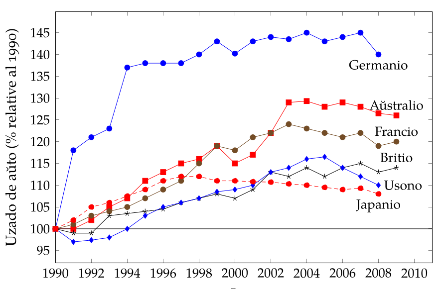
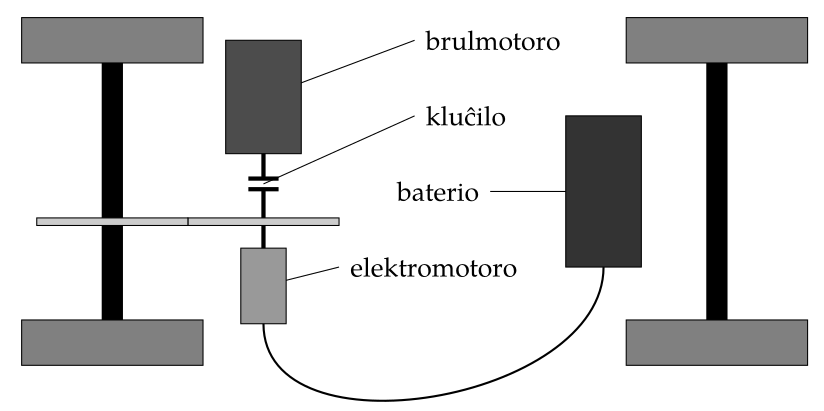

# Homa movebleco estonta
## Kiel ni moviĝos en tempoj de altiĝantaj energikostoj

<!--
<Johannes.Mueller@esperanto.de>

-->

<blockquote class="resumo">
Multaj diskutoj nuntempe okazas pri la elĉerpiĝo de nafto kaj la malabundeco de
energio. Granda kialo por la bezono de energio kaj nafto estas la homa movebleco.
Kiel do la homoj vojaĝos aŭ atingas siajn laborejojn en mondo kun pli multekosta
energio. Ĉu la movebleco, kiujn homoj en kelkaj mondpartoj havas estas konservebla?
Kiuj estas la defioj teknikaj kaj sociaj por ne nur konservi ĝin sed ankaŭ disvastigi ĝin
al aliaj mondopartoj.
</blockquote>

## 1 Enkonduko
En la nuna epoko en kelkaj mondpartoj la homoj dum jardekoj alkutimiĝis al vasta
homa movebleco. Ekzemple en Usono kaj Aŭstralio pli ol po sescent aŭtomobiloj por
mil enloĝantoj ekzistas. En Eŭropo estas depende de la lando inter po tricent kaj po
sescent. En aliaj mondpartoj, ekzemple Afriko, Ĉinio ekzistas malpli ol po dek aŭ-
tomobiloj por mil enloĝantoj []. La tutmonda kvanto de uzataj aŭtomobiloj rapide
kreskas, ĉefe en partoj, kie oni ĝis nun malmulte uzas ilin, ekzemple Ĉinio kaj Barato.
Eĉ ĉi-tempe oni rimarkas, ke la prezo por nafto kreskadas. Foje okazas pro ekonomia
krizo, ke ĝi malkreskas, sed tiaj efikoj kutime estas portempaj. Tiu kreskado de la
naftoprezo ne nur estas kaŭzata de la kreskanta kvanto da bezonata nafto, sed ankaŭ
de la malkreskanta aŭ almenaŭ limigita kvanto da disponebla nafto. En la pasintaj
jaroj jam observeblas la tendenco, ke la tutmonda uzado de aŭtoj ekmalkreskas.

Do se la homaro volas konservi la ekzistantan homan moveblecon kaj eĉ disvastigi
ĝin al mondaj regionoj, kie ĝi ankoraŭ ne ekzistas – ambaŭ ja estas dezirinda afero –
oni bezonas iel anstataŭigi la nafton.

## 2 Paŝoj al la elektra aŭtomobilo
Kiam la aŭtomobilo enkondukiĝis kiel amase disponebla veturilo, ne estis evidente,
ke ĝi uzos brulmotoron. Fakte la elektra motoro havas avantaĝojn kompare al la brul-
motoro.

Bildo 1: La tutmonda uzado de aŭtoj [^2]

- Ĝi estas pli efika.
- Ĝi povas reuzi energion per dezirata bremsado.
- Ĝi ne bezonas rapidumŝanĝilon.

Kial do oni ne uzadas ĝin? Simpla respondo: ne facilas kunporti sufiĉe grandan kvanton da elektra energio. Nuntempe ekzistantaj elektraj aŭtomobiloj havas distancpovon
de malpli ol 200 kilometroj. La distancpovo de brulmotora aŭtomobilo estas preskaŭ
mil kilometroj. Krome oni povas refueli brulmotoran aŭtomobilon ene de kelkaj minutoj. Reŝargi baterion de elektra aŭto daŭras plurajn horojn. Do la aktualaj elektraj
aŭtomobiloj ne taŭgas por longaj vojaĝoj. Krome ili estas ankoraŭ multe pli kostaj ol
komparebla brulmotora aŭto.

### 2.1 La hibrida aŭto
La unua paŝo de la brulmotora aŭto al elektra aŭto estas la t.n. hibrida aŭto aŭ mallonge “hibrido”. Ĝi estas aŭto, kiu havas kaj brulmotoron kaj elektromotoron. Do ĝi
tiel kombinas la avantaĝojn de ambaŭ. La ĉefa ideo estas uzi la kapablon de elektra
motoro reuzi energion per bremsado. Kutima bremsilo de aŭtomobilo simple transformas la movenergion de la aŭto al varmo. La energio tiel estas perdita. Elektra
motoro povas ne nur transformi elektran energion al movenergio sed ankaŭ inverse.
Do malsuprenirante deklivon aŭ proksimiĝante ruĝan semaforon ĝi povas dum bremsado la veturilon parte reŝargi la baterion. La tiel stokita elektra energio poste povas
malŝarĝi la brulmotoron kaj tiel ŝpari fuelon. Depende de la ŝargstato de la baterio
kaj la veturkondiĉoj oni povas eĉ malkluĉi kaj poste malŝalti la brulmotoron kaj veturi
nur elektre. La ŝoforo ne bezonas mem decidi, ĉar tion tute aŭtomate faras komputilo.

Bildo 2: Principo de hibrida aŭtomobilo [4]

### 2.2 Kontaktila hibrido

La t.n. kontaktila hibrido estas la dua paŝo al la elektra aŭto. Ĝi similas al la hibrido,
sed ĝi havas pli grandan baterion. Krome ĝi havas kontaktilon por ŝargi la baterion
el fiksa elektrofonto. Plenŝargita baterio ebligas veturi distancojn de kelkdek ĝis cent
kilometroj. Do tio sufiĉas por urbaj veturoj kiel ekzemple veturi al laborejo aŭ aĉetumado. Poste oni dumnokte povas reŝargi la baterion. Por vojaĝoj inter du urboj tio jam
ne plu sufiĉas. Tiuokaze la brulmotoro enŝaltiĝus kaj la aŭto kondutus kiel kutima
hibrido.

### 2.3 Elektra aŭto kun distancpovigilo

Plia paŝo al elektra aŭto estas la t.n. distancpovigilo. La hibridoj uzas siajn brulmotorojn en kutima maniero. Per rapidumo la forto de la motoro estas transdonita al
la radoj. La elektra motoro estas dua motoro. Kontraste al tio distancpovigilo estas
brulmotoro, kies ununura tasko estas laŭbezone reŝargi la baterion aŭ provizi energion por la elektromotoro. Do oni veturas elektre, kaj kiam la baterio proksimiĝas al
elĉerpiĝo aŭtomate enŝaltiĝas la distancpovigilo provizonte elektran energion por kaj
reŝargi la baterion kaj nutri la elektromotoron. La avantaĝo estas, ke oni ne bezonas
rapidumŝanĝilon, ĉar la brulmotoro nur estas uzata je unu turnnombro.

### 2.4 La nurelektra aŭtomobilo

Por la nurelektra aŭtomobilo oni tute rezignas pri brulmotoro. Ĝis nun restas la problemo, kiel nutri la elektromotoron. Ekzistas ĉefe du ebloj.

#### 2.4.1 Elektra aŭto nutrata de baterio

La plej simpla metodo estas nutri la elektromotoron de reŝargebla baterio. Oni simple
uzas kutiman baterion kiel uzata en tekkomputiloj. La problemo estas ke la kapacito
de aktuala baterio nur sufiĉas por distancpovo de malpli ol 200 kilometroj. Krome
tiaj baterioj estas multekostaj kaj tiel kaŭzas grandan parton de la prezo de la veturilo.
Plia malavantaĝo estas, ke la ŝargo de la baterioj daŭras plurajn horojn. Do ne eblas
dum kelkaj minutoj reŝargi ĝin post elĉerpiĝo.

Unu ideo por solvi la problemon pri la distancpovo, estas starigi sistemon de ŝan-
ĝeblaj baterioj. Kiam dum vojaĝo elĉerpiĝas la baterio oni en fuelejo povas ŝanĝi la
baterion. Oni fordonas la elĉerpitan kaj ricevas plenŝargitan kaj por tio pagas monon.
Tio postulas eblon rapide ŝanĝi la baterion de la aŭto per ia maŝino. Krome ĉiuj veturilfarantoj devus interkonsenti pri normaj baterioj kiuj estas interŝanĝeblaj.

#### 2.4.2 Elektra aŭto nutrata de fuelĉelo

La dua pridiskutata metodo nutri veturilan elektromotoron estas la t.n. fuelĉelo. La
energio de fuelo ne estas uzata per eksplodigi la fuelon, sed per elektroĥemia procezo
transformi ĝin al elektra energio. La plej efika fuelo por tio procezo estas hidrogeno.
Oni atingus distancpovon kompareblan kun brulmotora kaj oni rapide povas refueli la
veturilon. Tamen restas du gravaj problemoj. Malfacilas stoki hidrogenon sendanĝere,
kaj ankoraŭ ne ekzistas disdonreto por disponebligi hidrogenon grandskale.

### 2.5 Alternativa vidpunkto

Ĉi-tempe krom la kostoj la ĉefa problemo de elektra aŭtomobilo estas la malgranda
distancpovo. Preskaŭ ĉiuj klopodoj pri evoluigo de elektra aŭto temas pri tiuj du aferoj.
Oni povus ja demandi kial oni fakte bezonas tiel altan distancpovon. Kiom da tagoj
en la jaro oni vere veturas per sia aŭto pli ol 200 kilometrojn tage? Ĉu ne eblus por tiuj
esceptaj okazoj trovi alian manieron vojaĝi? Grava kialo vojaĝi per aŭto estas, ke oni
surloke bezonas aŭton. Do alternativo estus vojaĝi pertrajne kaj surloke laŭbezone lui
veturilon. Tiel eĉ nuntempe jam eblus uzi nurelektran aŭton.

Krome ankaŭ por la enurba trafiko ofte neindividuaj trafikiloj tute taŭgas. En gran-
daj urboj multaj homoj jam tute rezignas pri propra aŭtomobilo kaj uzas publikajn
trafikilojn por la ĉiutagaj bezonoj. Enkondukiĝis dum la pasintaj jardekoj plia eblo
por kompletigi la enurban moveblecon, la aŭtodividado. Estas firmaoj, kiuj disponebligas aŭtojn al siaj klientoj por mallonga tempo. La kliento pagas etan monatan
kotizon de ekzemple kvin Eŭroj, kaj povas uzi aŭtojn kontraŭ pago de porhora kaj
porkilometra prezo. Kontraste al kutimaj aŭtoluejoj, kiuj nur forluas aŭton por kompleta tago, kliento povas uzi aŭton laŭbezone por duona horo. Multaj homoj por la
ĉiutaga vivo ne bezonas aŭton, tamen ĝi unu aŭ du foje monate utilas por ekzemple
aĉeti stokon da trinkaĵoj.

## 3 Estonteco de la aviado

En la pasintaj jardekoj flugvojaĝoj imprese malmultkostiĝis. Ĉefe la mallongdistancaj
kaj mezdistancaj flugoj fariĝis tre malmultekostaj, ofte eĉ malpli kostaj ol samitinera
trajnvojaĝo. Kial tio povas esti? Estas du ĉefaj kialoj por tiu efiko. La infrastrukturaj
kostoj por la aviadumado estas malaltaj. Estas granda konkurenco inter la flughavenoj,
kiuj foje eĉ pagas al la aviadaj firmaoj ĉiun alflugon. Krome la fuelo por aviadiloj
estas havebla preskaŭ senimposte. Do mallonge: la plej granda parto de la kostoj por
flugvojaĝo estas la energikostoj, kaj tiuj estas relative malaltaj pro impostaj kialoj.
Do kion signifas tio por la estonteco de la aviado? La aviado certe estas la trafikilo
kiu plej severe suferos je la plikostiĝo de la energio. Krome ne ekzistas koncepto por
sennafta aviado, kontraste al la aŭtomobilado kiel priskribita en sekcio ^2. Kiel oni
do fuelos aviadilojn sen nafto? Ĉu per hidrogeno? Ĉu per biologia fuelo? Ĉu tiaj
konceptoj jam post dek ĝis dudek jaroj estos pretaj por vasta uzado? Rigardante la
renovigemon de la grandaj aviadilfarantoj oni dubas. La aviadila industrio estas iom
pli optimisma pri tio [^3].

Ne malverŝajnas, ke la homoj kiuj dum sia studenta aĝo ĝuis la eblon malmultekoste
aviadile vojaĝi, iam rakontas pri tio al siaj genepoj, kvazaŭ rakonto el fora nekredebla
pratempo. Bone povas esti, ke la enlanda aŭ enkontinenta aviado tute malaperos kaj
nur restos la aviado transoceana interkontinenta.

## 4 Alternativaj energifontoj
Pripensante kiel anstataŭigi la nafton oni ne forgesu, ke ankaŭ nenaftdevena energio
ne senĉese disponeblas. La temo estontaj energifontoj fakte meritus propran artikolon.

## La aŭtoro

Johannes Mueller studis materialsciencon kaj dum la studado
ekinteresiĝis pri komputila tipografio. Profesie li okupiĝas pri la
esplorado pri ŝtaloj ĉe la firmao Bosch en Germanio proksime de
Stuttgart. En sia libertempo li multe okupiĝas pri Esperanto. Interalie li instruas Esperanton ĉe la universitato de Stuttgart, muzikumas kaj verkas artikolojn aŭ prelegojn pri sia profesia fako.

## Bibliografio

[^1]: World Bank. Passenger cars (per 1,000 people). World Development Indicators. URL:
http://data.worldbank.org/indicator/IS.VEH.PCAR.P3/.

[^2]: International Transport Forum. Transport Outlook. Meeting the Needs of 9 Billion
People. OECD, 2011.

[^3]: Jörg Sieber. Langfristige Sicherung der Luftverkehrs durch neue Antriebstechnologien
und alternative Brennstoffe. München: MTU Aero Engines, 2008. URL: http://www.
mtu.de/de/technologies/engineering_news/development/Sieber_Sicherun
g_Luftverkehr_de.pdf.

Scienca Revuo 1/2012Homa movebleco estonta

[^4]: Wikipedia. Hybridelektrokraftfahrzeug. URL: http://de.wikipedia.org/w/index.
php?title=Hybridelektrokraftfahrzeug&oldid=97132789.
