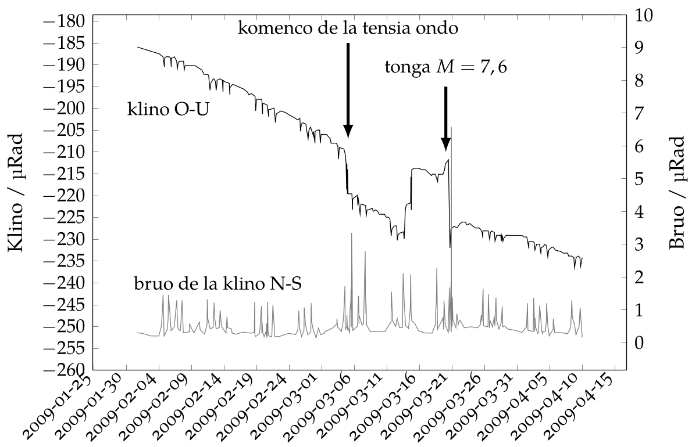

# Sukcesaj tertrem-prognozoj kaj nova opinio pri la movado de litosferaj platoj

<!--
Václav Procházka
V Bažantnici 2636
CZ-27201 Kladno
Ĉeĥio

<vprochaska@seznam.cz>
-->

<blockquote class="resumo">
    La tertremoj prognozeblas, kio estis pruvita jam dum la 70-aj jaroj en Ĉinio. La
    mezurado-rezultojn de moviĝoj kaj deformoj helpe de vertikalaj statikaj pendoloj (klinometroj) subtere ĉefe en la centra Eŭropo (Kalenda, Neumann et al., 2011) montris
    anomalioj antaŭ ol grandaj tertremoj, situantaj orientrande de la eŭrazia plato, sed ofte
    eĉ pli foren. La mezuradoj ankaŭ pruvis intiman rilaton de la procedo de deformoj de
    masivo al la sunradiadon. La sunradiado estas la precipa energi-fonto (sufiĉas 0,X % de
    la sunenergio falinta a la tersurfaco) por la movado de la litosferaj platoj, pere de termo-elastikaj ondoj kaj klika meĥanismo. Tio verŝajne definitive malkonfirmas la teorion
    de konvekciaj (cirkuladaj) fluadoj en la termantelo. La rezultoj instigas al elkonstruo
    de tutmonda reto de vertikalaj statikaj pendoloj kunlabore kun aliaj aparatoj.
</blockquote>

Pluraj geologoj kaj sismologoj ĝis nun opinias, ke la tertremoj (krom post-skuoj) ne
prognozeblas [^4], [^7]. En Ĉinio oni atingis spektindajn sukcesojn jam dum la 70aj jaroj,
per diversaj metodoj inklude observon de la besto-konduto [^8] (en Esperanto vidu [9,
10]). Tamen plimulto de ĉi tiaj rezultoj estis pretervidita per parto de la faka publiko, ĉar oni ne publikigis ilin anglalingve. Signifa kontribuo tamen originas ankaŭ el
la sisme kalma centra Eŭropo: la monografio “Inklinoj, tuttera tektoniko kaj tertrem-prognozoj” [^6], eldonita ĉeĥlingve (Náklony, globální tektonika a predikce zemětřesení) kaj
dum la jaro 2012 anglalingve (Tilts, global tectonics and earthquake prediction). La libro
resumas la mezurado-rezultojn de moviĝoj kaj deformoj helpe de vertikalaj statikaj
pendoloj (klinometroj) subtere. Kvankam la mezuradoj ĝis nun realiĝis sole en Eŭropo (kaj la unuaj du jaroj sole en Ĉeĥio kaj Slovakio), oni kutime observis anomaliojn
antaŭ grandaj tertremoj, situantaj orientrande de la eŭrazia plato, kaj ofte eĉ pli foren.
La sukcespleno ≈ 70 − 80% de nepublikigitaj prognozoj en 4-semajnaj temperoj, faritaj antaŭ eldono de la monografio, estas nun testita per prognozoj senditaj al aliaj
prognozistoj (laborantaj kun aliaj metodoj) mondskale.

## Ĉefaj konkludoj de la monografio

La tertremoj estas prognozeblaj. Ne ĉiuj, sed reale tiuj kun la magnitudo M ≥ 6.
Tiuokaze kutime eblas observi antaŭsignojn pli ol unu tagon antaŭ la ĉefa evento. La

Bildo 1: Anomalia inklino kaj bruo de la pendolo, lokita en jam neuzita areo de la
minejo Lubeník en Slovakio, antaŭ la tertremo en la insularo Tonga la 19-an de marto
2009 (la pintoj en labortagoj estas kaŭzitaj per funkcio de ventolsistemo en la minejo).

tertremoj ekas per multaj ekzogenaj faktoroj. Precipaj meĥanismoj inkludas eksponon,
tajdojn kaj varion de la rotaci-rapido de la Tero (aŭ de la taglongeco), malpli signifas
la meteorologiaj ekstremoj, inundoj k.a.

La plej grava energi-fonto por la movado de la litosferaj platoj estas la sunradiado.
Ĝia intima rilato al la evoluo de deformoj de masivo (ĉefe en tagaj kaj jaraj cikloj) estis
plej bone pruvita ĝuste per mezuradoj per vertikalaj statikaj pendoloj. La temperatur-
varioj kaŭzas pro la dilateblo de rokaĵoj termoelastikajn ondojn [^5]. Ĉi tiuj deformoj
ja havas grandskale ciklecan karakteron (tagan, jaran k.s.), sed ĝia rezulto estas ne-
inversigebla, nome pro la klika meĥanismo (vd. ankaŭ [^1]). La principo de la klika
meĥanismo estas, ke la fendaĵoj pleniĝas per materialo falinta de supre, kaj tial la ĉir-
kaŭa maso ne povas reveni ĝis la origina pozicio.

La agado de eksteraj fortoj havas kiel rezulton la okcidentan drifton de la litosfe-
raj platoj rilate al mantelo (kion konstatis jam Doglioni [^2]), kun rapideco mezvalore
proks. 0, 1 mm/tago. Reciprokaj movadoj de la platoj estas kaŭzitaj per diferencoj en ili-
aj rapidecoj kaj ekzaktaj mantelo-rilataj kursoj (nuntempe, la minimuman rapidecon
havas la antarkta kaj la Nazca plato [^3]).

La plialtigita tektonika tensio en rokaĵoj kaŭzas la deformon, kiu mezureblas per
kelkaj metodoj, inklude vertikalajn statikajn pendolojn, realtempe. 

Antaŭ la tertremoj
la deform-evoluo multokaze rapidiĝas laŭ la deform-kurbo post la cedo-limo. Tiamaniere observeblas unu el tertrem-antaŭsignoj.
Antaŭ la ĉefa evento oni ofte observis la t.n. tensiajn ondojn, kiaj probable ekestas
proksime de la rompiĝanta asperito (t.e. la loko en kontakto de du platoj aŭ blokoj de
la krusto, kie la reciproka movado dumtempe estas blokita). Surprize, en Mezeŭropo
observiĝis la alvenoj de la tensiaj ondoj el la tuta terglobo, plej ofte el randoj de la
eŭrazia plato. Ĉi tiaj tensiaj ondoj havas periodojn de tertrem-ekigaj meĥanismoj (plej
ofte temas pri periodo taga aŭ duontaga). Laŭ la tempa fluo de la tensiaj ondoj eblas
taksi la meridianon, kie situas la asperito.

Ni devas rigardi la tertremojn el tuttera vidpunkto, ĉar ĉiaj litosferaj platoj estas en
reciproka kontakto kaj deformoj aŭ movo de unu plato kaŭzas ŝanĝon de la tensio kaj
de la movo de la ceteraj platoj. Pro tio la tertremoj aperas serie, kaj antaŭ- kaj post-
skuoj devas esti serĉataj ne nur proksime de la fokuso, sed tuttere.

La interkomuniko de deformometroj kaj pluaj mezuriloj en unu tuttera sistemo ebl-
igos observi interagojn de la litosferaj platoj, taksi la evoluon de deformoj kaj de la
tensio-transdono inter regionoj, kaj tial prijuĝi sekvajn probablajn danĝerajn lokojn
de estontaj grandaj tertremoj.

La pruvita dominanta rolo de la eksteraj fortoj en la movado de litosfer-platoj verŝaj-
ne definitive malkonfirmas la teorion de konvekciaj (cirkuladaj) fluadoj en la termantelo. Konekse al tio, ankaŭ la ideo de la tergloba interno ŝanĝiĝas esence, kio estas
temo pro multe pli ol unu monografio. Tamen ni provis almenaŭ atentigi al la fakto,
ke la ĉefaj argumentoj prezentitaj por la konvekcio ne estas sendependaj kaj ekzistas
alternativaj, ofte pli simplaj klarigoj. Konkrete estas koncize diskutitaj (precipe en la
ĉeĥa versio) diferencaj ideoj pri:

- la kvanto de radioaktivaj elementoj en la tergloba kerno kaj la plej malsupra mantelo (niaopinie ili preskaŭ ne estas tie),
- genezo de la ardaj punktoj (”hotspots”) (kiujn ni rigardas kiel manifeston de
aĝaj grandaj frapoj, kie la transira krater-kaverno atingis ĝis sub la oceanan litosferon),
- funkciado de la plata tektoniko en prekambrio (en la erao de malpli forta sunradiado kaj pli forta termoefiko ne ekzistis plata tektoniko komparebla kun la
hodiaŭa),
- materia interŝanĝo de la malsupra kaj la supra mantelo (kion ni rigardas kiel tre
limigitan).

La konstato, ke kelkaj dekonoj de procento de la sunenergio falinta al la tersurfaco
ŝanĝas sin en meĥanikan energion en la terkrusto, devas esti konsiderata ankaŭ en
klimatomodeloj.

Do la novaj rezultoj ne nur instigas al plirapidigita elkonstruo de tutmonda reto de
vertikalaj statikaj pendoloj kunlabore kun aliaj aparatoj, sed ankaŭ malfermas vastan
agosferon por sciencistoj el diversaj fakoj, por ke preciziĝu kaj diskutigu la nova teorio
de la movado de litosfer-platoj.

## Bibliografio

[^1]: J.G.A. Croll. “A new hypothesis for Earth lithosphere evolution”. En: New Concepts in Global Tectonics Newsletter 45 (2007), p. 34-51.

[^2]: Carlo Doglioni. “Geological evidence for a global tectonic polarity”. En: Journal
of the Geological Society 150.5 (1993), p. 991-1002. DOI: 10.1144/gjgs.150.5.09
91.

[^3]: Carlo Doglioni, David H. Green kaj F. Mongelli. “On the shallow origin of hotspots and the westward drift of the lithosphere”. En: Geological Society of America
Special Papers 288 (2005), p. 735-749. DOI: 10.1130/0-8137-2388-4.735.

[^4]: Robert J. Geller. “Earthquake prediction: a critical review”. En: Geophysical Journal International 131.3 (1997), p. 425-450. ISSN: 1365-246X. DOI: 10.1111/j.1365-246X.1997.tb06588.x.

[^5]: Milan Hvoždara, Ladislav Brimich kaj L. Skalský. “Thermo-elastic deformations
due to the annual temperature variation at the tidal station in Vyhne”. En: Studia
Geophysica et Geodaetica 32 (2 1988), p. 129-135. ISSN: 0039-3169. DOI: 10.1007/BF01637575.

[^6]: P. Kalenda k.a. “Náklony, globální tektonika a predikce zemětřesení”. En: Česká
geologie (2011), 245 pp.

[^7]: Ian Main. “Is the reliable prediction of individual earthquakes a realistic scientific goal?” En: Nature debates (1999). URL: http://www.nature.com/nature/debates/earthquake/.

[^8]: Kelin Wang k.a. “Predicting the 1975 Haicheng Earthquake”. En: Bulletin of the
Seismological Society of America 96.3 (2006), p. 757-795. DOI: 10.1785/0120050191.

[^9]: S Xu. “Apliko de seismologiaj metodoj por prognozi tertremon”. En: Geol. Int 8
(1990), p. 58-66.

[^10]: Y. Zhao kaj F. Qian. “Terrezistiveco, antaŭsimptomoj de tertremo kaj ĝia prognozado”. En: Geol. Int 8 (1990), p. 79-87.

