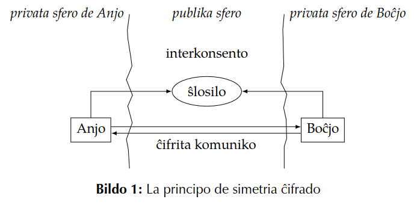
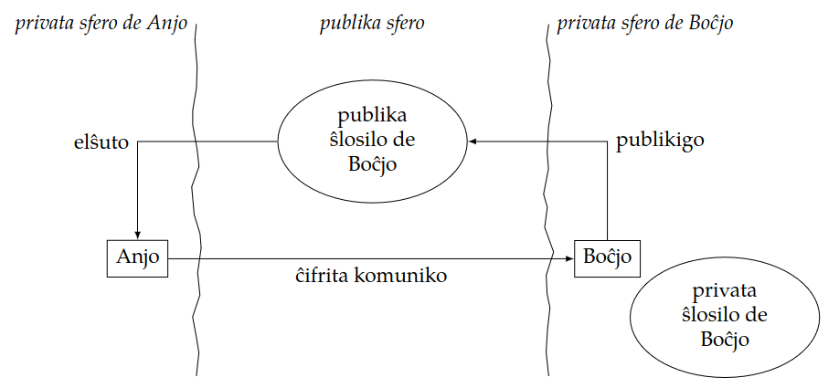
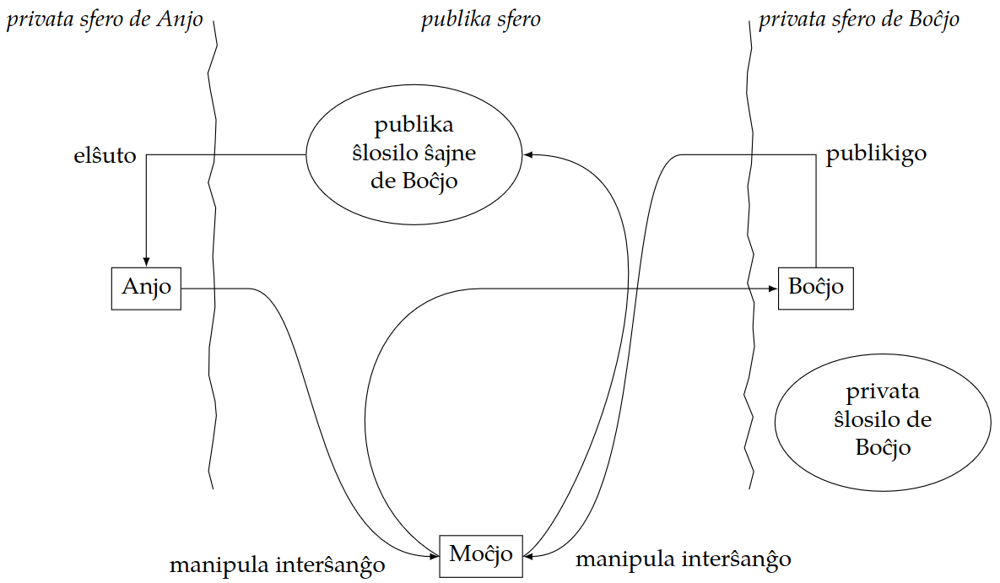
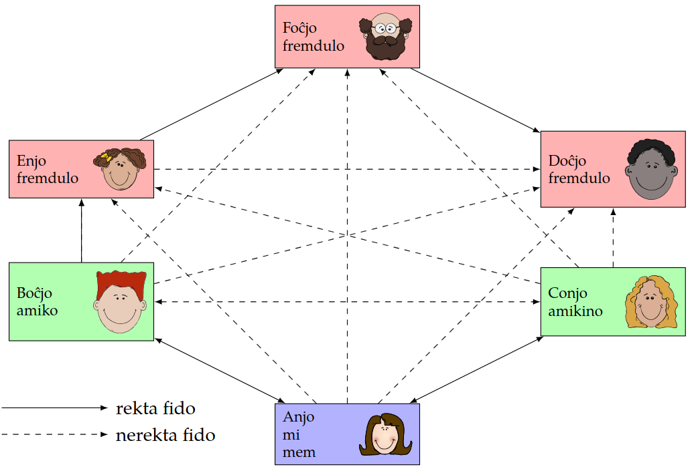

# Ĉifrado, pli kaj pli grava

## Kiel ni protektu nian komunikadon kaj niajn datumojn kaj kial

<blockquote class="resumo>
En la pasintaj jardekoj la reta komunikado iĝis la plej grava formo de longdistanca
komunikado. Pri telefono kaj telefonnumeroj, ni eble rakontos al niaj nepoj kiel niaj
geavoj nuntempe rakontas pri la permana konektado de telefonligoj fare de la “ĉarma
fraŭlino”. En la nuna tempo ni komunikas per retmesaĝo aŭ aliaj retaj transportiloj. Se
ni volas rekte babili, ni uzas retan telefonsistemon. Ankaŭ por stoki datumojn ni uzas
ciferecajn rimedojn. Ni ofte eĉ stokas ilin ekstere de niaj propraj loĝejoj, ĉar iu ofertas
al ni la eblon atingi niajn datumojn tie stokitajn de ĉie ajn. Ĉu niaj datumoj en cifereca
formo fakte estas sekuraj? Ĉu iu tria persono eble povas legi niajn privatajn mesaĝojn
foje eĉ intimajn? Ĉu eble iu tria persono falsas mesaĝon senditan aŭ ricevotan? Kiel
ni povas esti certaj, ke retmesaĝo vere venis de la indikita sendinto? En la pasinta
jaro montriĝis ke la sekretaj servoj stokas niajn komunikajn datumojn kaj eble uzos ilin
poste por ankoraŭ ne konataj celoj.

Ja ekzistas teknologioj por solvi ĉiujn tiajn problemojn. Oni nur devas koni kaj uzi ilin.
Por tio tiu ĉi artikolo pledas klarigante la principojn kiujn oni konu por uzi la rimedojn.
</blockquote>

## 1 Historio de ĉifrado

Verŝajne jam ekde kiam la homoj komencis komuniki per lingvoj, ili serĉis vojojn transsendi 
mesaĝojn al alia homo, sen ke tria homo povu ekscii ĝian enhavon. Unu el la
plej facilaj metodoj estas flustri en la orelon de la persono, al kiu oni celas transsendi 
la mesaĝon. Ĝis nun oni uzas la rimedon de la “kvarokula interparolado”, do
la interparolado kun nur du ĉeestantoj. Antaŭ ĉirkaŭ 5000 jaroj la homaro inventis la
skribon [^3]. Ankaŭ por la skriba mesaĝumado oni serĉis vojojn skribi mesaĝon, kiun
nur kapablu legi la persono alskribata kaj neniu alia. Por tio oni inventis sekretajn
skribaĵojn aŭ kodojn aŭ ankaŭ sekretajn lingvojn.
Ĉiuj tiaj provoj protekti informon havas unu komunan trajton. Ili uzas la principon,
ke la homo, kiu ne eksciu la informon, ne konas la metodon. La modernaj ĉifraj metodoj 
uzas la tute kontraŭan principon, nome la principon de *Kerckoff* [^9]. Tiu principo
diras, ke “La atakanto konas vian metodon.” Sed kiel do oni povas skribi sekretojn,
se la atakanto konas la principon de la ĉifro? Por tio oni uzas matematikajn rimedojn,
kiujn oni inventis en la pasinta jarcento kaj kiuj estas facile uzeblaj per komputiloj.

Bildo 1: La principo de simetria ĉifrado

## 2 Bazaj principoj

Por klarigi principojn de ĉifrado enkondukiĝis du fikciaj figuroj kiel ekzemplo. En
la angla lingvo oni nomas ilin Alice kaj Bob. En tiu ĉi artikolo ili nomiĝu Anjo kaj
Boĉjo. Ni nun imagas, kiel Anjo kaj Boĉjo skribas mesaĝojn al unu la alia kaj por tio
uzas ĉifradon. Tiu ĉi sekcio klarigas la principojn, ne la praktikan uzon de ĉifrado.
La praktika uzo estas pli facila, ĉar la meĥanismoj estas kaŝitaj malantaŭ programaĵo.
Matematikajn detalojn ni en tiu ĉi artikolo ne traktas. Eble estonte troviĝas aŭtoro, kiu
kontribuos tian artikolon al Scienca Revuo. Ankaŭ ekzistas vikipedia artikolo pri la
temo [^6].

### 2.1 Simetria ĉifrado

La pli facila metodo estas la simetria ĉifrado. La principo estas montrata en bildo 1.
Anjo kaj Boĉjo interkonsentas pri komuna ŝlosilo[^pn1]. kaj poste komunikas per mesaĝoj
ĉifritaj per tiu komuna ŝlosilo. Du gravaj malavantaĝoj evidentas:

- En bildo 1 oni vidas, ke la interkonsento pri la komuna ŝlosilo okazas en la publika sfero. La atakanto povas kapti la ŝlosilon dum interkonsento. Do oni bezonas
komunikkanalon tre fidindan por interkonsenti pri la komuna ŝlosilo. Tian oni
kutime ne havas.
- La komuna ŝlosilo taŭgas nur por la komunikparo Anjo kaj Boĉjo. Se Anjo volas skribi mesaĝon al – ni diru – Conjo, Anjo kaj Conjo devas interkonsenti pri
komuna ŝlosilo kaj Anjo devas stoki ĉiujn unuopajn ŝlosilojn, pri kiu ŝi interkonsentis kun siaj unuopaj komunikpartneroj. Kaj ŝi devas zorge atenti pri tiu
ŝlosilaro ke neniu atakanto – eble nerimarkite – kopias unu el la ŝlosi loj. Se ŝi
perdas unu ŝlosilon, ŝi ne plu povas malĉifri la mesaĝojn de la koncerna persono.

Bildo 2: La principo de malsimetria ĉifrado

### 2.2 Malsimetria ĉifrado

Pro la ĵus menciitaj malavantaĝoj de la simetria ĉifrado oni inventis la tiel nomatan
malsimetrian ĉifradon. La principo estas montrata en bildo 2. Ĉiu partoprenanto de
la komuniko kreas por si ŝlosilparon. La ŝlosilparo konsistas el la privata ŝlosilo kaj la
publika ŝlosilo. Per la publika ŝlosilo oni nur povas ĉifri. Per la privata oni malĉifras.
Do se Boĉjo kiel en bildo  volas ricevi ĉifritan mesaĝon de Anjo, li publikigas sian
publikan ŝlosilon. Anjo akiras t.e. elŝutas ĝin kaj ĉifras per ĝi mesaĝon al Boĉjo. Tiun
mesaĝon nur Boĉjo povas malĉifri per sia privata ŝlosilo. En bildo 2 oni vidas, ke la
privata ŝlosilo de Boĉjo restas en la privata sfero de Boĉjo kaj ne eniras la publikan
sferon.
Se Anjo volas skribi ĉifritan mesaĝon al Conjo, ŝi petas la publikan ŝlosilon de Conjo
kaj uzas tiun por ĉifri. Do ne bezonatas komuna ŝlosilo por ĉiu komunikparo. Sufiĉas
po unu paro por ĉiu partoprenanto de la komunikado. Ĉiu partoprenanto publikigas
sian publikan ŝlosilon kaj zorge atentas pri sia privata ŝlosilo. Por skribi mesaĝon al
iu oni akiras ties publikan ŝlosilon kaj ĉifras per ĝi la mesaĝon sendotan.
La malsimetria ĉifrado havas plian avantaĝon, la eblon subskribi mesaĝon. Ekzemple Boĉjo volas sendi al Anjo la mesaĝon “Mi amas vin. Via Boĉjo”. Do li ĉifras la
mesaĝon per la publika ŝlosilo kaj sendas ĝin al Anjo. Atakanto ne povas legi la mesaĝon, do ĉio en ordo. La sekvan tagon atakanto volas intrigi la aferon. Ankaŭ la
atakanto havas aliron al la publika ŝlosilo de Anjo kaj povas uzi ĝin por ĉifri la jenan
mesaĝon kaj sendi ĝin al Anjo: “Mi ne plu amas vin, sed Conjon. Via eksa Boĉjo.” Tio
povas kaŭzi eĉ pli gravajn problemojn inter Anjo kaj Boĉjo. Kiel do Anjo povas esti
certa ĉu la mesaĝo estas aŭtenta, do vere venas de Boĉjo kaj ne de iu malica atakanto?
La solvo estas subskribi la mesaĝon.

Do Boĉjo estas eĉ pli saĝa kaj ne nur ĉifras sian mesaĝon sed ankaŭ subskribas ĝin.
Por tio li uzas sian privatan ŝlosilon por krei subskribon. La subskribo estas datumpeco, kiu dependas kaj de la privata ŝlosilo kaj de la mesaĝo subskribata. Li sendas
la mesaĝon kaj la subskribon al Anjo. Anjo povas uzi la publikan ŝlosilon de Boĉjo
por kontroli, ĉu la subskribo estas vere kreita per la privata ŝlosilo de Boĉjo. Se jes, la
mesaĝo estas aŭtenta.

## 3 Atakebloj kaj kontraŭmezuroj

La ĉifradaj metodoj mem estas konsiderataj sekuraj. Tio signifas, ke rompo de ĉifro
postulas tiel altan kvanton da komputila forto, ke ĝi praktike ne eblas kaj ne eblos. La
malfortaj punktoj ne estas la metodoj mem sed ties uzantoj. Tial uzanto sciu kelkajn
aferojn pri atakebloj kaj kontraŭmezuroj.

### 3.1 Atakebloj
#### 3.1.1 Ŝtelo de la privata ŝlosilo

La ĉefa kondiĉo por la fidindeco de ĉifrado estas, ke la privataj ŝlosiloj uzataj restu
sekretaj kaj aŭtentaj. Tio signifas, ke oni zorge gardu sian privatan ŝlosilon. Oni ne
stoku ĝin sur perdiĝemaj datumstokiloj kiel ekzemple poŝmemoriloj. Oni bone gardu
la komputilojn, kiuj enhavas la privatan ŝlosilon. Kiam oni lasas ilin enŝaltitaj, ĉiam
oni protektu ĝin per pasvorto. La privataj ŝlosiloj mem kutime estas protektitaj per
pasvorto. Tiu pasvorto nepre estu forta pasvorto.
Samtempe oni zorge protektu siajn komputilojn de virusoj kaj aliaj ŝteleniremaj pro-
gramaĵoj. Tio fakte estas tasko de ĉiu respondeca komputiluzanto. Estas bone imagebla, ke ni iam spertos virusojn aŭ vermojn, kiuj celas kapti tiajn privatajn ŝlosilojn.

### 3.1.2 Mezula atako

Grava kondiĉo estas, ke la publikaj ŝlosiloj, kiujn oni uzas por ĉifri estas aŭtentaj, t.e.
oni volas esti certa, ke uzata publika ŝlosilo vere apartenas al la homoj, al kiu oni celas
mesaĝi.
Tiu kondiĉo implicas unu atakeblon, la tiel nomatan mezulan atakon. Do ni denove
rigardas la ekzemplon de Anjo kaj Boĉjo. Anjo akiras la publikan ŝlosilon de Boĉjo kaj
uzas ĝin por ĉifri mesaĝon sendotan al Boĉjo. Sed ĉu ŝi povas esti certa, ke la publika
ŝlosilo mem estas aŭtenta? Eble atakanto – en bildo 3 li nomiĝas Moĉjo – kaptis la
publikan ŝlosilon de Boĉjo survojan al Anjo kaj anstataŭigis ĝin per alia publika ŝlosilo,
kiu mensoge diras ke ĝi estas de Boĉjo. Poste la atakanto kaptas la mesaĝon tiel ĉifritan,
malĉifras kaj legas ĝin kaj fine ĉifras ĝin per la vera publika ŝlosilo de Boĉjo por sendi
ĝin al Boĉjo. Boĉjo do ricevas ĉifritan mesaĝon malĉifreblan per sia privata ŝlosilo kaj
eĉ ne suspektas, ke la atakanto Moĉjo jam legis la klarmesaĝon. Per tiu mezula atako
la atakanto en la mezo povas ataki kaj la fidindecon kaj la aŭtentecon de la mesaĝo.

Bildo 3: La principo de la mezula atako. La atakanto Moĉjo unue manipulas la publikan
ŝlosilon de Boĉjo kaj poste la mesaĝon de Anjo al Boĉjo.

### 3.2 Kontraŭmezuroj

Kion fari kontraŭ la mezula atako? La respondo estas simpla, sed tio ne signifas ke la
afero facilas. La publikaj ŝlosiloj devas esti aŭtentaj. Oni povas uzi alian sekuran ko-
munikkanalon por interŝanĝi la publikajn ŝlosilojn. Sed sekuraj komunikkanaloj estas
multekostaj aŭ malkomfortaj, ekzemple oni povas renkontiĝi persone por interŝanĝi
la publikajn ŝlosilojn. Tio postulas almenaŭ unufoje renkontiĝi kun ĉiu komunikpartnero antaŭ ol kapabli komuniki fidinde. Do necesas faciligaj rimedoj.

#### 3.2.1 La fingrospuro

Oni povas voĉlegi la ŝlosilojn per telefono. Tio estas malavantaĝa ĉar la ŝlosiloj kutime estas longaj sensignifaj ĉenoj de literoj kaj ciferoj (vd. bildo 4a). Tion oni povas
faciligi per tiel nomata fingrospuro. La fingrospuro estas kvazaŭ kontrolsumo de la
tuta ŝlosilo. Bildo 4 montras la diferencon inter la tuta ŝlosilo kaj la fingrospuro. La
fingrospuro eblas printi sur vizitkarto aŭ kontroli telefone.

Do reen al Anjo kaj Boĉjo. Ili lernis de la spertita mezula atako kaj poste volas uzi
aŭtentajn ŝlosilojn. Ili interŝanĝas siajn publikajn ŝlosilojn per atakebla kanalo. Po-
ste ili uzas fidindan sed multekostan kanalon por interŝanĝi la fingrospurojn. Anjo
kalkulas de la ebla publika ŝlosilo de Boĉjo la fingrospuron kaj komparas ĝin kun la
sekure ricevita fingrospuro. Se fingrospuroj identas la publika ŝlosilo de Boĉjo estas
aŭtenta. Boĉjo sammaniere povas aŭtentigi la eblan publikan ŝlosilon de Anjo.

<table>
<tr>
<td><pre>
-----BEGIN PGP PUBLIC KEY BLOCK-----
Version: GnuPG v1.4.14 (GNU/Linux)
mQMuBFHUWO4RCADMJpQzY7J9nG6+xbMyeKOJu8ZZoRPswXuHs6Yq+rtioMvlkSG3
uAlUcOf3N21Qu7+YaB5V/5uoAof/Ab/iTOrxfp43R3dIi3zjfqrCw+f3rPm87hJT
YTRnBxFNbBKiXxZ3U5j4kbQWg9kuqT+v5z3rfV/W4NYnwfxZujNHeCg5GADg3tIo
41YBmmihjYDTYPC5IP+vDXsA8gcnrJ9Q/r6MtDzRG+HpfjTZowx5BaXQstXGuHIk
KewjAVe4CcQo3IdbagG6X1xHzujMgftfq0uZG5U26mPKGsAIdq6CLThW1JBsPIXh
GHm/YJM4Lqpp3Cg3wcRztEX7+9eaiI8Spy+zAQCdu1ayjcLXQJz1AhTTU8mca0ey
qr8DSvxACydgDu3GxQf/VaCoaoo5oOwdfdp/Smv2WUXOYM/CPAeueIxIschXv6YV
kG+/JH3l3YKC3qq+SmNRVEkAl6594HIr4Q3nFzFTnGhQCS6F2SgnHuS3u6pJNd+1
u5+f5+xIJtAe2Y8cPrKEASq05oX2LerYE/DV2wToXDY6ASzjqCx85scYv5RR2Zc2
f9yttdQM9w/X/AD+HfcLjq3TSWzUuaeJekGjqqSL24yyhuu8jhV/OTaFXLIZTm61
dctyVa72ry18qzZ9EuHF7F66DL27KeeCMpHzRMgXdQu6SDFZ+SdtauAxnrypnJ5p
ubj8xyTwmZlDz3d5Kw2TYVw5G23aKEg5E2sqs7PJLAgAsgrcWxy/eC8HXn7MoEdU
STXMmPB1i1wMzfMEewhyb3zPBpR8tNjC0CE9RXLU0OI3u+XwT/b0Biog+RNLCUIg
VSRUlCq8QBGp1DQhD+Xg1zNj+PoPBuLTkndI1zf8rcSylHTUN1WykALa1erJC6zJ
dB6VhAcKGTCaFzTzOXekn4EDCaVUwpwQjoJMlu+xfkl3JUzCVPbAl2uzhaCjPQoi
NR+35IVYT+xbiffmWd9mpBMRD3oGYyQ/7cWd3OJqjOYPkgePgt4M/JP0nxcZ6wKu
LEktwA21qB1+AYxdgRZEEJelTMO0hE5l+5POYmyasaNuNiaIaHduaA0tSwL2V1lu
1LQrSm9oYW5uZXMgTXVlbGxlciA8am9oQGpvaGFubmVzLW11ZWxsZXIub3JnPoh6
BBMRCAAiBQJR1FjuAhsjBgsJCAcDAgYVCAIJCgsEFgIDAQIeAQIXgAAKCRDxNBF8
dkKT0oh+AQCQqNcbBU3tvGI+C8dX6QvuwnrpiwwmztCBIf5lFu9gKwEAhYsAaVTD
bRZy84xyO02FmRJWEjyFF6uJHviMjdzsAoKIgwQTEQgAKwIbIwYLCQgHAwIGFQgC
CQoLBBYCAwECHgECF4ACGQEFAlHhczEFCQHuTaYACgkQ8TQRfHZCk9LixAEAgsJG
wZjck1WuSXAlz/O7bHLti7w9SXJQuvUmdUSfhOUA/RUahEF5H+QSjuPmBmWUHOpp
A0iXyN0nwNQcVszUvP87tEJKb2hhbm5lcyBNdWVsbGVyIChwb3IgRXNwZXJhbnR1
am8pIDxKb2hhbm5lcy5NdWVsbGVyQGVzcGVyYW50by5kZT6IgAQTEQgAKAIbIwYL
CQgHAwIGFQgCCQoLBBYCAwECHgECF4AFAlHhczcFCQHuTaYACgkQ8TQRfHZCk9Jf
OAD7BMB+jWs0O0lsil8nKBlw4coXvcqABec1VbkHcn1Jp1MBAJv+aaemnNawcab6
pzSQ7BV0aL5WRrxwsYi5QC2HxfOftE1Kb2hhbm5lcyBNdWVsbGVyIChldml0aW5k
YSAvIHZlcmFsdGV0IC8gZGVwcmVjYXRlZCkgPGpvaGFubmVzLW11ZWxsZXJAd2Vi
LmRlPoiABBMRCAAoAhsjBgsJCAcDAgYVCAIJCgsEFgIDAQIeAQIXgAUCUeFzNwUJ
Ae5NpgAKCRDxNBF8dkKT0tW7AP0ccLQ0SOmO7cIcTNRivYgZbc/kGwA6PZMlZCIx
nq9+kgD7B/GpAyez4ONMult+IH/Lyvkzq/3ZgSMvXixu+7Mi+ZW0LkpvaGFubmVz
IE11ZWxsZXIgPG11emlrb0Bqb2hhbm5lcy1tdWVsbGVyLm9yZz6IgAQTEQgAKAIb
IwYLCQgHAwIGFQgCCQoLBBYCAwECHgECF4AFAlHhczcFCQHuTaYACgkQ8TQRfHZC
k9J0cAD/aWnPO2yhKznDdq1BcXd0MPG/3Vh62/EL1bvOMDymCH8A/A3JCqfgMRP/
m1jkPtmpzzQ9VJYrKyVCJxEjt4aWAMdetC5Kb2hhbm5lcyBNdWVsbGVyIDxyZXRl
am9Aam9oYW5uZXMtbXVlbGxlci5vcmc+iIAEExEIACgCGyMGCwkIBwMCBhUIAgkK
CwQWAgMBAh4BAheABQJR4XM3BQkB7k2mAAoJEPE0EXx2QpPSC8wBAJFHWjbmSIek
EfKI2/gQZyxkFB7op+iyY/VCYz9hSD4ZAQCReXF8DbHhY0sUh7nY7cDiK57d73i7
IZ+9BSa0AUBT3bkCDQRR1FjuEAgAz2Lo7JZE3Osm7Z38Byx2LuixqEjbF76dk7d9
l2Yo3RIJfgd6r9+eueXzyg5A4tY+yloifgZHJT2bA0lMlF7bjl+tKTXoDgeN5K3n
BoMwhhwuBhJvDYGk71pTrzsl7MuwHe9Dq7ZStmNs/tUbGk8iy5GP0+6zUTLbbnla
ADPPDcmHFdZ5J7x+GJ4xMfRbmktZHaePemjdeG/rnvqbV329soKeHs+hgM4XYcg/
+PDp+Pq+AlMsHMTH8/jMFsWIcXn09eRrBexEdyPV9CKZ2p9l6BLNo8FBLtO8WYEK
AujEWCUE9KWNlSxBbHnOYw6o/7yAhS43c1yNL8B0Lbu5dY1o4wADBgf9HJYCp95a
AFbySiG5QbVcktaPcLmc8LTSJy9PRbbf4p7DmGzopAzK3rdnSGlyxkSu5ESdtd0o
1e/VyI6iw1cC2Bpy9hDbVMqu5IfmFVsBQG0VWsPjFkf9tcKlw3Qj3qE+j5Skn++q
9JABz68hwG8lulTu7tnvexIaxIS6oY/Yel308x66uIXr9PJ9v5QnXwDUyORAdjUe
5uZ4by/Fr7l+sdw65gfL3eSM9Vc5hR+B82NXcHxQgZJdyxCtDN7XtTP36LmImD/C
eoPTjZ2MALy+amp8uah/LauXJqvnn/caf3i0xVj9dcXCnEl5YjU88yP8eOG4sYLu
4iy0v2axZWBYe4hhBBgRCAAJBQJR1FjuAhsMAAoJEPE0EXx2QpPSF6EA/1HpM5/O
5ZmCoFnA3pbWi9U3MXA3Ab3uTkXRFQ9o73J7AQCEoUiY3jIxo9mJI0UHNW3Nhtob
EyZXrg/3zwJ00b4WAg==
=2Y3a
-----END PGP PUBLIC KEY BLOCK-----</pre>
</td>
<td>
<pre>E76C 345C 80B1 9E65 5653 9987 F134 117C 7642 93D2</pre>
</td></tr>
<tr>
<td>
(a) La tuta ŝlosilo
</td>
<td>
(b) La fingrospuro
</td>
</tr>
</table>
Bildo 4: Komparo de kompleta plublika ŝlosilo kaj ties fingrospuro. Montrata estas la
vera publika ŝlosilo de la aŭtoro.

Bildo 5: Reto de fido. Ni mem (Anjo) rekte nur fidas je du personoj, nome Boĉjo kaj
Conjo. Pro la fido de Boĉjo je Enjo kaj ties fido je Foĉjo kaj ties je Doĉjo, ni malrekte
fidas je tiuj personoj. Same Conjo, ĉar ŝi fidas je ni.

#### 3.2.2 Aŭtentiga aŭtoritato

Alia eblo estus, ke fidinda aŭtoritato subskribas ĉies publikajn ŝlosilojn. Do Anjo kreas
ŝlosilparon kaj kun la publika ŝlosilo vizitas la aŭtentigan aŭtoritaton kaj petas subskribon de sia publika ŝlosilo. La aŭtentiga aŭtoritato subskribas ĝin per sia privata
ŝlosilo kaj donas la subskribon al Anjo. Anjo poste povas sendi al Boĉjo sian publi-
kan ŝlosilon kun la subskribo de la aŭtentiga aŭtoritato. Boĉjo povas uzi la ĉie konatan
publikan ŝlosilon de la aŭtentiga aŭtoritato por aŭtentigi la subskribitan publikan ŝlosilon de Anjo. Stariĝas kelkaj demandoj pri tiu metodo:

- Ĉu la aŭtentiga aŭtoritato estas fidinda? Eble atakanto povas konvinki ĝin, ke li
estas Anjo kaj tiel ricevi subskribitan ŝlosilon, kiu funkcias kiel aŭtenta publika
ŝlosilo de Anjo.
- Kio okazas se atakanto sukcesas ŝteli la privatan ŝlosilon de la aŭtentiga aŭtoritato? Tiam la atakanto povas subskribi ajnan falsan ŝlosilon kaj ŝajnigi ke la
aŭtoritato agnoskis ĝin aŭtenta. Tia afero en la jaro 2011 grandskale okazis. Pri
tio okazo legu en sekcio 4.2.1.

#### 3.2.3 Reto de fido

Simpatia metodo aŭtentigi ŝlosilojn estas la tiel nomata reto de fido. Ĝi signifas, ke ne
centra aŭtentiga aŭtoritato subskribas la ŝlosilojn, sed ĉiu uzanto subskribas la ŝlosilojn, kiujn li konsideras aŭtentaj. Oni ne nur fidas la ŝlosilojn mem kontrolitajn sed
ankaŭ tiujn kontrolitajn de amikoj kaj de amikoj de amikoj. Bildo 5 montras la principon. Ni prenas la pozicion de Anjo. Anjo havas du amikojn, kiujn ŝi fidas, nome
Boĉjon kaj Conjon. Boĉjo fidas Enjon, kiu fidas Foĉjon, kiu fidas Doĉjon. Ĉiu subskribas la ŝlosilojn de ĉiu sia fidato. Do Anjo nerekte fidas ankaŭ la ŝlosilon de Enjo, Foĉjo,
kaj Doĉjo.

Ni rigardu ekzemplojn. Se Anjo akiras la ŝlosilon de Enjo, ŝi trovos la subskribon de
Boĉjo, kiun ŝi fidas. Do hura, la ŝlosilo de Enjo estas fidinda. Se ŝi akiras la ŝlosilon
de Foĉjo, ŝi trovos la subskribon de Enjo, akiras ties ŝlosilon, trovos la subskribon de
Boĉjo, kiun ŝi fidas. Do hura, la ŝlosilo de Enjo estas fidinda. Same la ŝlosilo de Foĉjo.
Same eĉ Conjo povas fidi la ŝlosilojn de Boĉjo, Enjo, Foĉjo kaj Doĉjo.

Ekzistas simpla matematika priskribo por la reto de fido. Por simpleco oni difinas,
ke oni povas fidi la posedanton de ŝlosilo aŭ parte aŭ komplete aŭ tute ne. Por kalkuli
la aŭtentecon *A* de ŝlosilo, oni bezonas la nombron de parte fidataj subskribintoj *p*
kaj la nombron de komplete fiditaj subskribintoj *k*. Estu P la nombro de parte fidataj
subskriboj bezonataj por atingi kompletan fidon. Same estu *K* la nombro de plene
fidataj subskriboj por atingi kompletan fidon. La aŭtenteco de la koncerna ŝlosilo
kalkuliĝas per

$$ A = \frac{p}{P} + \frac{k}{K}$$

Se la valoro de A estas malpli granda ol 1, ni parte fidas la ŝlosilon, se ĝi estas egala al
aŭ pli granda ol 1 ni plene fidas ĝin. Kutime oni uzas *K* = 1 kaj *P* = 2. Tio signifas,
ke oni bezonas du parte fidatajn subskribojn aŭ unu komplete fidatan subskribon por
komplete fidi ŝlosilon.

La reto de fido estas simpatia afero, ĉar ĝi ne nur fidas je teĥnologio, sed ankaŭ postulas fidon je homoj. Tio signifas, ke homoj pripensu, kiujn homoj ili fidas. Ekzemple
por Boĉjo tio signifas, ke ju pli da homoj fidas lin, des pli da homoj povas fidinde
komuniki kun li. Bedaŭrinde tiu metodo estas preskaŭ nur uzata per veraj komputilemuloj. En komputilemulaj kongresoj eĉ okazas specialaj eventoj por tio. Homoj
renkontiĝas, konatiĝas kaj subskribas la ŝlosilojn de la aliaj. En la angla lingvo oni
nomas tian eventon “crypto party”, en Esperanto “ĉifrofesto”. Ĉifrofesto estas ankaŭ
inda evento por Esperanto-renkontiĝoj.

## 4 Praktika uzo de ĉifrado

Ĝis nun ni nur traktis la teorion de ĉifrado. Ni uzis la fikciajn ekzemplajn figurojn de
Anjo kaj Boĉjo por pli bone kompreni kiel la tuta afero funkcias. Sed nun ni adiaŭas
niajn du amikojn kaj lasas ilin komuniki inter si. Ni nun interesiĝas, kiel ni povas uzi
la konojn, kiujn ni akiris observante Anjon kaj Boĉjon interkomuniki.

### 4.1 Ĉifri sian datumon

Sufiĉe facile estas ĉifri siajn proprajn datumojn. Ekzistas programaĵoj, kiuj ĉifras tutan aŭ partan durdiskon de komputilo. Modernaj Linuksaj sistemoj dum la instalo
demandas, ĉu la datumoj de la uzanto estu ĉifrataj. Se oni respondas jese, la datumoj
estas ĉifrataj. Ŝlosilo por malĉifri ilin estas la pasvorto, kiun la uzanto uzas por ensaluti
en la komputilon. Do eĉ se iu ŝtelas vian komputilon, la datumoj restas sekretaj.

Ankoraŭ ne facilas ĉifri datumojn stokitajn aliloke, sur la tiel nomata nubo. Nuntempe multajn datumojn siajn oni alŝutas al iaj serviloj por stoki ilin tie kaj aliri ilin de
ĉie ajn. Tiaj datumoj kutime ne estas ĉifritaj kaj do legebla por ĉiu, al kiu la posendanto
de la servilo donas aliron. Oni ankaŭ konsciu ke oni ne fidinde povas viŝi kaj detrui
tiajn datumojn, ĉar verŝajne la posendanto de la servilo konservas rezervajn kopiojn.
Taŭga solvo por tio estus, alŝuti nur la ĉifritajn datumojn kaj konservi la ŝlosilon nur
sur la propraj komputiloj. Bedaŭrinde por tio metodo ankoraŭ ne ekzistas facile uzebla programaĵo. Alternativo estas starigi siajn proprajn nubajn servilojn. Ĉar ne ĉiuj
homoj havas la fakajn konojn por fari tion, estas pripensinda eblo kunigi grupon de
amikaj homoj, kiuj uzas komunan servilon.

### 4.2 Ĉifri komunikon
#### 4.2.1 Kie vi eble senkonscie jam uzas ĉifradon

Ankaŭ por ĉifri komunikon ekzistas bona programaĵo. Ekzemple por komuniki per
retejo – ekzemple kun banko – ekzistas la protokolo “https”. Ĝi funkcias per malsimetria ĉifrado eĉ sen la konscio de la uzanto. Aŭtentigaj aŭtoritatoj aŭtentigas la
publikajn ŝlosilojn de la retejo. Fakte ekzistas pluraj tiaj aŭtentigaj aŭtoritatoj. En
kutima retumilo estas granda listo de aŭtentigaj aŭtoritatoj, je kiuj la retumilo fidas.
Trarigardante tiun liston, oni ne certas, ĉu ĉiuj tiuj aŭtoritatoj vere estas fidindaj.

La historio montris, ke fakte ne ĉiuj estas fidindaj. Ekzemple Nederlanda aŭtentiga
asocio estis atakata de iu, kiu sukcesis ŝteli la privatan ŝlosilon de la asocio. La ata-
kanto poste vendis la ŝlosilon verŝajne al la Irana registaro, kiu uzis ĝin por observi
sekretan komunikadon inter Irano kaj la resto de la mondo [^4]. Por tio ili uzis mezulan
atakon priskribitan en sekcio 3.1.

Alia malavantaĝo estas, ke la aŭtoritatoj uzas sian kapablon atesti la aŭtentecon de
publikaj ŝlosiloj por kvazaŭ printi monon. Ili apenaŭ kontrolas la aŭtentecon de la
ŝlosiloj kaj nur postulas jaran sumon por sia servo. La retejo de Scienca Revuo uzas la
servon de volontula aŭtentiga asocio CAcert[^pn2]. Bedaŭrinde ne ĉiuj retumiloj fidas ĝin
dekomence.

#### 4.2.2 Ĉifri retpoŝtojn

Principe ĉifri retpoŝtojn facilas. Ekzistas programaĵoj, kiuj faras tion laŭ la principo de
malsimetria ĉifrado. La ĉefa malfacilaĵo estas, ke ne sufiĉas, ke oni mem kapablas kaj
volas ĉifri mesaĝojn. Ankaŭ la komunikpartneroj devas kapabli kaj voli tion, por ke
ĉifrita komuniko povu okazi.

La plej populara formato por ĉifri retmesaĝojn estas la PGP formato [^8]. PGP staras por *pretty good privacy*. Same nomiĝas la unua programaĵo, kiu disponebligis
ĝin. Nuntempe ekzistas aliaj programaĵoj. Inter ili la plej populara verŝajne estas
GnuPG [^2]. Ekzistas en la reto multaj paĝoj kaj filmetoj, kiuj praktike montras la uzon
de GnuPG. Tre populara estas la kombino de la retpoŝtilo Thunderbird kaj la kromprogramaĵo Enigmail, kiu peras la eblojn de GnuPG [^1]. Uzantoj de retejaj retpoŝtiloj
kiel gmail povas uzi la kromaĵon Mailvelope por la retumilo Chrome [^7].

Bedaŭrinde ne troviĝas tia informo en Esperanto. La aŭtoro de tiu ĉi artikolo foje
okazigas atelierojn pri ĉifrado kaj ĉifrofestojn (vd. 3.2.3) en Esperanto-aranĝoj. La
instrumaterialoj kolektiĝas en la retejo http://ĉifru.net [^5].

La publikajn ŝlosilojn oni povas akiri de publikaj serviloj. La programaĵoj por administri sian ŝlosilaron kutime konas la servilojn kaj oni povas per serĉado de nomo aŭ
retpoŝtadreso serĉi publikan ŝlosilon de persono. Akirante la ŝlosilon, oni ricevas ĉiujn
subskribojn de aliaj homoj, kiuj asertas la aŭtentecon de tiu ŝlosilo. Kaj jen problemo
de la reto de fido: La reto de fido povas esti maniero ekscii pri ies sociaj kontaktoj. Tio
laŭ datumprotekta vidpunkto estas evitinda afero. Krome la publikaj ŝlosiloj enhavas
la validajn retpoŝtadresojn de la uzantoj. Tio povus kaŭzi ioman kvanton da spamo.

Same kiel akiri ŝlosilojn kaj subskribojn de aliaj, oni povas publikigi siajn ŝlosilojn kaj
subskribojn al ŝlosilaj serviloj. Ne gravas, kiun servilon oni elektas, ĉar ili interŝanĝas
siajn ŝlosilojn. La publika ŝlosilo de la aŭtoro de tiu ĉi artikolo havas la identecon
`76293D2` kun fingrospuro `E76C 345C 80B1 9E65 5653 9987 F134 117C 7642 93D2`.

## 5 Kial entute ĉifri?
### 5.1 Mi ja ne havas nenion kaŝindan.

Tamen jes. Ĉiuj havas ion kaŝindan. La demando estas, al kiu oni devas kaŝi ion. La
sintenon, ke oni estas sekura, nur ĉar oni havas neniajn kaŝindaĵojn, estas la vojo al
memcenzuro. Multaj ideoj, kiuj antaŭenigas la mondon komence estas kaŝindaj, ĉu
scienca aŭ teknika malkovraĵo, ĉu nova politika ideo, kiu danĝerigas la ekzistantajn
registrarojn aŭ la aktualajn potenculojn. Se homoj konstante timas malkovron de tiaj
kaŝindaĵoj pro konstanta observado, ili vere ĉesus pensi en kaŝinda maniero. Estas
kvazaŭ tondiloj en ĉies kapo, kiuj tranĉas niajn pensojn eble kaŝindajn antaŭ ol ni dis-
kutas ilin eĉ kun amikoj. Libereca socio ĉiam devas doni al siaj membroj la eblon,
bonkonscience havi sekretojn. Tiel faru la ŝtatoj, kiuj deklaras sin libereca kaj demo-
krata.

La etoso esti observata ĉiam kaj ĉie estas verŝajne eĉ pli danĝera ol la observado
mem. Eble iuj el la legantoj aŭdis aŭ uzis la frazon “Dio vidas ĉion”, kiun oni uzas
por obeigi infanojn tiel, ke ili estu bonkondutaj eĉ se la gepatroj ne observas ilin.

Eble tia estas ekzakte la etoso, kiujn la sekretaj servoj volas krei. Eble ili celas esti
kvazaŭ la cifereca Dio, kiu protokolas la tutan homan komunikon. Do ne diskutu pri
maldecaĵoj kiel ekzemple novaj politikaj sistemoj kun viaj amikoj, ĉar la sekretaj servoj
aŭdas ĉion.

### 5.2 Sed la sekretaj servoj ja povas malĉifri ĉion.

Tiel ĝenerale ne pravas, ke la sekretaj servoj ĉion povas malĉifri. Pravas, ke ili multege
da mono investas por klopodi rompi la ĉifraĵojn. Kaj pasinttempe estis novaĵoj, ke
kelkaj ĉifraj metodoj ne plu estas uzindaj. Sed tre verŝajnas, ke la kutimaj metodoj ne
estas rompeblaj eĉ de la sekretaj servoj. Do se oni bone protektas sian privatan ŝlosilon,
oni komunikas sekure.

Sed eĉ, se la sekretaj servoj per grandega kvanto da komputila forto, sukcesas rompi
la ĉifraĵojn, ili certe ne povas rompi la tutan ĉifritan komunikaĵaron de la mondo. Do
ju pli da komuniko okazas ĉifre, des pli malfacile estas por la sekretaj servoj observi
ĉion. Do la uzo de ĉifrado estas ago de sindefendo des pli efika, ju pli da homoj uzas
ĝin.

## 6 Konkludo
Ĉifra komuniko laŭ mia opinio fariĝu memkomprenebla kutimo de la homoj. Same
kiel ŝlosado de loĝejo aŭ de aŭto, se oni forlasas ĝin. Vizio estas, ke sur ĉies vizitkarto
staru identiga numero de la pria publika ŝlosilo kaj ties fingrospuro. Ĉiam, kiam oni
donas al iu sian retpoŝtadreson oni samtempe donu la identigan numeron de la publika ŝlosilo. Eble ni iam havos retpoŝtsistemon, kiu ebligas aŭtomatan elŝutadon kaj
kontrolon de la aŭtenteco, kiam oni uzas retpoŝtadreson.

[^pn1]: Ŝlosilo estas (eventuale sekreta) datumo, kiun oni uzas por ĉifrado aŭ malĉifrado

[^pn2]: http://www.cacert.org

## Bibliografio

[^1]: A simple interface for OpenPGP email security. URL: https://www.enigmail.net
(vizitita 2013-12-24).

[^2]: GnuPG, The GNU Privacy Guard. URL: http://gnupg.org (vizitita 2013-12-14).

[^3]: H. Haarmann. Geschichte der Schrift. C.H. Beck, 2002. ISBN: 3-406-47998-7.

[^4]: A. Kaplan kaj O. Lendl. Zwischenbericht DigiNotar Certificate Authority Hack und
Relevanz für Österreich. URL: http://www.cert.at/static/downloads/specials/
CERT.at_report_DigiNotar_Breach_public.pdf (vizitita 2013-12-24).

[^5]: Kolektejo por esperantlingvaj materialoj pri ĉifrado. URL: http://ĉifru.net.

[^6]: Kriptologio. Vikipedio, la libera enciklopedio. URL: http://eo.wikipedia.org/
wiki/Kriptologio (vizitita 2013-12-14).

[^7]: OpenPGP Encryption for Webmail. URL: http://www.mailvelope.com/ (vizitita
2013-12-24).

[^8]: PGP. Vikipedio, la libera enciklopedio. URL: http://eo.wikipedia.org/wiki/
PGP (vizitita 2013-12-14).

[^9]: B. Schneier. Applied Cryptography. John Wiley & Sons, 1996. ISBN: 0-471-11709-9.
