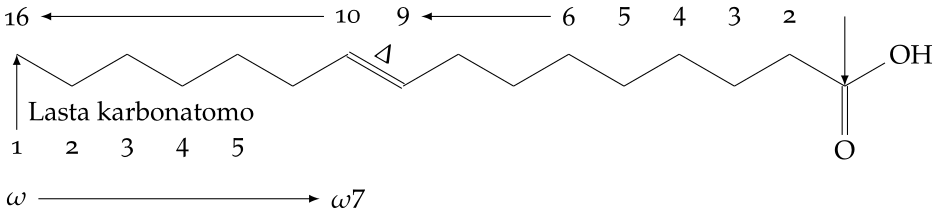
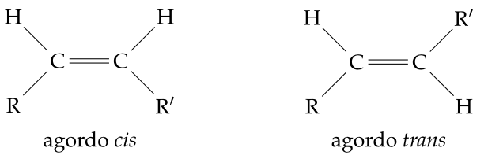

# Kutimuzaj nomoj de grasaj acidoj

<!-- * anthony.lucas@netforspeed.com -->

<blockquote class="resumo">
Post prezento de la diversaj nomenklaturoj por nomi la grasajn acidojn, la kutimuzaj
nomoj de la ĉefaj grasaj acidoj plej bone troveblaj estas diskutitaj. Fakte, la kutimuzaj
nomoj ofte mankas en Esperantujo aŭ ofte la ekzistantaj nomoj ŝajnas ne taŭgi pro
nesistemeco kaj malkohereco. La celo ne estas iluzie altrudi vortarojn, sed veki la
viglecon de la biologiistoj por ke ili zorgu pri la problemoj.
</blockquote>

## 1 Enkonduko

La grasaj acidoj estas karboksilaj acidoj konsistantaj el karboksila funkcio kaj hidro-
fobia alifata ĉeno saturita aŭ nesaturita. La longeco de la ĉeno ebligas ordigon de la
grasaj acidoj en kvar grupojn. La vaporiĝemaj grasaj acidoj konsistas el 2, 3 aŭ 4 karbonatomoj. La mallongaj grasaj acidoj konsistas el 6 ĝis 10 karbonatomoj. La mezlongaj
grasaj acidoj konsistas el 12 ĝis 14 karbonatomoj kaj la longaj grasaj acidoj el pli ol 16
karbonatomoj. Fakte, ekzistas almenaŭ tri sistemoj por nomi grasajn acidojn. Kompreneble, la unua estas la sistema ĥemia nomenklaturo tre bone priskribita de *Pluhař, Z.* en sia sistema ĥemia nomenklaturo en Esperanto, 3-a versio 2011 [^8]. La dua sistemo nomata omegao-sistemo estas pli specifa de la biologia scienco. Dum la unua
sistemo numeras la karbonatomojn de la karboksila funkcio ĝis la plej malproksima
karbono de la ĉeno, la dua numeras la karbonojn de la plej malproksima karbonatomo de la karboksila funkcio (ω − 1) ĝis la karbonatomoj de la karboksila funkcio mem
(ω − n) (bildo 1) [^7]. La tria sistemo, fakte ne estas sistemo, sed la biologiistoj ofte preferas nomi ĉiun grasan acidon, kiu havas biologiajn efikojn per specifa nomo sen iu ajn
akordo kun ekzistantaj sistemaj nomenklaturoj. Ĉi tiu artikolo celas prezenti la duan
sistemon kaj diskuti pri la tria maniero kadre de la Esperanta lingvo.

## 2 Enklasigo de la grasaj acidoj

Kutime oni enklasigas la grasajn acidojn laŭ ilia nombro da nesaturitaj ligoj. Se la
acido ne havas nesaturitan ligon, ĝi apartenas al la grupo de la saturitaj grasaj acidoj
kies ĥemiaj strukturoj sekvas la ĝeneralan formulon $$ CH_3-(CH_2)_n-COOH $$ (tabelo 1).

La grasaj acidoj enhavantaj unu duoblan ligon apartenas al la grupo de la mononesaturitaj acidoj. Ilia ĝenerala formulo estas $$ CH_3-(CH_2)_x-CH=CH-(CH_2)_y-COOH $$ (tabelo 2).

Tabelo 1: Ĉefaj grasaj acidoj saturitaj nature trovitaj. Ili estas prezentataj laŭ la sistema ĥemia nomenklaturo.

|Simbolo laŭ normiga nomenklaturo|Simbolo laŭ omegao-nomenklaturo|Ĥemia strukturo|Sistema nomo|
|---|---|---|---|
|C1:0|C1:0|$$CHOOH$$|Metanoika|
|C2:0|C2:0|$$CH_3COOH$$|Etanoika|
|C3:0|C3:0|$$CH_3CH_2COOH$$|Propanoika|
|C4:0|C4:0|$$CH_3(CH_2)_2COOH$$|Butanoika|
|C5:0|C5:0|$$CH_3(CH_2)_3COOH$$|Pentanoika|
|C5:0 izo|C5:0 izo|$$CH_3CHCHCH_2COOH$$|Metil-3-butanoika|
|C6:0|C6:0|$$CH_3(CH_2)_4COOH$$|Heksanoika|
|C7:0|C7:0|$$CH_3(CH_2)_5COOH$$|Heptanoika|
|C8:0|C8:0|$$CH_3(CH_2)_6COOH$$|Oktanoika|
|C9:0|C9:0|$$CH_3(CH_2)_7COOH$$|Nonanoika|
|C10:0|C10:0|$$CH_3(CH_2)_8COOH$$|Dekanoika|
|C12:0|C12:0|$$CH_3(CH_2)_{10}COOH$$|Dodekanoika|
|C14:0|C14:0|$$CH_3(CH_2)_{12}COOH$$|Tetradekanoika|
|C16:0|C16:0|$$CH_3(CH_2)_{14}COOH$$|Heksadekanoika|
|C18:0|C18:0|$$CH_3(CH_2)_{16}COOH$$|Oktadekanoika|
|C20:0|C20:0|$$CH_3(CH_2)_{18}COOH$$|Ikozanoika|
|C22:0|C22:0|$$CH_3(CH_2)_{20}COOH$$|Dokozanoika|
|C24:0|C24:0|$$CH_3(CH_2)_{22}COOH$$|Tetrakozanoika|
|C26:0|C26:0|$$CH_3(CH_2)_{24}COOH$$|Heksakozanoika|
|C28:0|C28:0|$$CH_3(CH_2)_{26}COOH$$|Oktakozanoika|
|C30:0|C30:0|$$CH_3(CH_2)_{28}COOH$$|Trikontanoika|

Tabelo 2: Ĉefaj grasaj acidoj mononesaturitaj nature trovitaj. Ili estas prezentataj laŭ la sistema ĥemia nomenklaturo.

|Simbolo laŭ normiga nomenklaturo|Simbolo laŭ omegao-nomenklaturo|Ĥemia strukturo|Sistema nomo de la acido|
|---|---|---|---|
|C12:1(9)|C12:1 ω − 3|$$CH_3CH_2CH = CH(CH_2)_7COOH$$|cis-9-dodekenoika|
|C14:1(9)|C14:1 ω − 5|$$CH_3(CH_2)_3CH = (CH_2)_7COOH$$|cis-9-tetradekenoika|
|C16:1(9)|C16:1 ω − 7|$$CH_3(CH_2)_5CH = CH(CH_2)_7COOH$$|cis-9-heksadekanoika|
|C18:1(trans6)|C18:1 ω − 12|$$CH_3(CH_2)_{10}CH = CH(CH_2)_4COOH$$|trans-9-oktadekenoika|
|C18:1(9)|C18:1 ω − 9|$$CH_3(CH_2)_7CH = CH(CH_2)_7COOH$$|cis-9-oktadekenoika|
|C18:1(trans9)|C18:1 ω − 9|$$CH_3(CH_2)_7CH = CH(CH_2)_7COOH$$|trans-9-oktadekenoika|
|C18:1(11)|C18:1 ω − 7|$$CH_3(CH_2)_5CH = CH(CH_2)_9COOH$$|cis-11-oktadekenoika|
|C18:1(trans11)|C18:1 ω − 7|$$CH_3(CH_2)_5CH = CH(CH_2)_9COOH$$|trans-11-oktadekenoika|
|C20:1(9)|C20:1 ω − 11|$$CH_3(CH_2)_9CH = CH(CH_2)_7COOH$$|cis-9-ikozenoika|
|C22:(11)|C22:1 ω − 11|$$CH_3(CH_2)_9CH = CH(CH_2)_9COOH$$|cis-11-dokozenoika|
|C22:1(13)|C22:1 ω − 9|$$CH_3(CH_2)_7CH = CH(CH_2)_{11}COOH$$|cis-13-dokozenoika|
|C24:1(15)|C24:1 ω − 9|$$CH_3(CH_2)CH = CH(CH_2)_{13}COOH$$|cis-15-tetrakozenoika|

La tria grupo arigas la grasajn acidojn polinesaturitajn. Ne ekzistas ĝenerala formulo por ili (tabelo 3). Dum la simpla ligo ebligas liberan rotacion de la du
karbonatomoj ĉirkaŭ sia akso, la duobla ligo fiksas la relativan pozicion inter la du
karbonatomoj. Konsekvence aperas du agordoj ĉirkaŭ la duobla ligo. Oni parolas pri
la cis-agordo kaj la trans-agordo (bildo 2). Kutime, en la naturo, ĉefe ekzistas la cis-izomeroj kaj ofte la trans-izomeroj havas negativajn efikojn al la vivaj estaĵoj. Ekzistas
alia izomertipo, ĉe kiu la karbonatomoj havas nelinian agordon. Tiukaze, oni almetas
la prefikson “izo” al la kutimuza nomo de la grasa acido. Tiumaniere, la valeriana acido havas unu izomeron, la izovaleriana acido (tabelo 2). La nombro da karbonatomoj
estas la sama sed ne ties agordo [^7].

La sistema ĥemia nomenklaturo difinas afiksojn por ĉiu ĥemia funkcio. Tiamaniere
koncerne la saturitajn grasajn acidojn la ĝenerala formulo estas X+Y+oika. La afikso
X esprimas la nombron da karbonatomoj en la ĉeno laŭ la sistema ĥemia nomenklaturo, la afikso Y difinas la saturitan aŭ nesaturitan karakteron de la karbonĉenoj (t.e.
karbonatomo estas saturita kiam ĝi estas ligita kun la plej granda nombro da hidrogen-atomoj kiun ĝi povas akcepti). Ĉu Y estas “an” tiu, kiu signifas ke la grasa acido estas saturita ĉu Y estas “en” tiam la grasa acido estas nesaturita. La afikso “-oika” karakterizas la funkcion karboksilan (COOH). Tiumaniere oni disigas la nomon “etanoika acido” tiel “et”+“an”+“oika” acido. “Et” estas la afikso por du karbonatomoj, “an” kaj
“oika” respektas la regulon ĉi-supre (tabelo 2). Samregule, dodekenoika acido estas
disigita en dodek+en+oika (tabelo ). Finfine oni disigas la nomon “oktadekadienoikan” acidon en “oktadeka”+“di”+“en”+„oika”. Tiam aperas la nova afikso “di” kiu
indikas la nombron da duoblaj ligoj en la ĉeno (tabelo 3).

Bildo 1: trans-9-heksadekenoika acido (palmolea acido, C16:1(9) aŭ C16:1 (ω − 7).
Sinteza skemo reprezentanta la sisteman ĥemia nomenklaturo de la grasaj acidoj kaj la omega-nomenklaturo.

Tabelo 3: Ĉefaj grasaj acidoj polinesaturitaj nature trovitaj. Ili estas prezentataj laŭ la sistema ĥemia nomenklaturo.

|Normiga|Omegaa|Ĥemia strukturo|Sistema nomo|
|---|---|---|---|
|C18:2(9, 12)|C18:2 ω−6|$$CH_3(CH_2)_4CH = CHCH_2CH = CH(CH_2)_7COOH$$|cis,cis-9,12-oktadekadienoika|
|C18:2(9, trans11)|C18:2 ω−7|$$CH_3(CH_2)_5CH = CHCH = CH(CH_2)_7COOH$$|cis,trans-9,11-oktadekadienoika|
|C18:2(trans10, 12)|C18:2 ω−6|$$CH_3(CH_2)_4CH = CHCH = CH(CH_2)_8COOH$$|trans,cis-10,12-oktadekadienoika|
|C18:3(6, 9, 12)|C18:3 ω−6|$$CH_3(CH_2)_3(CH_2CH=CH)_3(CH_2)_4COOH$$|cis,cis,cis-6,9,12-oktadekatrienoika|
|C18:3(9, 12, 15)|C18:3 ω−3|$$CH_3(CH_2CH=CH)_3(CH_2)_7COOH$$|cis,trans,trans-9,12,15-okadekatrienoika|
|C18:3(9, trans11, trans13)|C18:3 ω−5|$$CH_3(CH_2)_3(CH=CH)_3(CH_2)_7COOH$$|cis,trans,trans-9,11,13-oktadekatrienoika|
|C20:4(5, 8, 11, 14)|C20:4 ω−6|$$CH_3(CH_2)_4(CH=CHCH_2)_3CH = CH(CH_2)_3COOH$$|cis,cis,cis,cis-5,8,11,14-ikozatetraenoika|
|C20:5(5, 8, 11, 14, 17)|C20:5 ω−3|$$CH_3CH_2(CH=CHCH_2)_4CH = CH = CH(CH_2)_3COOH$$|cis,cis,cis,cis,cis-4,8,12,15,19-ikozapentaenoika|
|C22:5(4, 8, 12, 15, 19)|C22:5 ω−3|$$CH_3CH_2CH = CH(CH_2)_2CH = CHCH_2(CH=CH(CH_2)_2)_3COOH$$|cis,cis,cis,cis,cis-4,8,12,15,19-dokozapentaenoika|
|C22:6(4, 7, 10, 13, 16, 19)|C22:6 ω−6|$$CH_3CH_2(CH=CHCH_2)_5CH = CH(CH_2)_2COOH$$|cis,cis,cis,cis,cis,cis-4,7,10,13,16,19-dokozaheksaenoika|

La formulo C*a:b* sinteze karakterizas la grasajn acidojn. La C*a* difinas la nombron
da karbonatomoj en la ĉeno (ekzemple por etanoika acido: C2) kaj *b* por la nombro da
duoblaj ligoj en la ĉeno (tabelo 1). Kaze de nesaturitaj grasaj acidoj, la numeroj de la
unua karbonatomo de ĉiu duobla ligo estas parenteze almetitaj kaj disigitaj per komoj
(tabeloj 2 kaj 3).

Bildo 2: Skemo de la cis kaj trans agordo. R kaj R’ estas karbonaj ĉenoj.

La omega-sistemo estas ĉefe uzata de nutradsciencistoj. Ĝi estas malpli preciza ol la
sistema ĥemia nomenklaturo sed ebligas la organizadon de la grasaj acidoj laŭ omegaaj familioj (ω − 3, ω − 6, ktp.) kiuj havas biologian sencon kaj biologie specifajn
ecojn.

## 3 Esperantaj ekvivalentoj de la acidaj nomoj etnolingvaj

La avantaĝoj de la sistema ĥemia nomenklaturo estas ĝia sistemeco kaj precizeco, sed
la gravaj malavantaĝoj estas la trolongeco kaj malfacileco de la nomoj kreitaj per la
sistemo. Fine la uzado de tiuj nomoj en konversacioj estas nefarebla, ĉar la mensa
gimnastiko estas tro malfacila. Tial ekzistas kutimuzaj nomoj pli facile lerneblaj ĉar
ofte pli bildaj ol la nomenklaturaj nomoj. Fakte la nomo estas ofte donita de la malkovrantoj laŭ la cirkonstancoj de la malkovro kaj longtempe antaŭ ol bone koni la
precizan strukturon de la molekulo. Mirinde oni facile konstatas spikumante kutimuzajn nomojn de grasaj acidoj, ke Esperantaj nomoj estas heterogenaj kaj nesistemaj.
Tiel la grasa acido malkovrita en la vinagro estis nomita de la esploristo anglaling-
ve “acetic acid” kaj franclingve “acide acétique”. Tiu nomo ne estas elektita hazarde
sed ĝi venas de la latina vorto “acetum”, kiu Esperante signifas “aceto” aŭ “vinagro”.
Respektante la fundamentan 15-an regulon la nomo “acetic acid” estis kompreneble
paŭse alprenita al Esperanto kiel “aceta acido” [^10]. Ankoraŭ respektante la saman
regulon Esperantisto paŭsis “palmitic acid” kiel “palmita acido” [^11]. Ĉu tiu elekto estas logika? Ĝi malrespektas la -an regulon kaj se oni trarigardas la tabelojn 4 kaj 5,
oni konstatas, ke la rezulto estas tre heterogena kaj sensistema. Mankas kohereco. Se
la kreintoj de tiu nomo kalkulis ties signifon, t.e grasa acido eltirita el palmo, eble ili
simple nomis ĝin palma acido. Tiam la 15-a regulo de la Fundamento estus bone respektita [^14]. Ankoraŭ pli evidenta ekzemplo estas la “valerata” acido [^15]. Tiu acido
estis eltirita el la vegetaĵo nomita “Valeriano”. Eĉ se oni imagus ke “ata” estas sufikso,
ĝi ne povus modifi la radikon “Valerian-” kaj respektante bonan Esperanton oni skribu valerianata acido. Sed eble pro facileco oni tro facile misaplikis la 15-an regulon
kaj oni tro ofte rekte transprenas al Esperanto fremdajn vortojn. Ĉu valeriana acido
ne kompreneblas?

## 4 Prezento de la grasaj acidoj enklasigitaj

Nun mi petas al la legantoj, ke ili senkulpigu min pro la sekvo, kiu ŝajnas kvazaŭ
katalogo. Fakte en tabelo 5 estas arigitaj la nomoj de la diversaj ĉefaj grasaj acidoj
troveblaj rete kaj ĉefe en Vikipedio [^13] kaj en la najbara kolumno estas proponoj por
koherigo de la nomoj de la grasaj acidoj. La sekvo mallonge prezentas la nomojn unu
post la alian kaj atentigas pri kio eble ŝajnas malafabla.

### 4.1 La saturitaj grasaj acidoj
En la unua grupo estas arigitaj la saturitaj grasaj acidoj (tabelo 4).

Tabelo 4: Komparo inter la nomoj en la angla kaj Esperanto kaj sugesto por koherigi
kaj kompletigi la liston. Grasaj acidoj saturitaj.

|Sistema nomo de la acido|uzata nomo anglalingve trovebla|uzata nomo esperantalingve trovebla|Sugesto de novaj nomoj|
|---|---|---|---|
|Metanoika|Formic|Formika|Formika|
|Etanoika|Acetic|Aceta|Aceta|
|Propanoika|Propionic||propiona|
|Butanoika|Butyric||butera|
|Pentanoika|Valeric|Valerata|valeriana|
|Metil-3-butanoika|Isovaleric|IzoValerata|IzoValeriana|
|Heksanoika|Caproic|||
|Heptanoika|Enanthic||Vinoaroma|
|Oktanoika|Caprylic|||
|Nonanoika|pelargonic||Pelargonia|
|Dekanoika|Capric|||
|Dodekanoika|Laŭric|Laŭra|Laŭra|
|Tetradekanoika|Myristic||Miristika|
|Heksadekanoika|Palmitic|Palmita|Palma|
|Oktadekanoika|Stearic|Steara|Seba|
|Ikozanoika|Archidic||Arakida|
|Dokozanoika|Behenic|||
|Tetrakozanoika|Lignoceritic||Lignocerina|
|Heksakozanoika|Cerotic||Cerina|
|Oktakozanoika|Montanic|||
|Trikontanoika|Melissic||Melisa|

La formika acido 
: estis priskribita de s-ro John Wray en 1670 el suko de formikoj. Tamen, antaŭaj observoj ekzistis. Botanikistoj konstatis ke blua cikoria petalo (Cichorium sp) estis ruĝigita de formikaj abdomenoj, kiam oni metas ilin sur ĝin [^5],[^6].

La aceta acido 
: estas konata ekde la antikva epoko. La antikvaj romianoj faris vinagron el vino aere eksponita. Ili ŝatis saŭcon preparitan el boligita acida vino
konservita en plumbaj potoj. Post kelka tempo formiĝis plumba aceto kiu ilin
venenis. Ili tiam malsaniĝis pro plumba veneniĝo. Latinlingve la vorto por vinagro estas “acetum”.

La propiona acido
: Tiu nomo estis elektita de *Jean-Baptiste Dumas*, franca ĥemiisto
de la 19-a jarcento. Li konstruis la vorton el la grekaj radikoj “protos” (Esperanto: “unua”) kaj “pion” (Esperanto: ”graso”) ĉar li malkovris ke ĝi estas la plej eta el
la grasaj acidoj, kiu havas la grasan trajton, t.e. ke ĝi ne estas akve solvebla kaj formas nesolvitan tavoleton sur akvo.

La butera acido 
: estas delonge produktata de ĥemiisto el butero.

La valeriana acido 
: estas jam prezentita supre. Bedaŭrinde ĝi estas la unua acido facile
Esperante trovebla sub netaŭga nomo “valerata acido”.

La vinaroma acido 
: anglalingve “enanthic acid” kaj franclingve “acide énanthique”. Etimologie “enanthic” devenas el la greka vorto “oeno”, kiu Esperante signifas “vino”. Fakte tiu acido kontribuas al vinaromoj. Do tial mi kompreneble proponas la kutimuzan nomon ĉi-supran.

La pelargonia acido 
: estis eltirata el pelargonio.

La laŭra acido 
: estis eltirata el laŭro.

La miristika acido 
: estis eltirata el miristiko

La palma acido 
: estis eltirata el palmo sed bedaŭrinde kaj mirinde trovebla sub la nomo “palmita acido”.

La seba acido 
: estas trovebla sub la nomo “steara acido”. “Steara” devenas el al greka lingvovorto “stear” signifanta “sebo”.

La arakida acido 
: parolas per si mem.

La lignocerina acido kaj la cerina acido
: La vortoj devenas el la greka kaj la latina lingvoj. Ligno devenas el la latina vorto “lignum” kaj cerino devenas el la greka
vorto “cero”.

La melisa acido 
: estis eltirata el la meliso, Melissa sp.

Aparta problemo estas la grasaj acidoj eltirataj el kaprovira graso. Ili estas tri. Anglalingve, “caproic acid” (C6), “caprylic acid” (C8) kaj “capric acid” (C10). Por simpleco,
la unua povus esti la “kapra acido”. Sed por la sekvaj ne ekzistas metodo pli kohera ol
aliaj. Ĉu uzante la 15-an regulon, la dua kaj la tria estus “kaprila acido” kaj “kaprika
acido” ĉu imagante esperantalingvan solvon ili ekzemple estus la “elkrapra” acido kaj
la “virkapra acido”. Tiun lastan solvon oni elektas por tiu ĉi artikolo.

## 5 La nesaturitaj grasaj acidoj

Komence, la pionieroj difinis la grasajn korpojn jene:

<blockquote>
Substancoj kiuj brulas kun grandega flamo kaj deponantaj fumnigraĵon, kiuj solveblas alkohole kaj nesolveblas aŭ tre malmulte solveblas akve”. La
unuaj malsimiloj inter grasaj acidoj ĉefe baziĝas sur iliaj diversaj fluidigaj
temperaturoj. Oni nomas “oleoj” la grasajn acidojn kiu fluidiĝas sub 15
gradoj celsiaj, buteroj tiujn kiu moliĝas je 18 gradoj celsiaj kaj fluidiĝas je
kelkaj gradoj supre. La grasoj ĝenerale estas malpli fluidigeblaj ol la buteroj. La seboj estas tiuj, kiuj fluidiĝas supere de 40 gradoj celsiaj kaj finfine
la cerinoj fandiĝas inter 44 kaj 64 gradoj celsiaj [^2]. [*Traduko de la aŭtoro*]
<blockquote>

Escepte buteran, kapran kaj elkapran acidojn, ĉiuj saturitaj acidoj menciitaj solidiĝas
je 20 celsiaj gradoj. Inverse ĉiuj ne saturitaj acidoj menciitaj likviĝas je tiu temperaturo.
Do ne mirigas, ke la pioniroj almetis la vorton “olea” al multaj ne saturitaj acidoj. Por
tio estas laŭrolea acido (C12:1), miristikokea acido (C14:1), palmolea acido (iuj eble
nomas ĝin palmitoleata) (C16:1) kaj tiel plu…

Ĉi sube estas diskutataj nur la nomoj de grasaj acidoj, kies radikoj ankoraŭ ne estis
menciitaj (tabelo 5).

La erukolea acido
: estas eltirata el eruko. Eruko estas kreskaĵo el la familio de la kruciferacoj aŭ brasikacoj. Fakte se oni respektus la 15-an regulon, oni nomus ĝin
eruka acido, sed tiam mankus la informo pri ĝia fluideco je etosa temperaturo,
t.e. ĉirkaŭ inter 20 kaj 25 gradoj celsiaj [^1].

La gadolea acido
: tenas sian nomon el la moruo ĉar ĝia fiŝa genro estas Gadus sp. La
cetacolea acido estas bona markaĵo de la dieto de la predatoraj cetaceoj por la
mar-biologiistoj [^3].

La ŝarkolea acido
: La *selacholeic acid* Estus Esperante ŝarkolea acido. Efektive, la *Selachyomorpha* estas super-ordo de ŝarkoj. Iu povas kritiki tiun elekton ĉar la
vorto ŝarko estas malpli preciza ol la vorto *selach-* sed la rolo de tiuj kutimuzaj
nomoj ne estas precizeco sed facileco de la uzo. La sistema ĥemia nomenklaturo
zorgas pri precizeco.

Konstateblas, ke, kiam la grasaj acidoj enhavas pli ol unu nesaturitan ligon, tiam aperas la kvazaŭa sufikso “onic” tiel, kiel *arachidonic acid* aŭ *culpanodonic acid* (tabelo 6).

Tabelo 5: Komparo inter la nomoj en la angla kaj Esperanto kaj sugesto por koherigi
kaj kompletigi la liston. Grasaj acidoj mononesaturitaj.

|Sistema nomo de la acido|uzata nomo anglalingve trovebla|uzata nomo esperantalingve trovebla|Sugesto de novaj nomoj|
|---|---|---|---|
|cis-9-dodekenoika|Laŭroleic|Laŭrolea|
|cis-9-tetradekenoika|Myristoleic|Miristikolea|
|cis-9-heksadekanoika|Palmitoleic|Palmolea|
|trans-6-oktadekenoika|Petroselaidic||
|cis-9-oktadekenoika|Oleic|Olea|
|trans-9-oktadekenoika|Elaidic||
|cis-11-oktadekenoika|Vaccenic|Vakcenolea|
|trans-11-oktadekenoika|trans vaccenic|trans Vakcenolea|
|cis-9-ikozenoika|gadoleic|Gadolea|
|cis-11-dokozenoika|cetoleic|Cetacolea|
|cis-13-dokozenoika|erucic|Erukolea|
|cis-15-tetrakozenoika|selacholeic|Ŝarkolea|

Tabelo 6: Komparo inter la nomoj en la angla kaj Esperanto kaj sugesto por koherigi
kaj kompletigi la liston. Grasaj acidoj polinesaturitaj.

|Sistema nomo de la acido|uzata nomo anglalingve trovebla|uzata nomo esperantalingve trovebla|Sugesto de novaj nomoj|
|---|---|---|---|
|cis,cis-9,12-oktadekadienoika|Linoleic||Linolena|
|cis,trans-9,11oktadekadienoika|Rumenic||Rumenolena|
|trans,cis-10,12-oktadekadienoika|||
|cis,cis,cis-6,9,12-oktadekatrienoika|γ-linolenic||γ-Linolena|
|cis,trans,trans-9,12,15-okadekatrienoika|α-linolenic||α-Linolena|
|cis,trans,trans-9,11,13-oktadekatrienoika|eleostearic||Elesebolena
|cis,cis,cis,cis-5,8,11,14-ikozatetraenoika|arachidonic||Arakidolena|
|cis,cis,cis,cis,cis-5,8,11,14,17-ikozapentaenoika|timnodonic||Tinusolena|
|cis,cis,cis,cis,cis-4,8,12,15,19-dokozapentaenoika|cuplanodonique|||
|cis,cis,cis,cis,cis,cis-4,7,10,13,16,19-dokozaheksaenoika|cervonic||Cerbolena|

Sed fakte ne ekzistas oficiala regulo pri la kutimuzaj nomoj. Tio estas la natura histo-
rio de lingvoj kaj do ekzistas multaj esceptoj je la kvazaŭa regulo ekzemple rumenic
acid aŭ eleostearic acid. La internacia lingvo kontraŭe al la naciaj lingvoj estas kreita
relative regula. Tiu estas la volboŝlosilo kiu faciligas la lernadon. Tial oni provas iden-
tigi kvazaŭan regulon en la naciaj lingvoj kaj transformi ĝin al senescepta regulo en
Esperanto. Kompreneble estus sensencaĵo, ke rezulto tro malsimilus naciajn lingvon
ekzemple Volapuko, do oni proponas konservi la radikojn sed ĝeneraligi la uzadon de
la vortoj olea kaj olenia por specife paroli pri la mononesaturitaj kaj la polinesaturitaj
grasaj acidoj. Tiel la grasaj acidoj C16:0 estus palma acido, C16:1 estus palmolea acido
kaj la aliaj C16:X (kun X > 24) estus palmoleniaj acidoj.

Finfine sciencaj verkoj abundas pri ikozapentaenoika kaj la dokozaheksaenoika acidoj. Ilia trovebla kutimuza nomo estas “timnodonic” [^4] kaj “cervonic acid” [^9] esprimeblaj en Esperanto kiel tinusolenia kaj cerbonia acidoj laŭ la ĉi-supra regulo. Sed fakte
en la scienca literaturo, tiuj grasaj acidoj estas menciitaj kiel EPA kaj DHA.

Konklude, la celo de tiu artikolo ne estas solvi ĉiujn problemojn pri kutimuzaj nomoj de la grasaj acidoj sed klare prezenti la problemon. Tial ne estas proponoj por
la “pretroselaidic acid”, aŭ la “elaidic acid”. Restas ankoraŭ ĉiuj grasaj acidoj entenantaj neparan nombron da karbonatomoj kiel la “triglic acid” [2-metilbut-2-enoika acido (C5:1(2))] eltirata el la “croton tiglium”. Kotona acido ŝajnas esti la pli taŭga nomo,
ĉar ĝi signifas ion por la plimulto. La regulo proponite en tiu artikolo helpus koherigi kaj homogenigi la kutimajn nomojn de la grasaj acidoj kaj preventus disiĝadon.
Esperante ke ekde nun la Esperantista biologiistaro prizorgos la aferon.

## Bibliografio

[^1]: X. Bao, M. Pollard kaj J. Ohlrogge. “The biosynthesis of erucic acid in developing
embryos of brassica rapa”. En: Plant Physiol. . (), p. –. : -
. : 10.1104/pp.118.1.183.

[^2]: M.E. Chevreul. Recherches chimiques sur les corps gras d'origine animale. F. G. Le-
vrault, . : http://books.google.de/books?id=94\_H7hfQfS0C.

[^3]: M.H. Cooper, S.J. Iverson kaj K. Rouvinen-Watt. “Metabolism of dietary cetoleic acid (:n-) in mink (Mustela vison) and gray seals (Halichoerus grypus)
studied using radiolabeled fatty acids”. En: Physiol. Biochem. Zool. . (),
p. –. : -. : 10.1086/505513.

[^4]: J. Dyerberg, H. O. Bang kaj N. Hjorne. “Fatty acid composition of the plasma
lipids in Greenland Eskimos”. En: Am. J. Clin. Nutr. . (), p. –. :
-. : http://ajcn.nutrition.org/content/28/9/958.long.

[^5]: W.B. Johnson. History of the process and present state of animal chemistry. History
of the Process and Present State of Animal Chemistry. Johnson, . : http:
//books.google.de/books?id=eAOIqOm0GScC.


[^6]: Wray John. “Extract of a Letter, Written by Mr. John Wray to the Publisher Ja-
nuary . . Concerning Some Un-Common Observations and Experiments
Made with an Acid Juyce to be Found in Ants”. En: Phil. Trans.  (), p. .
: 10.1098/rstl.1670.0052.

[^7]: Les Lipides. : http : / / sites . univ - provence . fr / wabim / d _ agora / d _
biochimie/lipides.pdf.

[^8]: Zdeněk Pluhař. “Sitema ĥemia nomeklaturo en Esperanto”. En: (). : http:
//www.eventoj.hu/steb/kemio/kemia-nomenklaturo-versio-2011-2.pdf.

[^9]: N. Sarda k.a. “Docosahexaenoic acid (cervonic acid) incorporation into different
brain regions in the awake rat”. En: Neurosci. Lett. . (), p. –. :
-. : 10.1016/0304-3940(91)90157-O.

[^10]: Vikipedio, eld. Aceta acido. : http://eo.wikipedia.org/wiki/Aceta_acido.

[^11]: Vikipedio, eld. Palmita acido. : http://eo.wikipedia.org/wiki/Palmita_
acido.

[^12]: Vikipedio, eld. Valerata acido. : http://eo.wikipedia.org/wiki/Valerata_
acido.

[^13]: Vikipedio – la libera enceklopedio. : http://eo.wikipedia.org.

[^14]: L.L. Zamenhof. Fundamento de Esperanto: gramatiko, ekzercaro, universala vortaro.
Hachette, . : http://www.akademio-de-esperanto.org/fundamento/.
Scienca Revuo 2/63
(2013)
