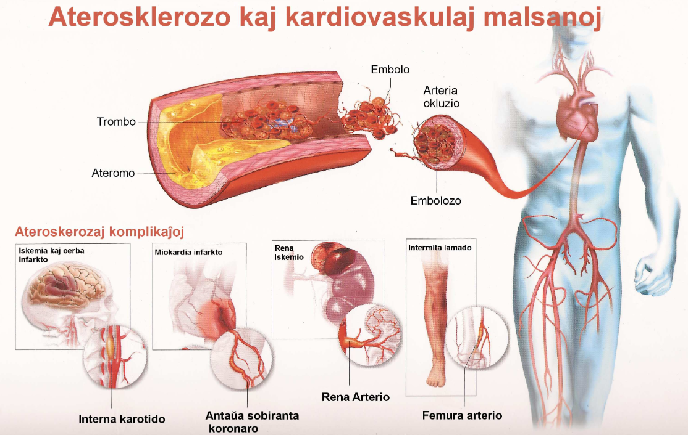
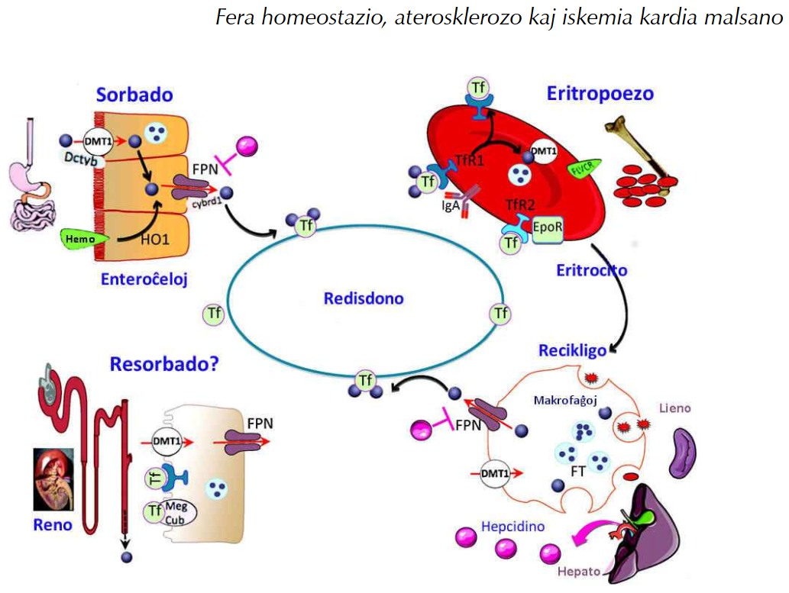

# Fera homeostazio, aterosklerozo kaj iskemia kardia malsano

<!-- *anthony.lucas@netforspeed.com -->

<blockquote class="resumo">
La aterosklerozo estas la fonto de multaj vaskulaj eventoj kaj unu el la plej gravaj
mortriskoj. De post pluraj jaroj la biologistaro suspektas, ke la fero ludas gravan rolon
en la ateroma kresko. Post la prezento de la fera metabolo ni detale priskribas, kiam
kaj kiel la fero kontribuas al ateromplaka plikreskigo.
</blockquote>

## 1 Enkonduko

En 1008 17 milionoj da personoj mortis pro kardiovaskulaj malsanoj en la mondo. Tio
estas la unua mortkaŭzo pro ne transdonebla malsano antaŭ kanceroj je 30 % el mortintoj [20]. Tamen la virinoj ŝajnas nature protektataj kontraŭ tiuj malsanoj ĝis menopaŭzo. En 1981 sciencistoj hipotezis ke la seks-specifa fermetabolo kaŭzus la virinan
rezistecon kontraŭ kardiaj malsanoj [22]. La konfirmo de tiu hipotezo kreskigas la ide-
on ke la fero ludas gravan rolon en la apero de la aterosklerozo. Fakte aterosklerozo
estas fonto de multaj kardiovaskulaj malsanoj (bildo 1). Aterosklerozo estas inflamo
de la arteriomalsano pro akumulado da lipidoj en subendotelio kaŭzata de misekvili-
bro en la histo-lipidaj interŝanĝoj [15]. Le celo de tiu ĉi artikolo estas prezenti la rolon
de la fera metabolo en tiu patologio.

## 2 La fera metabolo

Fero estas metalo, kiu transportas elektronojn kaj facile konvertiĝas de Fe(II)-a formo
al Fe(III)-a formo. Kiam la fero estas libera, ĝi ne estas ligita kun alia molekulo, kiu
ĝin stabiligas. Fakte, Fe(II)-a reakcias kun oksigeno kaj formas superoksidojn. Ĝi povas ankaŭ reakcii kun hidrogena peroksido kaj formi hidroksilajn radikojn (HO.) kaj
hidroksilajn jonojn. Tiuj radikoj rapide reakcias kun molekuloj en la medio, ilin oksidante. Tamen fero ludas gravan rolon en la metabolo. Ĝi estas en hemoglobino,
mioglobino aŭ citokromoj. En mitokondrioj ĝi ludas gravan rolon en elektrontransportado kaj en la citokromoj, ĝi estas prosteta grupo de multaj enzimoj konduktantaj
redoksajn reakciojn. En homa korpo fero estas nemalhavebla, sed en sufiĉa koncentriteco [13].

$$\ce{H2O2 + Fe^{2+} → Fe^{3+} + ^\bullet OH + OH^\bullet}$$

Bildo 1: La aterosklerozo estas la fonto de multaj kardiovaskulaj malsanoj tiaj cerba
iskemio, miokardia infarkto, rena iskemio aŭ aintermita lamado [5].

La tutkorpa enhavo je fero en sana homo estas ĉirkaŭ 50 mg/kg. La plejmulto estas
en la hemoglobino kaj mioglobino, respektive en la eritrocitoj kaj muskolaj ĉeloj. Por
la taga sintezo de la 200 miliardoj da ruĝaj sangoĉeloj necesas 25-30 mg da fero. Tiu
alporto ĉefe dependas de la recikligo de la hema fero fare de la histaj makrofaĝoj, kiuj
fagocitas la mortantajn ruĝajn sangoĉelojn kaj katabolas la hemon. Dume la nutra
alporto ĉirkaŭas  mg tage kaj helpas por ekvilibri la tagajn perdojn [2](#2).

## 3 La intesta ensorbo de la fero

La nutrodevenan feron ensorbas ĉefe la duodenaj enterocitoj. Antaŭ la ensorbo, Fe(III)
reduktiĝas al Fe(II) per enzimo el la ekstera surfaco de la apeksa membrano, nomita
duodena citokromo-b5(Dcit B) reduktazo[^1]. Poste Fe(II) estas transportita tra membrano per apeksa kuna transportilo nomita divalenta metala transportilo 1 (DMT1).
DMT1 estas proteino el 70 kDa, konsistanta el 10 transmembranaj lokoj kaj kapablas
transporti feron (Fe(II)) parigita al protono. En la ĉelo, la fero estas ĉu stokita sub nereakcia formo ĉu liberigita en la sangocirkulado per feroportinoj (FPN) en la enterocita
bazoflanka membrano. FPN estas proteino el 67 kDa kaj 12 transmembranaj lokoj ankaŭ troviĝantaj en la makrofaĝoj, kie ĝi ludas rolon en eksporto de fero. Kondukita
de la FPN en la sangfluon, Fe II estas oksidata al Fe(III) per membrana feroksidazo
(Hefaestino[^2]) antaŭ ĝia transdono al plasma transportilo kaj disdono al organismaj
ĉeloj [2].

Bildo 2: Fera homeostazio. la fera metabolo funkcias kiel ferma ciklo. La intesto sorbas
la feron el la nutraĵoj kaj la makrofaĝoj ĝin stokas kaj recikligas la feron post fagocitozo
de la mortantaj ruĝaj globuloj. La fero en la sangfluo estas redisdonita al ĉelaj histoj
per Tf, aparte la medolo por maturigo de la antaŭaj eritropoezaj ĉeloj. Tre malmulte
da fero estas filtrita de la renaj glomeruloj; tiu fero estas tute resorbita laŭ la nefro [2].

Kiam fero estas en hema formo, ĝin ensorbas la enterocitoj kaj la hemo-oksgenazo[^3],
kies ĉefa izoformo estas hemo-oksigenazo-1 (HO-1), ĝin liberigas el la hemo 2. La ensorbo de la hemo estas pli efika ol la ensorbo de la neorganika fero, sed la meĥanismo
estas malbone konata [2] (bildo 2).

[^1]: EC 1.6.2.2 laŭ esperanta adapto de Nomenklatura Komitato de la internacia Unio de la Biokemia kaj Molekula Biologio (NK-IUBMB Enzima nomenklaturo) Nomenclature Committee of the International Union of Biochemistry and Molecular Biology (NC-IUBMB Enzyme Nomenclature). Reakcio katalizata: $\ce{NADH + 2 ferikcitokromo b_5 = NAD^+ + H^+ + 2 ferokcitokromo b_5}$ [8]

[^2]: laŭ esperanta adapto de EC 1.16.3.1. Feroksidazo. Reakcio katalizata: $\ce{4 Fe(II) + 4 H+ + O2 -> 4 Fe(III) + 2 H2O}$.

[^3]: laŭ esperanta adapto de EC 1.14.99.3. Hemo-oksgenazo. Reakcio katalizata: $\ce{hemo + 3 AH2 + 3 O2 -> biliverdino + Fe2+ + CO + 3 A + 3 H2O}$.

## 4 Sistema regado de intesta ensorbo

La intesta ensorbo de la fero estas ĉefe reguligata per hepcidino, hormono de la fe-
ra metabolo, plejmulte sekreciita de la hepatocitoj. La hepcidino ligas al FPN sur la
makrofaĝoj aŭ la DMT1 sur la duodenaj ĉeloj. Tiu ligo rezultiĝas en enĉeligo de tiuj
receptoroj kaj ties malkonstruo en la lizosomoj. Sekvas malpliigo de la fera enĉeligo.
En la intesto tio rezultiĝas en malpliigo de fero-absorbo.

En la hepato, la fero estas stokita per ĝia ligo kun la *feritino*. La feritino estas heteropolimero el 24 subunuoj. Estas 2 tipoj da subunuoj: la peza ĉeno (H-feritino) kaj la
malpeza ĉeno (L-feritino) kiuj formas sferan envolvaĵon kun centra spaco kiu kapablas
stoki ĝis 4500 feratomoj. Sur la surfaco de la hepatocitoj ekzistas glikoproteinoj kiuj
mezuras la saturitan transferinan koncentritecon en la sango. Tiu mezuro helpas la
hepatocitojn zorgi la sintezon da hepcidino. Kiam la sanga koncentriteco de saturita
transferino kreskas, tiam la hepcidina sintezo malkreskas kaj inverse [2] (bildo 2).

## 5 Makrofaĝa rolo

La histaj makrofaĝoj estas la ĉefaj ĉeloj de la fera recikligo kaj ĝia redisdono en la medulo por eritropoezo. La plej granda fonto da fero por la makrofaĝoj estas fagocitozo
de la mortaj eritrocitoj kaj la recikligo de la hemoglobina fero. En la fagocita vezikulo, la hemon metaboligas la HO-1 kaj alveninte en la citosolo, la fero estas ĉu stokita
en la feritino, ĉu eksportita el ĉelo per la eksportilo FPN parigita al ceruloplasmino[^4],
plasma feroksidazo. La sangaj monocitoj ankaŭ obtenas feron per TfR1-DMT1 vojo,
kvankam ĝi estas malofta en la histaj makrofaĝoj. La kvanto da FPN sur la ĉelsurfaco
dependas de multaj faktoroj, samfoje en- kaj ekster-ĉelaj.
La partopreno de tiu FPN rekte reguligas la recikligon de la hema fero. Fakte, FPN
sintezon en la makofagoj stimulas la hemo, samtempe ke ĝi aktivigas la $\ce{HO_{n-1}}$. Post
kiam fero estas libera en la citosolo, ĝi stimulas la sintezon de FPN. Kiam FPN troviĝos
en sufiĉa kvanto sur la membrano de la makrofaĝo, ĝi reguligas la sangfluan hepcidinon. La ligo de la hepcidino sur la FPN kaŭzas ĝian enĉeligon kaj ĝian detruon per
lizosomoj [6] (bildo 2).

## 6 Epidemiologio

Kvankam kelkaj studoj ne montras korelativecon inter fera stoko kaj koronaj malsanoj [7], [23], raportoj sugestas, ke alta sera ferkoncentriteco korelativas kun pli granda risko da
kardia infarkto kaj kardiovaskulaj malsanoj [11], [9], [19]. Laŭ studoj kun finnaj viroj, kies
sera koncentriteco da feritino superas 200 μg/l havas 2.2 foje pli altan riskon por kardia
infarkto ol la viroj havantaj malpli altan nivelon. Aldone la ligo de tiu datumo al la
sera koncentriteco da MDL kreskigas la kardian riskon. Tio sugestas sinergian rolon
de alta fera stoko kaj alta nivelo da MDL [9]. Alia studo kun afrikdevenaj usonanoj kaj
neafrikdevenaj usonanoj montras ke sera feritino estas signifa prognozilo por kardiaj
eventoj.

La Bruneka studo [4] montris, ke plasma feritinkoncentriteco estas unu el la plej fortaj prognoziloj por la ateroskleroza plukresko. Ŝanĝoj de la fera stoko dum la pasintaj
kvin jaroj, modifas la aterosklerozan riskon: malpliigo bonas dum la pliigo malbonas.
Feritina kaj MDLa koncentritecoj sinergie kreskigas la kardiovaskulan riskon [12], [17].

[^4]: laŭ esperanta adapto de EC1.16.3.1

## 7 Kiel la fero favorus aterosklerozan aperon

La mekanismoj per kiuj la fero stimulas aterosklerozan aperon ne klaras sed ekzistas
hipotezoj. Eblas ke ĝia kataliza rolo en la lipida peroksidado estas grava faktoro en la
ateromovunda apero.
Nature la MDL povas transiri la endotelian parieton alvenante en la subendotelia
medio ĉar la fiziologia rolo de la MDL estas la alporto de kolesterolo kaj trigliceridoj
al histoj inter kiuj estas la arteriaj parietoj. Sed iafoje la MDLa koncentriteco en la
sango tro altas ekzemple pro malbona vivmaniero (sensporteco, tabakismo, tromanĝado). Tiam la MDLa koncentriteco en la histoj aparte en la subendotelio, kie la MDLoj
stagnas, estas oksiditaj pro la ĉeesto da oksidantaj molekuloj en tiu spaco. Sed ĝis nun
tiu fenomeno ne estas bone konata. Tamen la ateroma kaj plasma fero kaj la ĉeesto
da oksiditaj MDLoj varbas makrofaĝojn pere de la aktivigo da adherigaj molekuloj
surface de la endoteliaj ĉeloj kaj poste ilian kondukon trans la endotelia parieto per
diapedezo [15], [17].
La grandaj arterioj , kia aorto, estas tiel grandaj ke ili estas sangumitaj de mikro-
vaskula reto nomita vaso vasorum [15]. Proksime aŭ en la ateroma plako okazas mikrohemoragioj pro rompo da mikrovaskuloj. Plie, ekzistas en la arteroj difektiĝemaj
regionoj, kiuj favoras endoteliajn misfunkciojn. Do, arterioforkoj estas karakterizataj
per ŝanĝo de la sanga fluo kaj streĉaj fortoj kiuj stimulas modifon de la genetika espri-
mo kaj de la metabolo de la endoteliaj ĉeloj. Tiuj modifoj kaŭzas la tralasigon de la
endotelia parieto kaj rezultas en altigo de MDL enira fluo [15] kaj fluo de eritrocitoj.
En la intimo, eritrocitoj apoptozas aŭ nekrozas[^5] eligante la hemoglobinon, ĉar la lipidoj de la ateromplako estas toksaj [18]. Siavice oksidado de hemoglobinoj eligas feron.
La eligita fero siavice oksidus la ne-oksiditajn MDLojn. Aldone la oksiditaj hemoglobinoj ankaŭ varbas makrofaĝojn pro la esprimo da adherigaj molekuloj surface de la
endoteliaj ĉeloj [16].

La makrofaĝoj varbitaj per oksidataj MDLoj kaj oksidataj hemoglobinoj fagocitas tiujn molekulojn kaj purigas la arteriajn histojn. Farante tion ili veneniĝas. En la makro-
faĝa lizosomo le fero liberiĝas de la hemoglobino je ĝia oksidanta formo. Tiam ili
ludas rolon en la oksidado de la enmakrofaĝaj MDLoj [21]. Fine la oksiditaj MDLoj
akumuliĝas en la makrofaĝoj kiuj tranformiĝas al ŝaŭmĉeloj [15]. Post la morto de la
makrofaĝo, ĝia enhavo elverŝiĝas en la intimo. La fero libera en la intimo oksidas la
ĉeestantajn molekulojn, kiel la MDLoj.
Pro troa koncentriteco da lipidoj en la sangoplasmo, la lipidoj ankaŭ akumuliĝas en
la hepato. Tiam aperas hepata steatozo kaj eĉ NASH (Ne Alkohola Steatoza Hepatito.).
En kelkaj pacientoj, NASH okazas kun troa fera koncentriteco en la hepato. Tiam hep-
cidina esprimo kreskas [1]. Tio kreskigas la makrofaĝan ferakumuladon pro detruo
de la feroportino kaj konsekvencas en fera tokseco.

[^5]: Apoptozo estas la morto de ĉelo stimulata per la ĉelo mem. Nekrozo estas morto de ĉelo kaŭzata de ekstera okazo.

Le hepcidino estas ankaŭ esprimita de la adipa histo [3]. Ĉe obezulo, la hepcidina
koncentriteco en la sango estas pli alta ol ĉe neobezulo ĉar la adipa histo kaŭzas la
samajn efektojn ol ĉe la kuracatoj trafitaj de NASH.

Resume la fero infiltras la intimon ĉu per mikrohemoragioj de la vaso vasorum ĉu
per la eritrocito, ĉu per permeableco de la endotelia parieto ĉu per la varbitaj makro-
faĝoj digestintaj eritrociterojn. Post la oksidiĝo de la plako la fero liberiĝas de la hemo
kaj oksidas molekulojn el la plako, rapidigante la ateroman kreskon. Aliaj metabolaj
malsanoj pligravigus la fenomenon, per misregulado de la fera metabolo.

## 8 Eblaj rimedoj

Ĉu ekzistas rimedoj kontraŭ le ateroma fero? Ĝis nun ne estas pruvo, ke kelatiganto,
tia kia deferoksamino plibonigas la arterion per malaltigo de la fera koncentriteco en la
ateromplako ĉe homo [17]. Tamen, ŝajnas ke ĉe muso eblas bremsi la ateroman kreskon
per fermanka dieto [14].

Molekuloj el kreskaĵoj ŝajnas interesaj pro sia kapableco kelatigi la feron. La Garcinia
kola estas uzata kiel medikamento de kelkaj indiĝenaj afrikanoj. Ĝi enhavas biflavonoidon (la Kolavirono) kiu protektas kontraŭ oksidado de la MDL. Same la floranolo
ekstraktita el la brazila vinber-arbo Dioclea grandiflora preventas la produkton de li-
beraj radikaloj kiuj povas oksidi MDLojn. Ĝis nun ne estas sciencaj rezultoj pri ĝia
efikeco kontraŭ aterosklerozo, sed ĝi havas potencialon fariĝi bona kandidato por sci-
encaj esploroj [10].

## 9 Konkludo

Ekzistas pli kaj pli da indikoj, ke la fero ludas rolon en la ateroma kresko kaj ke misre-
gulado de ĝia homeostazio pro aliaj malsanoj trafas la arterian sanecon. Sammaniere
kiel oni kutime parolas pri “malbona kolesterolo” kaj “bona kolesterolo”, oni preskaŭ
povas paroli “pri malbona fero” kaj “bona fero” ĉar ĝi ankaŭ ekzistas sub du formoj:
unue, kiam ĝi estas ligita kun alia organika molekulo, ĝi estas nemalhavebla por nia
organismo; kaj due, kiam ĝi liberiĝas, ĝi povas toksikigi la organismon. Ĝis nun, ne
ekzistas efika rimedo kontraŭ la ateroma fero.

## Bibliografio

[1]: U. Ahmed, P. S. Latham kaj P. S. Oates. “Interactions between hepatic iron and lipid metabolism with possible relevance to steatohepatitis.” En: World J Gastroenterol 18.34 (2012), 4651-8.

[2]: C. Beaumont kaj Z. Karim. “Actualité du métabolisme du fer”. En: Rev. Méd. Interne 34.1 (2013), 17-25. ISSN: 0248-8663. DOI: 10.1016/j.revmed.2012.04.006.

[3]: S. Bekri k.a. “Increased adipose tissue expression of hepcidin in severe obesity is independent from diabetes and NASH.” En: Gastroenterology 131.3 (2006), 788-96.

[4]: Bruneck Studie. URL: https://www.i-med.ac.at/neurologie/ forschung/atherosklerose/documents/Praesentation_Bruneck_Studie.pdf.

[5]: Cardiologydoc’s Blog. URL: http://cardiologydoc.wordpress.com/ (vizitita 2013-11-15).

[6]: I. De Domenico k.a. “The Molecular Mechanism of Hepcidin-mediated Ferroportin Down-Regulation”. En: Mol. Biol. Cell 18.7 (2007), 2569-2578. DOI: 10.1091/mbc.E07-01-0060.

[7]: A. Enbergs k.a. “Failure to confirm ferritin and caeruloplasmin as risk factors for the angiographic extent of coronary arteriosclerosis.” En: Coron Artery Dis 9.2–3 (1998), 119-24.

[8]: Esperanto-centro en Budapesxt. URL: http://www.eventoj.hu (vizitita 2013-11-22).

[9]: G. H. Frey kaj D. W. Krider. “Serum ferritin and myocardial infarct”. En: W. V. Med. J. 90.1 (1994), 13-5.

[10]: H. C. Hatcher k.a. “Synthetic and natural iron chelators: therapeutic potential and clinical use.” En: Future Med Chem 1.9 (2009), 1643-70.

[11]: M. P. Holay, A. A. Choudhary kaj S. D. Suryawanshi. “Serum ferritin-a novel risk factor in acute myocardial infarction”. En: Indian Heart J. 64.2 (2012), 173-7.

[12]: S. Kiechl k.a. “Body iron stores and the risk of carotid atherosclerosis: prospective results from the Bruneck study.” En: Circulation 96.10 (1997), 3300-7.

[13]: T. Kurz, J. W. Eaton kaj U. T. Brunk. “The role of lysosomes in iron metabolism and recycling”. En: Int. J. Biochem. Cell Biol. 43.12 (2011), 1686-1697. ISSN: 1357-2725. DOI: /10.1016/j.biocel.2011.08.016.

[14]: T. S. Lee k.a. “Iron-deficient diet reduces atherosclerotic lesions in apoE-deficient mice.” En: Circulation 99.9 (1999), 1222-9.

[15]: A. Lucas. “Aterosklerozo Epidemiologio”. En: Teleskopo 3 (2011).

[16]: J. L. Martin-Ventura k.a. “Erythrocytes, leukocytes and platelets as a source of oxidative stress in chronic vascular diseases: Detoxifying mechanisms and potential therapeutic options.” En: Thromb Haemost 108.3 (2012), 123-34.

[17]: J. J. M. Marx, A. E. R. Kartikasari kaj N. A. Georgiou. “Can iron chelators influence the progression of atherosclerosis?” En: Hemoglobin 21.1-2 (2008), p. 123-34.

[18]: E. Nagy k.a. “Red cells, hemoglobin, heme, iron, and atherogenesis.” En: Arterioscler Thromb Vasc Biol 30.7 (2010), 1347-53.

[19]: M. E. Olesnevich k.a. “Serum ferritin levels associated with increased risk for developing CHD in a low-income urban population”. En: Public Health Nutrition 15 (07 jul. 2012), 1291-1298. DOI: 10.1017/S1368980011003284.

[20]: OMS. Statistiques sanitaires mondiales 2012. URL: http://www.who.int/gho/publications/world_health_statistics/2012/fr/index.html (vizitita 2013-03-15).

[21]: L. Satchell kaj D. S. Leake. “Oxidation of low-density lipoprotein by iron at lysosomal pH: implications for atherosclerosis.” En: Biochemistry 51.18 (2012), 3767-75.

[22]: J. L. Sullivan. “Iron and the sex difference in heart disease risk”. En: Lancet 1.8223 (1981), 1293-4.

[23]: Q. Sun k.a. “Excessive body iron stores are not associated with risk of coronary heart disease in women.” En: J. Nutr. 138.12 (2008), 2436-41.
